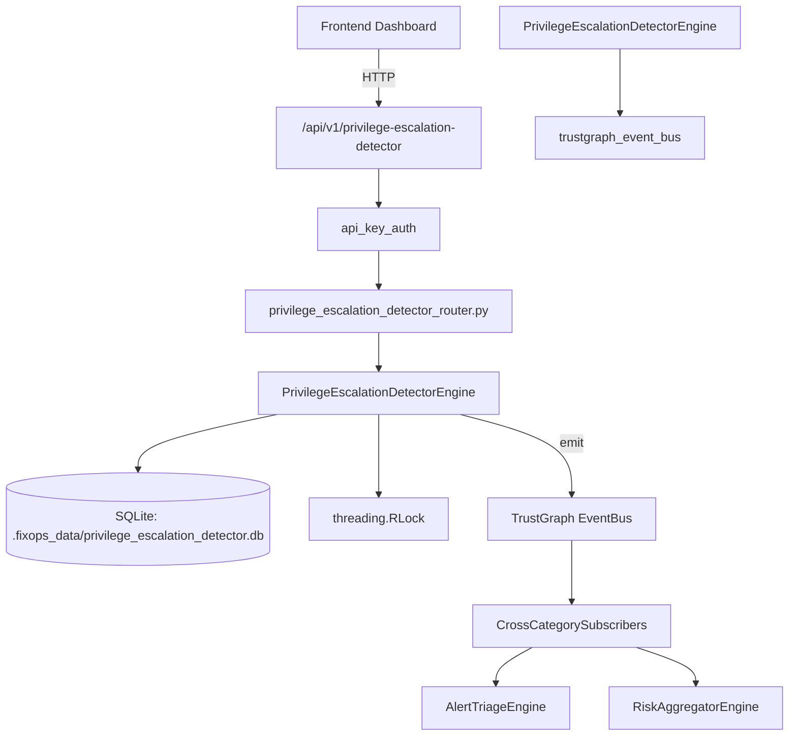

# US-0187: Privilege Escalation Detector

## Sub-Epic: Identity
**Master Goal**: ALDECI — $35/mo enterprise security intelligence platform replacing $50K-500K/yr tools

## User Story
As a **Maria Lopez (IT Director)**, I need to detect privilege escalation
so that the platform delivers enterprise-grade identity capabilities at 1/1000th the cost of legacy tools.

## Why This Matters
Privilege Escalation Detector replaces functionality found in enterprise tools like CrowdStrike, Wiz, Snyk, and Rapid7.
By building this into ALDECI's $35/mo stack, customers save $50K+/yr on standalone Identity tooling.

## Architecture

## Current State: 85% Complete
- ✅ `record_privilege_event()` — Record a privilege escalation event. (line 220)
- ✅ `list_privilege_events()` — List privilege escalation events, optionally filtered by user. (line 293)
- ✅ `detect_anomalous_escalation()` — Analyze a specific event and return anomaly assessment. (line 328)
- ✅ `create_detection_rule()` — Create a detection rule for privilege escalation patterns. (line 359)
- ✅ `list_detection_rules()` — List all detection rules for an org. (line 416)
- ✅ `get_escalation_heatmap()` — Return escalation activity heatmap for the past N hours. (line 427)
- ❌ No dedicated router — endpoint may be in gap_router.py
- ❌ TrustGraph event emission — not yet verified

## Key Functions (from `suite-core/core/privilege_escalation_detector_engine.py` — 552 lines)
- `PrivilegeEscalationDetectorEngine.record_privilege_event()` — Record a privilege escalation event. (line 220)
- `PrivilegeEscalationDetectorEngine.list_privilege_events()` — List privilege escalation events, optionally filtered by user. (line 293)
- `PrivilegeEscalationDetectorEngine.detect_anomalous_escalation()` — Analyze a specific event and return anomaly assessment. (line 328)
- `PrivilegeEscalationDetectorEngine.create_detection_rule()` — Create a detection rule for privilege escalation patterns. (line 359)
- `PrivilegeEscalationDetectorEngine.list_detection_rules()` — List all detection rules for an org. (line 416)
- `PrivilegeEscalationDetectorEngine.get_escalation_heatmap()` — Return escalation activity heatmap for the past N hours. (line 427)
- `PrivilegeEscalationDetectorEngine.get_detection_stats()` — Return aggregate detection statistics for an org. (line 479)

## Dependencies
- **Depends on**: trustgraph_event_bus
- **Depended by**: Routers, TrustGraph EventBus, CrossCategorySubscribers
- **TrustGraph**: Event emission wired via ResponseInterceptorMiddleware
- **Source file**: `suite-core/core/privilege_escalation_detector_engine.py` (552 lines)
- **Router file**: `suite-api/apps/api/N/A`

## API Endpoints
| Method | Path | Description |
|--------|------|-------------|
| GET | `/api/v1/privilege-escalation-detector` | List resources |

## Tasks Remaining
1. Verify TrustGraph event emission works end-to-end (2h)
2. Add integration test with real persona workflow (2h)
3. Wire CrossCategorySubscriber consumer chain (1h)
4. Validate with 30-persona walkthrough (1h)
5. Create dedicated router (needs wiring in app.py) (3h)
6. Expand test coverage to edge cases (2h)

## Definition of Done
- [ ] Maria Lopez (IT Director) can access /api/v1/privilege-escalation-detector and get meaningful data
- [ ] All CRUD operations return correct HTTP status codes
- [ ] TrustGraph receives events from this engine
- [ ] 48+ tests passing in `tests/test_privilege_escalation_detector_engine.py`
- [ ] 30-persona walkthrough includes this endpoint at 100%
- [ ] No hardcoded org_id — all queries are org-scoped

## Sprint: Wave 48 (est. April 24-26, 2026)

## Test Coverage
- **Test file**: `tests/test_privilege_escalation_detector_engine.py`
- **Tests**: 48 tests
- **Status**: Passing
