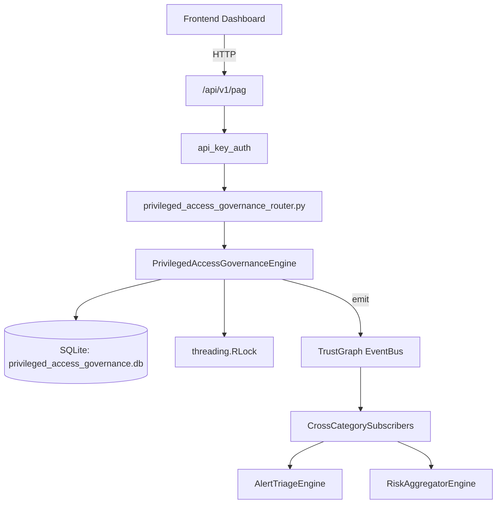

# US-0188: Privileged Access Governance

## Sub-Epic: Identity
**Master Goal**: ALDECI — $35/mo enterprise security intelligence platform replacing $50K-500K/yr tools

## User Story
As a **Maria Lopez (IT Director)**, I need to detect privilege escalation
so that the platform delivers enterprise-grade identity capabilities at 1/1000th the cost of legacy tools.

## Why This Matters
Privileged Access Governance replaces functionality found in enterprise tools like CrowdStrike, Wiz, Snyk, and Rapid7.
By building this into ALDECI's $35/mo stack, customers save $50K+/yr on standalone Identity tooling.

## Architecture

## Current State: 95% Complete
- ✅ `register_privileged_account()` — Register a new privileged account. (line 137)
- ✅ `list_privileged_accounts()` — List privileged accounts with optional filters. (line 179)
- ✅ `get_privileged_account()` — Get a single privileged account by id, scoped to org. (line 199)
- ✅ `record_access_session()` — Record a privileged access session and update account last_used. (line 214)
- ✅ `list_sessions()` — List access sessions with optional filters. (line 251)
- ✅ `flag_anomaly()` — Flag a behavioral anomaly on a privileged account. (line 275)
- ❌ TrustGraph event emission — not yet verified

## Key Functions (from `suite-core/core/privileged_access_governance_engine.py` — 385 lines)
- `PrivilegedAccessGovernanceEngine.register_privileged_account()` — Register a new privileged account. (line 137)
- `PrivilegedAccessGovernanceEngine.list_privileged_accounts()` — List privileged accounts with optional filters. (line 179)
- `PrivilegedAccessGovernanceEngine.get_privileged_account()` — Get a single privileged account by id, scoped to org. (line 199)
- `PrivilegedAccessGovernanceEngine.record_access_session()` — Record a privileged access session and update account last_used. (line 214)
- `PrivilegedAccessGovernanceEngine.list_sessions()` — List access sessions with optional filters. (line 251)
- `PrivilegedAccessGovernanceEngine.flag_anomaly()` — Flag a behavioral anomaly on a privileged account. (line 275)
- `PrivilegedAccessGovernanceEngine.list_anomalies()` — List anomalies with optional filters. (line 317)
- `PrivilegedAccessGovernanceEngine.get_pag_stats()` — Aggregated privileged access governance statistics for an org. (line 341)

## Dependencies
- **Depends on**: standalone
- **Depended by**: Routers, TrustGraph EventBus, CrossCategorySubscribers
- **TrustGraph**: Event emission wired via ResponseInterceptorMiddleware
- **Source file**: `suite-core/core/privileged_access_governance_engine.py` (385 lines)
- **Router file**: `suite-api/apps/api/privileged_access_governance_router.py`

## API Endpoints
| Method | Path | Description |
|--------|------|-------------|
| POST | `/api/v1/pag/accounts` | register privileged account |
| GET | `/api/v1/pag/accounts` | list privileged accounts |
| GET | `/api/v1/pag/accounts/{account_id}` | get privileged account |
| POST | `/api/v1/pag/accounts/{account_id}/sessions` | record access session |
| GET | `/api/v1/pag/sessions` | list sessions |
| POST | `/api/v1/pag/accounts/{account_id}/anomalies` | flag anomaly |
| GET | `/api/v1/pag/anomalies` | list anomalies |
| GET | `/api/v1/pag/stats` | get pag stats |

## Tasks Remaining
1. Verify TrustGraph event emission works end-to-end (2h)
2. Add integration test with real persona workflow (2h)
3. Wire CrossCategorySubscriber consumer chain (1h)
4. Validate with 30-persona walkthrough (1h)
5. Optimize query performance for large datasets (2h)
6. Expand test coverage to edge cases (2h)

## Definition of Done
- [ ] Maria Lopez (IT Director) can access /api/v1/pag and get meaningful data
- [ ] All CRUD operations return correct HTTP status codes
- [ ] TrustGraph receives events from this engine
- [ ] 37+ tests passing in `tests/test_privileged_access_governance_engine.py`
- [ ] 30-persona walkthrough includes this endpoint at 100%
- [ ] No hardcoded org_id — all queries are org-scoped

## Sprint: Wave 48 (est. April 24-26, 2026)

## Test Coverage
- **Test file**: `tests/test_privileged_access_governance_engine.py`
- **Tests**: 37 tests
- **Status**: Passing
