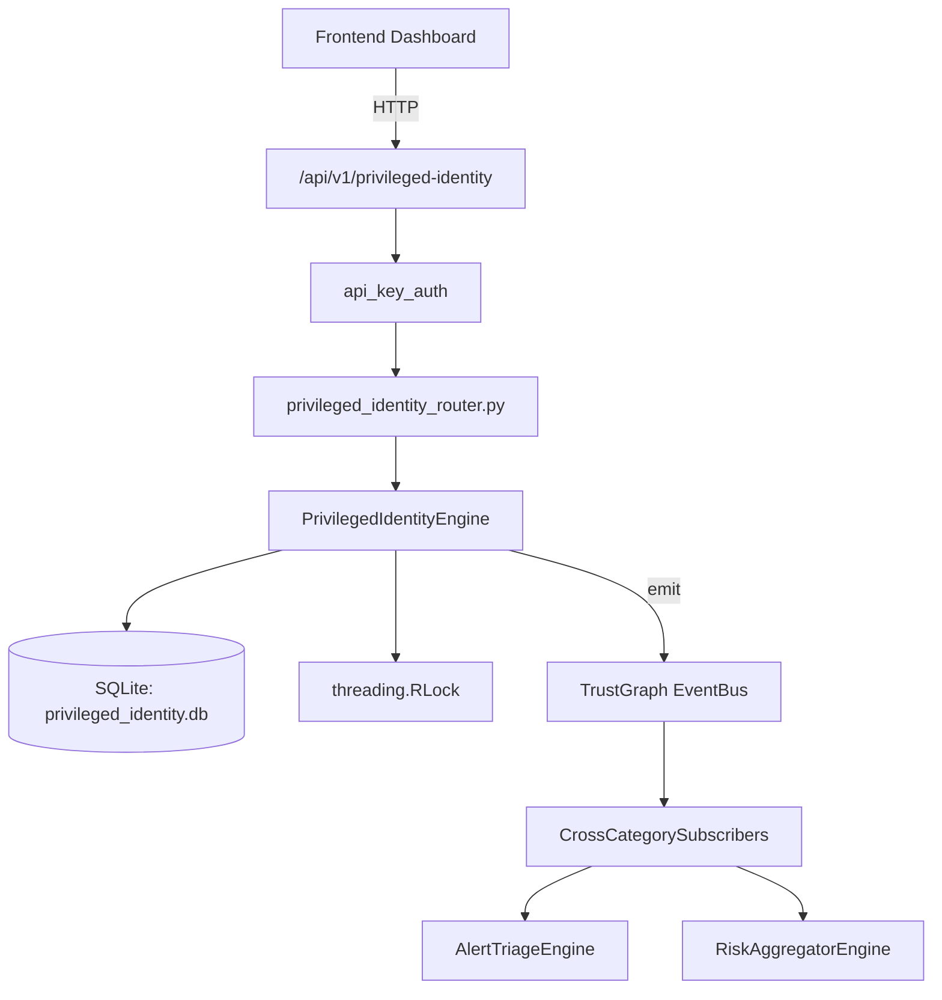

# US-0189: Privileged Identity

## Sub-Epic: Identity
**Master Goal**: ALDECI — $35/mo enterprise security intelligence platform replacing $50K-500K/yr tools

## User Story
As a **Maria Lopez (IT Director)**, I need to detect privilege escalation
so that the platform delivers enterprise-grade identity capabilities at 1/1000th the cost of legacy tools.

## Why This Matters
Privileged Identity replaces functionality found in enterprise tools like CrowdStrike, Wiz, Snyk, and Rapid7.
By building this into ALDECI's $35/mo stack, customers save $50K+/yr on standalone Identity tooling.

## Architecture

## Current State: 95% Complete
- ✅ `register_account()` — Register a privileged account. Deduped on (org_id, username, system_name). (line 154)
- ✅ `update_risk_level()` — Manually override an account's risk level. (line 204)
- ✅ `rotate_password()` — Record a password rotation event. (line 225)
- ✅ `get_account()` — Fetch a single account scoped to org_id. (line 242)
- ✅ `list_accounts()` — List all accounts for the org. (line 251)
- ✅ `get_high_risk_accounts()` — Return accounts with risk_level in (critical, high), critical first. (line 260)
- ❌ TrustGraph event emission — not yet verified

## Key Functions (from `suite-core/core/privileged_identity_engine.py` — 525 lines)
- `PrivilegedIdentityEngine.register_account()` — Register a privileged account. Deduped on (org_id, username, system_name). (line 154)
- `PrivilegedIdentityEngine.update_risk_level()` — Manually override an account's risk level. (line 204)
- `PrivilegedIdentityEngine.rotate_password()` — Record a password rotation event. (line 225)
- `PrivilegedIdentityEngine.get_account()` — Fetch a single account scoped to org_id. (line 242)
- `PrivilegedIdentityEngine.list_accounts()` — List all accounts for the org. (line 251)
- `PrivilegedIdentityEngine.get_high_risk_accounts()` — Return accounts with risk_level in (critical, high), critical first. (line 260)
- `PrivilegedIdentityEngine.open_session()` — Open a new privileged session. (line 276)
- `PrivilegedIdentityEngine.close_session()` — Close a privileged session. (line 307)

## Dependencies
- **Depends on**: standalone
- **Depended by**: Routers, TrustGraph EventBus, CrossCategorySubscribers
- **TrustGraph**: Event emission wired via ResponseInterceptorMiddleware
- **Source file**: `suite-core/core/privileged_identity_engine.py` (525 lines)
- **Router file**: `suite-api/apps/api/privileged_identity_router.py`

## API Endpoints
| Method | Path | Description |
|--------|------|-------------|
| POST | `/api/v1/privileged-identity/accounts` | register account |
| PUT | `/api/v1/privileged-identity/accounts/{account_id}/risk` | update risk level |
| POST | `/api/v1/privileged-identity/sessions` | open session |
| PUT | `/api/v1/privileged-identity/sessions/{session_id}/close` | close session |
| POST | `/api/v1/privileged-identity/accounts/{account_id}/certify` | certify account |
| PUT | `/api/v1/privileged-identity/accounts/{account_id}/rotate` | rotate password |
| GET | `/api/v1/privileged-identity/summary` | get privileged summary |
| GET | `/api/v1/privileged-identity/high-risk` | get high risk accounts |
| GET | `/api/v1/privileged-identity/sessions/active` | get active sessions |
| GET | `/api/v1/privileged-identity/accounts/{account_id}/sessions` | get session history |

## Tasks Remaining
1. Verify TrustGraph event emission works end-to-end (2h)
2. Add integration test with real persona workflow (2h)
3. Wire CrossCategorySubscriber consumer chain (1h)
4. Validate with 30-persona walkthrough (1h)
5. Optimize query performance for large datasets (2h)
6. Expand test coverage to edge cases (2h)

## Definition of Done
- [ ] Maria Lopez (IT Director) can access /api/v1/privileged-identity and get meaningful data
- [ ] All CRUD operations return correct HTTP status codes
- [ ] TrustGraph receives events from this engine
- [ ] 52+ tests passing in `tests/test_privileged_identity_engine.py`
- [ ] 30-persona walkthrough includes this endpoint at 100%
- [ ] No hardcoded org_id — all queries are org-scoped

## Sprint: Wave 48 (est. April 24-26, 2026)

## Test Coverage
- **Test file**: `tests/test_privileged_identity_engine.py`
- **Tests**: 52 tests
- **Status**: Passing
