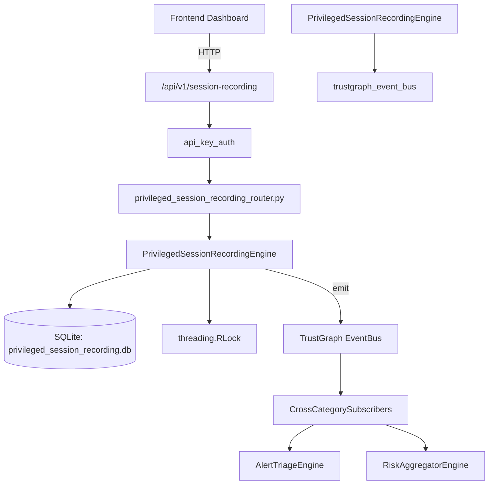

# US-0190: Privileged Session Recording

## Sub-Epic: Identity
**Master Goal**: ALDECI — $35/mo enterprise security intelligence platform replacing $50K-500K/yr tools

## User Story
As a **Maria Lopez (IT Director)**, I need to detect privilege escalation
so that the platform delivers enterprise-grade identity capabilities at 1/1000th the cost of legacy tools.

## Why This Matters
Privileged Session Recording replaces functionality found in enterprise tools like CrowdStrike, Wiz, Snyk, and Rapid7.
By building this into ALDECI's $35/mo stack, customers save $50K+/yr on standalone Identity tooling.

## Architecture

## Current State: 95% Complete
- ✅ `start_session()` — Start a new privileged session recording. Returns the session record. (line 115)
- ✅ `end_session()` — End a session. Sets status=completed, ended_at, duration_seconds, recording_url. (line 162)
- ✅ `list_sessions()` — List sessions for org, optionally filtered, ordered by started_at DESC. (line 190)
- ✅ `get_session()` — Fetch a single session scoped to org_id. Returns None if not found. (line 214)
- ✅ `record_alert()` — Record a session alert and increment session.alerts_count. (line 227)
- ✅ `list_alerts()` — List alerts for org, optionally filtered by session, type, or severity. (line 275)
- ❌ TrustGraph event emission — not yet verified

## Key Functions (from `suite-core/core/privileged_session_recording_engine.py` — 355 lines)
- `PrivilegedSessionRecordingEngine.start_session()` — Start a new privileged session recording. Returns the session record. (line 115)
- `PrivilegedSessionRecordingEngine.end_session()` — End a session. Sets status=completed, ended_at, duration_seconds, recording_url. (line 162)
- `PrivilegedSessionRecordingEngine.list_sessions()` — List sessions for org, optionally filtered, ordered by started_at DESC. (line 190)
- `PrivilegedSessionRecordingEngine.get_session()` — Fetch a single session scoped to org_id. Returns None if not found. (line 214)
- `PrivilegedSessionRecordingEngine.record_alert()` — Record a session alert and increment session.alerts_count. (line 227)
- `PrivilegedSessionRecordingEngine.list_alerts()` — List alerts for org, optionally filtered by session, type, or severity. (line 275)
- `PrivilegedSessionRecordingEngine.get_recording_stats()` — Return aggregate recording stats for the org. (line 303)

## Dependencies
- **Depends on**: trustgraph_event_bus
- **Depended by**: Routers, TrustGraph EventBus, CrossCategorySubscribers
- **TrustGraph**: Event emission wired via ResponseInterceptorMiddleware
- **Source file**: `suite-core/core/privileged_session_recording_engine.py` (355 lines)
- **Router file**: `suite-api/apps/api/privileged_session_recording_router.py`

## API Endpoints
| Method | Path | Description |
|--------|------|-------------|
| POST | `/api/v1/session-recording/sessions` | start session |
| GET | `/api/v1/session-recording/sessions` | list sessions |
| GET | `/api/v1/session-recording/sessions/{session_id}` | get session |
| POST | `/api/v1/session-recording/sessions/{session_id}/end` | end session |
| POST | `/api/v1/session-recording/sessions/{session_id}/alerts` | record alert |
| GET | `/api/v1/session-recording/alerts` | list alerts |
| GET | `/api/v1/session-recording/stats` | get recording stats |

## Tasks Remaining
1. Verify TrustGraph event emission works end-to-end (2h)
2. Add integration test with real persona workflow (2h)
3. Wire CrossCategorySubscriber consumer chain (1h)
4. Validate with 30-persona walkthrough (1h)
5. Optimize query performance for large datasets (2h)
6. Expand test coverage to edge cases (2h)

## Definition of Done
- [ ] Maria Lopez (IT Director) can access /api/v1/session-recording and get meaningful data
- [ ] All CRUD operations return correct HTTP status codes
- [ ] TrustGraph receives events from this engine
- [ ] 49+ tests passing in `tests/test_privileged_session_recording_engine.py`
- [ ] 30-persona walkthrough includes this endpoint at 100%
- [ ] No hardcoded org_id — all queries are org-scoped

## Sprint: Wave 48 (est. April 24-26, 2026)

## Test Coverage
- **Test file**: `tests/test_privileged_session_recording_engine.py`
- **Tests**: 49 tests
- **Status**: Passing
