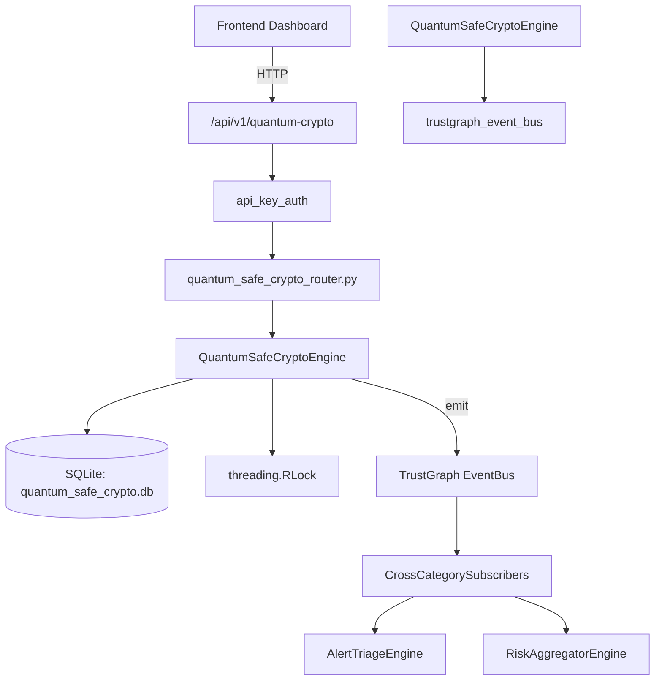

# US-0191: Quantum Safe Crypto

## Sub-Epic: Advanced
**Master Goal**: ALDECI — $35/mo enterprise security intelligence platform replacing $50K-500K/yr tools

## User Story
As a **Richard Adams (Security Architect)**, I need to assess quantum computing risks
so that the platform delivers enterprise-grade advanced capabilities at 1/1000th the cost of legacy tools.

## Why This Matters
Quantum Safe Crypto replaces functionality found in enterprise tools like CrowdStrike, Wiz, Snyk, and Rapid7.
By building this into ALDECI's $35/mo stack, customers save $50K+/yr on standalone Advanced tooling.

## Architecture

## Current State: 95% Complete
- ✅ `register_asset()` — Register a cryptographic asset. (line 170)
- ✅ `list_assets()` — Return assets for the org, optionally filtered. (line 251)
- ✅ `get_asset()` — Return a single asset by id with org isolation, or None. (line 285)
- ✅ `update_migration_status()` — Update migration_status on an asset. (line 300)
- ✅ `create_assessment()` — Create a quantum readiness assessment. (line 349)
- ✅ `complete_assessment()` — Complete an assessment with asset counts. (line 389)
- ❌ TrustGraph event emission — not yet verified

## Key Functions (from `suite-core/core/quantum_safe_crypto_engine.py` — 603 lines)
- `QuantumSafeCryptoEngine.register_asset()` — Register a cryptographic asset. (line 170)
- `QuantumSafeCryptoEngine.list_assets()` — Return assets for the org, optionally filtered. (line 251)
- `QuantumSafeCryptoEngine.get_asset()` — Return a single asset by id with org isolation, or None. (line 285)
- `QuantumSafeCryptoEngine.update_migration_status()` — Update migration_status on an asset. (line 300)
- `QuantumSafeCryptoEngine.create_assessment()` — Create a quantum readiness assessment. (line 349)
- `QuantumSafeCryptoEngine.complete_assessment()` — Complete an assessment with asset counts. (line 389)
- `QuantumSafeCryptoEngine.list_assessments()` — Return assessments for the org, optionally filtered by status. (line 427)
- `QuantumSafeCryptoEngine.create_migration()` — Create a migration plan for an asset. (line 450)

## Dependencies
- **Depends on**: trustgraph_event_bus
- **Depended by**: Routers, TrustGraph EventBus, CrossCategorySubscribers
- **TrustGraph**: Event emission wired via ResponseInterceptorMiddleware
- **Source file**: `suite-core/core/quantum_safe_crypto_engine.py` (603 lines)
- **Router file**: `suite-api/apps/api/quantum_safe_crypto_router.py`

## API Endpoints
| Method | Path | Description |
|--------|------|-------------|
| POST | `/api/v1/quantum-crypto/assets` | register asset |
| GET | `/api/v1/quantum-crypto/assets` | list assets |
| GET | `/api/v1/quantum-crypto/assets/{asset_id}` | get asset |
| PUT | `/api/v1/quantum-crypto/assets/{asset_id}/migration-status` | update migration status |
| POST | `/api/v1/quantum-crypto/assessments` | create assessment |
| PUT | `/api/v1/quantum-crypto/assessments/{assessment_id}/complete` | complete assessment |
| GET | `/api/v1/quantum-crypto/assessments` | list assessments |
| POST | `/api/v1/quantum-crypto/migrations` | create migration |
| GET | `/api/v1/quantum-crypto/migrations` | list migrations |
| GET | `/api/v1/quantum-crypto/stats` | get quantum stats |

## Tasks Remaining
1. Verify TrustGraph event emission works end-to-end (2h)
2. Add integration test with real persona workflow (2h)
3. Wire CrossCategorySubscriber consumer chain (1h)
4. Validate with 30-persona walkthrough (1h)
5. Optimize query performance for large datasets (2h)
6. Expand test coverage to edge cases (2h)

## Definition of Done
- [ ] Richard Adams (Security Architect) can access /api/v1/quantum-crypto and get meaningful data
- [ ] All CRUD operations return correct HTTP status codes
- [ ] TrustGraph receives events from this engine
- [ ] 67+ tests passing in `tests/test_quantum_safe_crypto_engine.py`
- [ ] 30-persona walkthrough includes this endpoint at 100%
- [ ] No hardcoded org_id — all queries are org-scoped

## Sprint: Wave 48 (est. April 24-26, 2026)

## Test Coverage
- **Test file**: `tests/test_quantum_safe_crypto_engine.py`
- **Tests**: 67 tests
- **Status**: Passing
