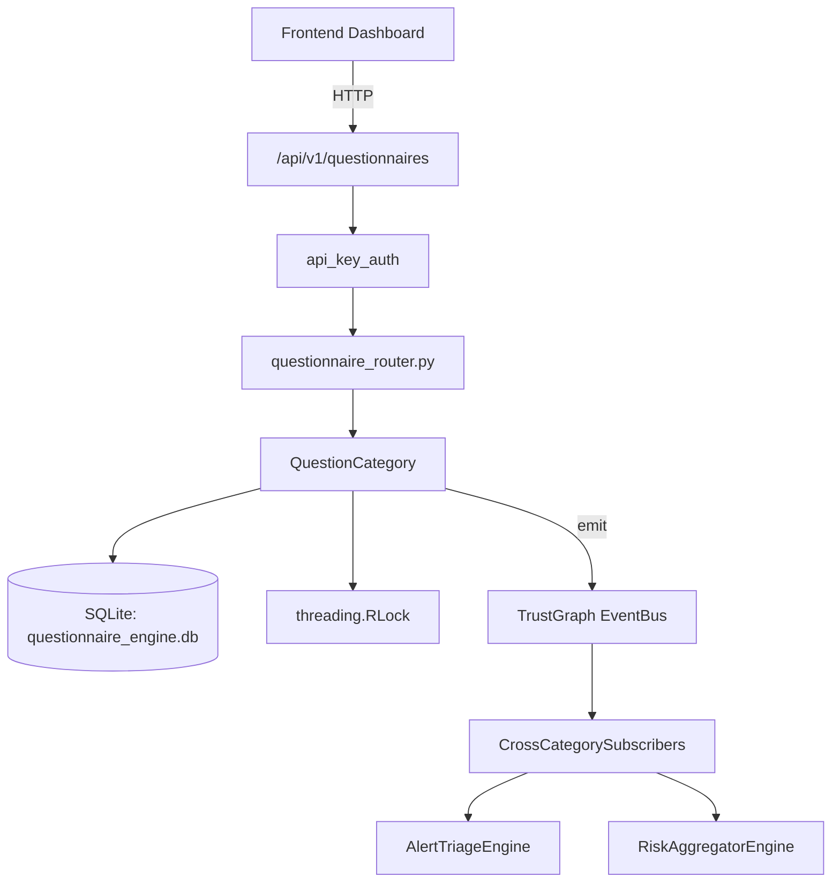

# US-0192: Questionnaire

## Sub-Epic: Advanced
**Master Goal**: ALDECI — $35/mo enterprise security intelligence platform replacing $50K-500K/yr tools

## User Story
As a **Robert Kim (Compliance Officer)**, I need to manage security questionnaires
so that the platform delivers enterprise-grade advanced capabilities at 1/1000th the cost of legacy tools.

## Why This Matters
Questionnaire replaces functionality found in enterprise tools like CrowdStrike, Wiz, Snyk, and Rapid7.
By building this into ALDECI's $35/mo stack, customers save $50K+/yr on standalone Advanced tooling.

## Architecture

## Current State: 95% Complete
- ✅ `create_questionnaire()` — Create a new questionnaire from a named template or custom question list. (line 796)
- ✅ `auto_answer()` — Auto-fill unanswered questions by matching against ALDECI capability templates. (line 846)
- ✅ `get_questionnaire()` — Retrieve a questionnaire with all questions and answers. (line 885)
- ✅ `list_questionnaires()` — List all questionnaires for an org (without question detail for efficiency). (line 894)
- ✅ `update_answer()` — Manually override an answer for a specific question. (line 902)
- ✅ `export_questionnaire()` — Export questionnaire as PDF-ready JSON or CSV. (line 931)
- ❌ TrustGraph event emission — not yet verified

## Key Functions (from `suite-core/core/questionnaire_engine.py` — 1144 lines)
- `QuestionnaireEngine.create_questionnaire()` — Create a new questionnaire from a named template or custom question list. (line 796)
- `QuestionnaireEngine.auto_answer()` — Auto-fill unanswered questions by matching against ALDECI capability templates. (line 846)
- `QuestionnaireEngine.get_questionnaire()` — Retrieve a questionnaire with all questions and answers. (line 885)
- `QuestionnaireEngine.list_questionnaires()` — List all questionnaires for an org (without question detail for efficiency). (line 894)
- `QuestionnaireEngine.update_answer()` — Manually override an answer for a specific question. (line 902)
- `QuestionnaireEngine.export_questionnaire()` — Export questionnaire as PDF-ready JSON or CSV. (line 931)
- `QuestionnaireEngine.get_answer_bank()` — Return reusable answers from the answer bank for this org. (line 989)
- `QuestionnaireEngine.add_to_answer_bank()` — Add or update a custom answer in the org's answer bank. (line 1009)

## Dependencies
- **Depends on**: standalone
- **Depended by**: Routers, TrustGraph EventBus, CrossCategorySubscribers
- **TrustGraph**: Event emission wired via ResponseInterceptorMiddleware
- **Source file**: `suite-core/core/questionnaire_engine.py` (1144 lines)
- **Router file**: `suite-api/apps/api/questionnaire_router.py`

## API Endpoints
| Method | Path | Description |
|--------|------|-------------|
| POST | `/api/v1/questionnaires` | create questionnaire |
| GET | `/api/v1/questionnaires/templates` | list templates |
| GET | `/api/v1/questionnaires/answer-bank` | get answer bank |
| POST | `/api/v1/questionnaires/answer-bank` | add to answer bank |
| GET | `/api/v1/questionnaires` | list questionnaires |
| GET | `/api/v1/questionnaires/{questionnaire_id}` | get questionnaire |
| POST | `/api/v1/questionnaires/{questionnaire_id}/auto-answer` | auto answer |
| PATCH | `/api/v1/questionnaires/{questionnaire_id}/questions/{question_id}` | update answer |
| POST | `/api/v1/questionnaires/{questionnaire_id}/submit` | submit questionnaire |
| GET | `/api/v1/questionnaires/{questionnaire_id}/export` | export questionnaire |

## Tasks Remaining
1. Verify TrustGraph event emission works end-to-end (2h)
2. Add integration test with real persona workflow (2h)
3. Wire CrossCategorySubscriber consumer chain (1h)
4. Validate with 30-persona walkthrough (1h)
5. Optimize query performance for large datasets (2h)
6. Expand test coverage to edge cases (2h)

## Definition of Done
- [ ] Robert Kim (Compliance Officer) can access /api/v1/questionnaires and get meaningful data
- [ ] All CRUD operations return correct HTTP status codes
- [ ] TrustGraph receives events from this engine
- [ ] 58+ tests passing in `tests/test_questionnaire_engine.py`
- [ ] 30-persona walkthrough includes this endpoint at 100%
- [ ] No hardcoded org_id — all queries are org-scoped

## Sprint: Wave 48 (est. April 24-26, 2026)

## Test Coverage
- **Test file**: `tests/test_questionnaire_engine.py`
- **Tests**: 58 tests
- **Status**: Passing
