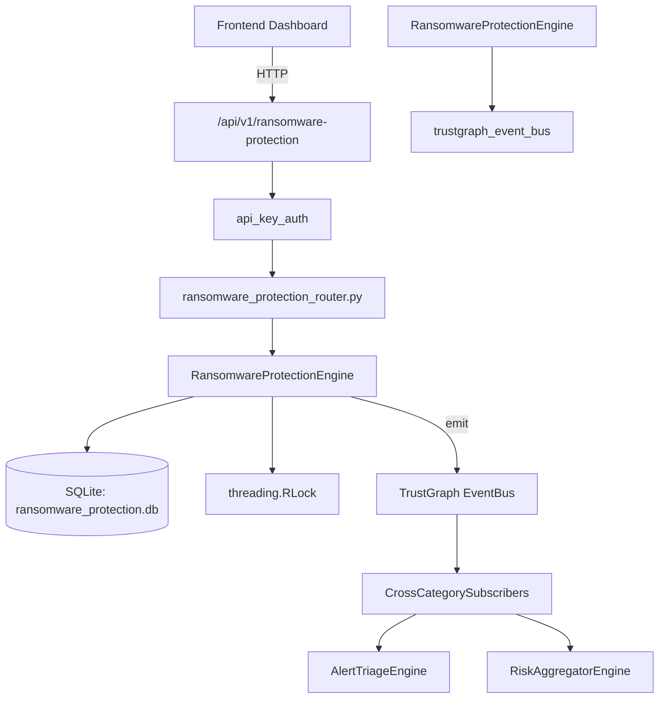

# US-0193: Ransomware Protection

## Sub-Epic: CTEM
**Master Goal**: ALDECI — $35/mo enterprise security intelligence platform replacing $50K-500K/yr tools

## User Story
As a **Karen Taylor (IR Lead)**, I need to protect against ransomware attacks
so that the platform delivers enterprise-grade ctem capabilities at 1/1000th the cost of legacy tools.

## Why This Matters
Ransomware Protection replaces functionality found in enterprise tools like CrowdStrike, Wiz, Snyk, and Rapid7.
By building this into ALDECI's $35/mo stack, customers save $50K+/yr on standalone CTEM tooling.

## Architecture

## Current State: 95% Complete
- ✅ `register_detection()` — Register a new ransomware detection. (line 151)
- ✅ `get_detection()` — implemented (line 191)
- ✅ `update_containment()` — Update containment status; set contained_at if status=contained. (line 202)
- ✅ `list_detections()` — implemented (line 240)
- ✅ `register_backup()` — Register a backup target. (line 261)
- ✅ `get_backup()` — implemented (line 291)
- ❌ TrustGraph event emission — not yet verified

## Key Functions (from `suite-core/core/ransomware_protection_engine.py` — 525 lines)
- `RansomwareProtectionEngine.register_detection()` — Register a new ransomware detection. (line 151)
- `RansomwareProtectionEngine.get_detection()` — Handle get detection (line 191)
- `RansomwareProtectionEngine.update_containment()` — Update containment status; set contained_at if status=contained. (line 202)
- `RansomwareProtectionEngine.list_detections()` — Handle list detections (line 240)
- `RansomwareProtectionEngine.register_backup()` — Register a backup target. (line 261)
- `RansomwareProtectionEngine.get_backup()` — Handle get backup (line 291)
- `RansomwareProtectionEngine.validate_backup()` — Record backup validation result. (line 302)
- `RansomwareProtectionEngine.get_unvalidated_backups()` — Backups with unknown/invalid status or not validated in 30 days. (line 331)

## Dependencies
- **Depends on**: trustgraph_event_bus
- **Depended by**: Routers, TrustGraph EventBus, CrossCategorySubscribers
- **TrustGraph**: Event emission wired via ResponseInterceptorMiddleware
- **Source file**: `suite-core/core/ransomware_protection_engine.py` (525 lines)
- **Router file**: `suite-api/apps/api/ransomware_protection_router.py`

## API Endpoints
| Method | Path | Description |
|--------|------|-------------|
| POST | `/api/v1/ransomware-protection/detections` | register detection |
| GET | `/api/v1/ransomware-protection/detections` | list detections |
| POST | `/api/v1/ransomware-protection/detections/{detection_id}/contain` | update containment |
| POST | `/api/v1/ransomware-protection/backups` | register backup |
| GET | `/api/v1/ransomware-protection/backups` | list backups |
| POST | `/api/v1/ransomware-protection/backups/{backup_id}/validate` | validate backup |
| GET | `/api/v1/ransomware-protection/unvalidated-backups` | get unvalidated backups |
| POST | `/api/v1/ransomware-protection/playbooks` | create playbook |
| POST | `/api/v1/ransomware-protection/playbooks/{playbook_id}/execute` | execute playbook |
| GET | `/api/v1/ransomware-protection/status` | get protection status |
| GET | `/api/v1/ransomware-protection/summary` | get summary |

## Tasks Remaining
1. Verify TrustGraph event emission works end-to-end (2h)
2. Add integration test with real persona workflow (2h)
3. Wire CrossCategorySubscriber consumer chain (1h)
4. Validate with 30-persona walkthrough (1h)
5. Optimize query performance for large datasets (2h)
6. Expand test coverage to edge cases (2h)

## Definition of Done
- [ ] Karen Taylor (IR Lead) can access /api/v1/ransomware-protection and get meaningful data
- [ ] All CRUD operations return correct HTTP status codes
- [ ] TrustGraph receives events from this engine
- [ ] 45+ tests passing in `tests/test_ransomware_protection_engine.py`
- [ ] 30-persona walkthrough includes this endpoint at 100%
- [ ] No hardcoded org_id — all queries are org-scoped

## Sprint: Wave 48 (est. April 24-26, 2026)

## Test Coverage
- **Test file**: `tests/test_ransomware_protection_engine.py`
- **Tests**: 45 tests
- **Status**: Passing
