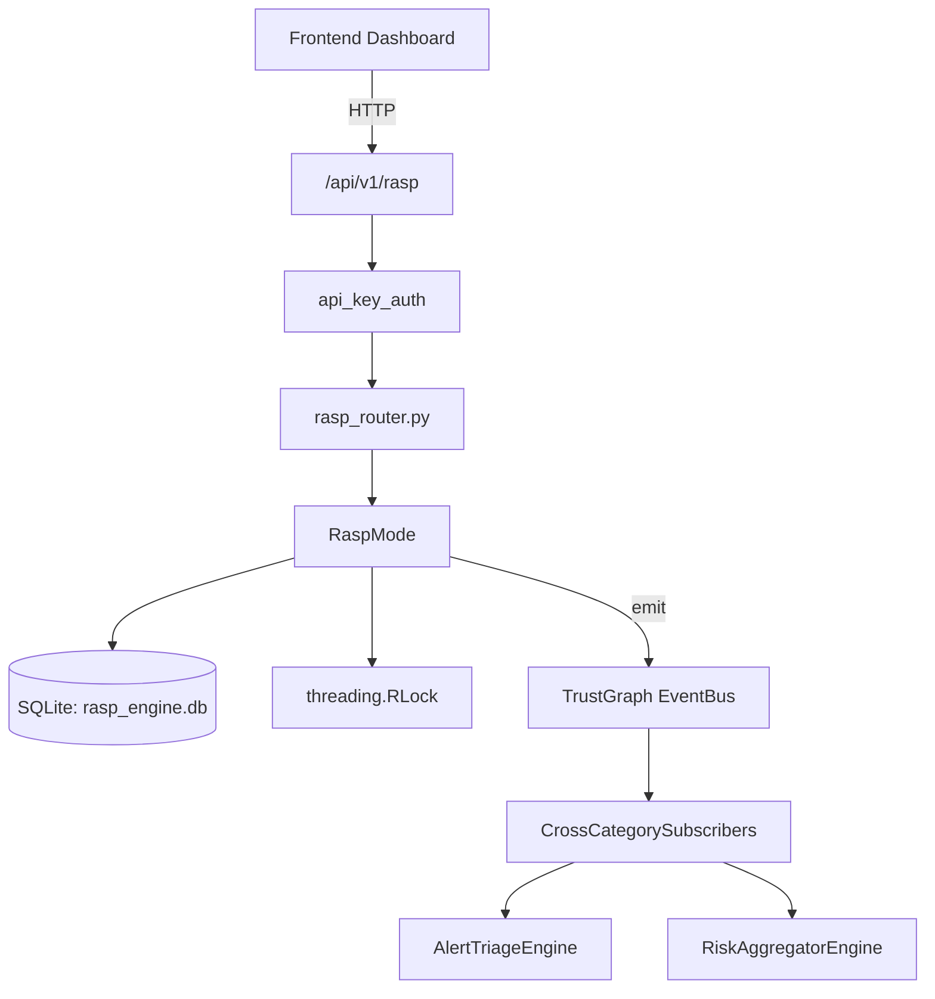

# US-0194: Rasp

## Sub-Epic: ASPM
**Master Goal**: ALDECI — $35/mo enterprise security intelligence platform replacing $50K-500K/yr tools

## User Story
As a **Emma Davis (DevSecOps Engineer)**, I need to protect runtime applications
so that the platform delivers enterprise-grade aspm capabilities at 1/1000th the cost of legacy tools.

## Why This Matters
Rasp replaces functionality found in enterprise tools like CrowdStrike, Wiz, Snyk, and Rapid7.
By building this into ALDECI's $35/mo stack, customers save $50K+/yr on standalone ASPM tooling.

## Architecture

## Current State: 95% Complete
- ✅ `increment()` — Add an event and return current count within window. (line 453)
- ✅ `count()` — Return current count for a key without adding a new event. (line 465)
- ✅ `reset()` — implemented (line 475)
- ✅ `register()` — implemented (line 495)
- ✅ `touch()` — Update last_seen; return 'fixation' if IP changed on existing session. (line 500)
- ✅ `concurrent_count()` — implemented (line 514)
- ❌ TrustGraph event emission — not yet verified

## Key Functions (from `suite-core/core/rasp_engine.py` — 1224 lines)
- `_SlidingWindow.increment()` — Add an event and return current count within window. (line 453)
- `_SlidingWindow.count()` — Return current count for a key without adding a new event. (line 465)
- `_SlidingWindow.reset()` — Handle reset (line 475)
- `_SessionStore.register()` — Handle register (line 495)
- `_SessionStore.touch()` — Update last_seen; return 'fixation' if IP changed on existing session. (line 500)
- `_SessionStore.concurrent_count()` — Handle concurrent count (line 514)
- `_SessionStore.remove()` — Handle remove (line 518)
- `_SessionStore.all_for_user()` — Handle all for user (line 524)

## Dependencies
- **Depends on**: standalone
- **Depended by**: Routers, TrustGraph EventBus, CrossCategorySubscribers
- **TrustGraph**: Event emission wired via ResponseInterceptorMiddleware
- **Source file**: `suite-core/core/rasp_engine.py` (1224 lines)
- **Router file**: `suite-api/apps/api/rasp_router.py`

## API Endpoints
| Method | Path | Description |
|--------|------|-------------|
| GET | `/api/v1/rasp/status` | get status |
| GET | `/api/v1/rasp/threats` | get threats |
| GET | `/api/v1/rasp/rules` | get rules |
| PUT | `/api/v1/rasp/rules/{rule_id}` | toggle rule |
| GET | `/api/v1/rasp/attackers` | get attackers |
| PUT | `/api/v1/rasp/mode` | set mode |
| GET | `/api/v1/rasp/config` | get config |

## Tasks Remaining
1. Verify TrustGraph event emission works end-to-end (2h)
2. Add integration test with real persona workflow (2h)
3. Wire CrossCategorySubscriber consumer chain (1h)
4. Validate with 30-persona walkthrough (1h)
5. Optimize query performance for large datasets (2h)
6. Expand test coverage to edge cases (2h)

## Definition of Done
- [ ] Emma Davis (DevSecOps Engineer) can access /api/v1/rasp and get meaningful data
- [ ] All CRUD operations return correct HTTP status codes
- [ ] TrustGraph receives events from this engine
- [ ] 29+ tests passing in `tests/test_rasp_engine.py`
- [ ] 30-persona walkthrough includes this endpoint at 100%
- [ ] No hardcoded org_id — all queries are org-scoped

## Sprint: Wave 48 (est. April 24-26, 2026)

## Test Coverage
- **Test file**: `tests/test_rasp_engine.py`
- **Tests**: 29 tests
- **Status**: Passing
