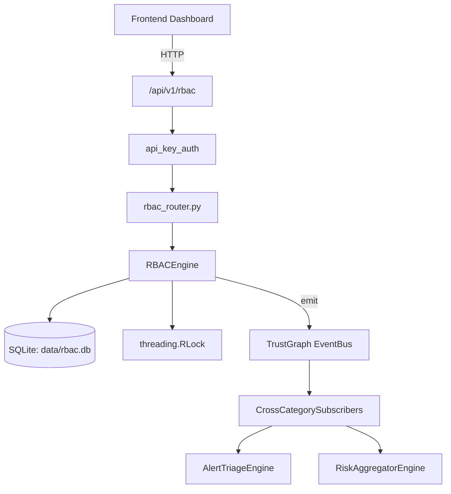

# US-0195: Rbac

## Sub-Epic: Identity
**Master Goal**: ALDECI — $35/mo enterprise security intelligence platform replacing $50K-500K/yr tools

## User Story
As a **Maria Lopez (IT Director)**, I need to manage role-based access control
so that the platform delivers enterprise-grade identity capabilities at 1/1000th the cost of legacy tools.

## Why This Matters
Rbac replaces functionality found in enterprise tools like CrowdStrike, Wiz, Snyk, and Rapid7.
By building this into ALDECI's $35/mo stack, customers save $50K+/yr on standalone Identity tooling.

## Architecture

## Current State: 95% Complete
- ✅ `assign_role()` — Assign a role to a user in an org. Returns assignment record. (line 133)
- ✅ `revoke_role()` — Revoke a role. Returns True if found and revoked. (line 174)
- ✅ `get_user_roles()` — Get all roles for a user in an org. (line 192)
- ✅ `get_user_scopes()` — Get all effective scopes including inherited. Returns deduplicated list. (line 201)
- ✅ `check_permission()` — Check if user has a specific scope. Handles wildcards (admin:all, read:*). (line 210)
- ✅ `check_tenant_access()` — Check if user can access data from target_org. super_admin can cross orgs. (line 226)
- ❌ TrustGraph event emission — not yet verified

## Key Functions (from `suite-core/core/rbac_engine.py` — 362 lines)
- `RBACEngine.assign_role()` — Assign a role to a user in an org. Returns assignment record. (line 133)
- `RBACEngine.revoke_role()` — Revoke a role. Returns True if found and revoked. (line 174)
- `RBACEngine.get_user_roles()` — Get all roles for a user in an org. (line 192)
- `RBACEngine.get_user_scopes()` — Get all effective scopes including inherited. Returns deduplicated list. (line 201)
- `RBACEngine.check_permission()` — Check if user has a specific scope. Handles wildcards (admin:all, read:*). (line 210)
- `RBACEngine.check_tenant_access()` — Check if user can access data from target_org. super_admin can cross orgs. (line 226)
- `RBACEngine.list_users_in_org()` — List all users with roles in an org. (line 243)
- `RBACEngine.get_role_hierarchy()` — Get role + all inherited roles (depth-first, deduped). (line 260)

## Dependencies
- **Depends on**: standalone
- **Depended by**: Routers, TrustGraph EventBus, CrossCategorySubscribers
- **TrustGraph**: Event emission wired via ResponseInterceptorMiddleware
- **Source file**: `suite-core/core/rbac_engine.py` (362 lines)
- **Router file**: `suite-api/apps/api/rbac_router.py`

## API Endpoints
| Method | Path | Description |
|--------|------|-------------|
| POST | `/api/v1/rbac/assign` | assign role |
| DELETE | `/api/v1/rbac/revoke` | revoke role |
| GET | `/api/v1/rbac/users/{user_id}/roles` | get user roles |
| GET | `/api/v1/rbac/users/{user_id}/scopes` | get user scopes |
| POST | `/api/v1/rbac/check` | check permission |
| GET | `/api/v1/rbac/org/{org_id}/users` | list org users |
| GET | `/api/v1/rbac/roles` | list roles |
| GET | `/api/v1/rbac/audit` | get audit log |

## Tasks Remaining
1. Verify TrustGraph event emission works end-to-end (2h)
2. Add integration test with real persona workflow (2h)
3. Wire CrossCategorySubscriber consumer chain (1h)
4. Validate with 30-persona walkthrough (1h)
5. Optimize query performance for large datasets (2h)
6. Expand test coverage to edge cases (2h)

## Definition of Done
- [ ] Maria Lopez (IT Director) can access /api/v1/rbac and get meaningful data
- [ ] All CRUD operations return correct HTTP status codes
- [ ] TrustGraph receives events from this engine
- [ ] 38+ tests passing in `tests/test_rbac_engine.py`
- [ ] 30-persona walkthrough includes this endpoint at 100%
- [ ] No hardcoded org_id — all queries are org-scoped

## Sprint: Wave 48 (est. April 24-26, 2026)

## Test Coverage
- **Test file**: `tests/test_rbac_engine.py`
- **Tests**: 38 tests
- **Status**: Passing
