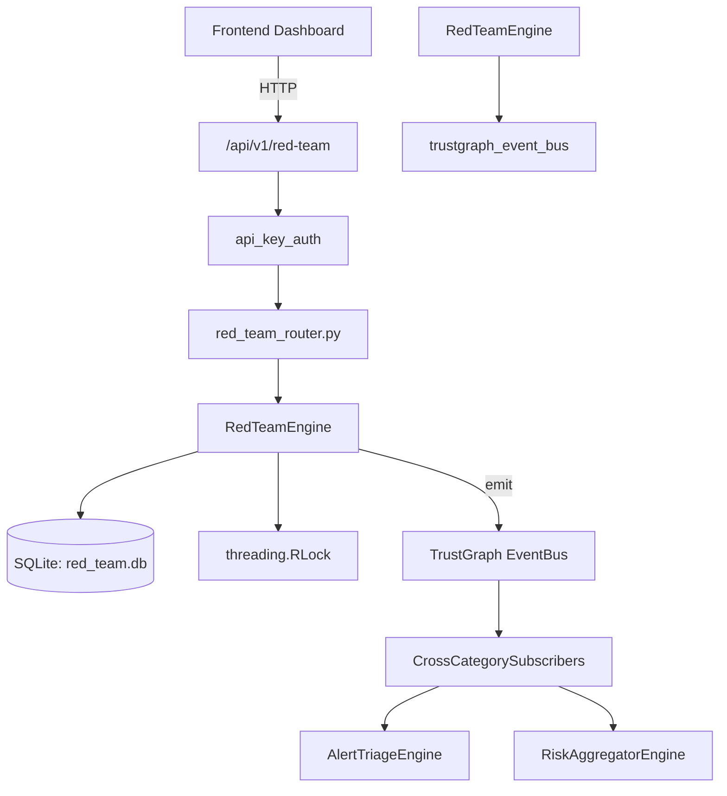

# US-0196: Red Team

## Sub-Epic: CTEM
**Master Goal**: ALDECI — $35/mo enterprise security intelligence platform replacing $50K-500K/yr tools

## User Story
As a **Lisa Zhang (Pentester)**, I need to manage red team operations
so that the platform delivers enterprise-grade ctem capabilities at 1/1000th the cost of legacy tools.

## Why This Matters
Red Team replaces functionality found in enterprise tools like CrowdStrike, Wiz, Snyk, and Rapid7.
By building this into ALDECI's $35/mo stack, customers save $50K+/yr on standalone CTEM tooling.

## Architecture

## Current State: 95% Complete
- ✅ `create_simulation()` — Create a new red team simulation definition. (line 172)
- ✅ `run_simulation()` — Execute a simulation and persist results. (line 236)
- ✅ `list_simulations()` — Return all simulations for an org, newest first. (line 327)
- ✅ `get_simulation_results()` — Return latest execution results for a simulation. (line 342)
- ✅ `get_attack_surface_score()` — Aggregate attack surface score across all completed simulations. (line 384)
- ✅ `get_mitre_coverage()` — Return per-tactic detection coverage from completed simulations. (line 429)
- ❌ TrustGraph event emission — not yet verified

## Key Functions (from `suite-core/core/red_team_engine.py` — 563 lines)
- `RedTeamEngine.create_simulation()` — Create a new red team simulation definition. (line 172)
- `RedTeamEngine.run_simulation()` — Execute a simulation and persist results. (line 236)
- `RedTeamEngine.list_simulations()` — Return all simulations for an org, newest first. (line 327)
- `RedTeamEngine.get_simulation_results()` — Return latest execution results for a simulation. (line 342)
- `RedTeamEngine.get_attack_surface_score()` — Aggregate attack surface score across all completed simulations. (line 384)
- `RedTeamEngine.get_mitre_coverage()` — Return per-tactic detection coverage from completed simulations. (line 429)

## Dependencies
- **Depends on**: trustgraph_event_bus
- **Depended by**: Routers, TrustGraph EventBus, CrossCategorySubscribers
- **TrustGraph**: Event emission wired via ResponseInterceptorMiddleware
- **Source file**: `suite-core/core/red_team_engine.py` (563 lines)
- **Router file**: `suite-api/apps/api/red_team_router.py`

## API Endpoints
| Method | Path | Description |
|--------|------|-------------|
| POST | `/api/v1/red-team/simulations` | create simulation |
| POST | `/api/v1/red-team/simulations/{simulation_id}/run` | run simulation |
| GET | `/api/v1/red-team/simulations` | list simulations |
| GET | `/api/v1/red-team/simulations/{simulation_id}/results` | get simulation results |
| GET | `/api/v1/red-team/attack-surface-score` | attack surface score |
| GET | `/api/v1/red-team/mitre-coverage` | mitre coverage |

## Tasks Remaining
1. Verify TrustGraph event emission works end-to-end (2h)
2. Add integration test with real persona workflow (2h)
3. Wire CrossCategorySubscriber consumer chain (1h)
4. Validate with 30-persona walkthrough (1h)
5. Optimize query performance for large datasets (2h)
6. Expand test coverage to edge cases (2h)

## Definition of Done
- [ ] Lisa Zhang (Pentester) can access /api/v1/red-team and get meaningful data
- [ ] All CRUD operations return correct HTTP status codes
- [ ] TrustGraph receives events from this engine
- [ ] 33+ tests passing in `tests/test_red_team_engine.py`
- [ ] 30-persona walkthrough includes this endpoint at 100%
- [ ] No hardcoded org_id — all queries are org-scoped

## Sprint: Wave 48 (est. April 24-26, 2026)

## Test Coverage
- **Test file**: `tests/test_red_team_engine.py`
- **Tests**: 33 tests
- **Status**: Passing
