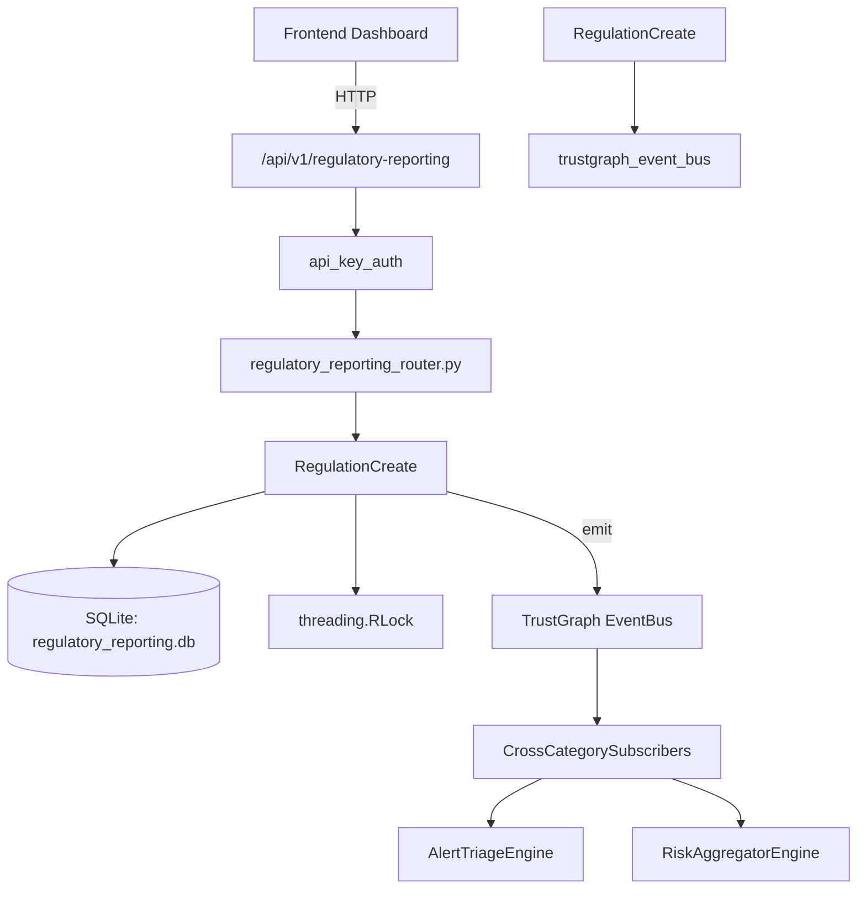

# US-0198: Regulatory Reporting

## Sub-Epic: GRC
**Master Goal**: ALDECI — $35/mo enterprise security intelligence platform replacing $50K-500K/yr tools

## User Story
As a **Robert Kim (Compliance Officer)**, I need to track regulatory changes
so that the platform delivers enterprise-grade grc capabilities at 1/1000th the cost of legacy tools.

## Why This Matters
Regulatory Reporting replaces functionality found in enterprise tools like CrowdStrike, Wiz, Snyk, and Rapid7.
By building this into ALDECI's $35/mo stack, customers save $50K+/yr on standalone GRC tooling.

## Architecture

## Current State: 95% Complete
- ✅ `register_regulation()` — Register a new regulation. Returns the regulation record. (line 153)
- ✅ `list_regulations()` — List regulations for org, optionally filtered by regulation_type. (line 187)
- ✅ `update_compliance_score()` — Update compliance score (clamped 0-100) and derive compliance level. (line 213)
- ✅ `create_report()` — Create a new compliance report in draft status. (line 239)
- ✅ `submit_report()` — Submit a draft report. (line 265)
- ✅ `list_reports()` — List reports for org, optionally filtered. (line 281)
- ❌ TrustGraph event emission — not yet verified

## Key Functions (from `suite-core/core/regulatory_reporting_engine.py` — 370 lines)
- `RegulatoryReportingEngine.register_regulation()` — Register a new regulation. Returns the regulation record. (line 153)
- `RegulatoryReportingEngine.list_regulations()` — List regulations for org, optionally filtered by regulation_type. (line 187)
- `RegulatoryReportingEngine.update_compliance_score()` — Update compliance score (clamped 0-100) and derive compliance level. (line 213)
- `RegulatoryReportingEngine.create_report()` — Create a new compliance report in draft status. (line 239)
- `RegulatoryReportingEngine.submit_report()` — Submit a draft report. (line 265)
- `RegulatoryReportingEngine.list_reports()` — List reports for org, optionally filtered. (line 281)
- `RegulatoryReportingEngine.get_regulatory_stats()` — Return regulatory compliance statistics for the org. (line 328)

## Dependencies
- **Depends on**: trustgraph_event_bus
- **Depended by**: Routers, TrustGraph EventBus, CrossCategorySubscribers
- **TrustGraph**: Event emission wired via ResponseInterceptorMiddleware
- **Source file**: `suite-core/core/regulatory_reporting_engine.py` (370 lines)
- **Router file**: `suite-api/apps/api/regulatory_reporting_router.py`

## API Endpoints
| Method | Path | Description |
|--------|------|-------------|
| POST | `/api/v1/regulatory-reporting/regulations` | register regulation |
| GET | `/api/v1/regulatory-reporting/regulations` | list regulations |
| PUT | `/api/v1/regulatory-reporting/regulations/{reg_id}/compliance-score` | update compliance score |
| POST | `/api/v1/regulatory-reporting/reports` | create report |
| PUT | `/api/v1/regulatory-reporting/reports/{report_id}/submit` | submit report |
| GET | `/api/v1/regulatory-reporting/reports` | list reports |
| GET | `/api/v1/regulatory-reporting/stats` | get regulatory stats |

## Tasks Remaining
1. Verify TrustGraph event emission works end-to-end (2h)
2. Add integration test with real persona workflow (2h)
3. Wire CrossCategorySubscriber consumer chain (1h)
4. Validate with 30-persona walkthrough (1h)
5. Optimize query performance for large datasets (2h)
6. Expand test coverage to edge cases (2h)

## Definition of Done
- [ ] Robert Kim (Compliance Officer) can access /api/v1/regulatory-reporting and get meaningful data
- [ ] All CRUD operations return correct HTTP status codes
- [ ] TrustGraph receives events from this engine
- [ ] 34+ tests passing in `tests/test_regulatory_reporting_engine.py`
- [ ] 30-persona walkthrough includes this endpoint at 100%
- [ ] No hardcoded org_id — all queries are org-scoped

## Sprint: Wave 48 (est. April 24-26, 2026)

## Test Coverage
- **Test file**: `tests/test_regulatory_reporting_engine.py`
- **Tests**: 34 tests
- **Status**: Passing
