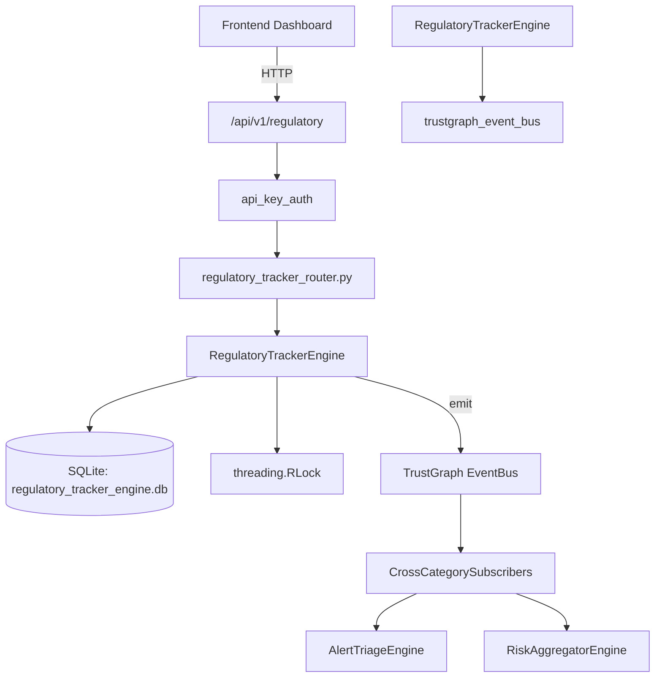

# US-0199: Regulatory Tracker

## Sub-Epic: GRC
**Master Goal**: ALDECI — $35/mo enterprise security intelligence platform replacing $50K-500K/yr tools

## User Story
As a **Robert Kim (Compliance Officer)**, I need to track regulatory changes
so that the platform delivers enterprise-grade grc capabilities at 1/1000th the cost of legacy tools.

## Why This Matters
Regulatory Tracker replaces functionality found in enterprise tools like CrowdStrike, Wiz, Snyk, and Rapid7.
By building this into ALDECI's $35/mo stack, customers save $50K+/yr on standalone GRC tooling.

## Architecture

## Current State: 95% Complete
- ✅ `add_regulation()` — Add a regulation. Returns the full regulation record. (line 145)
- ✅ `list_regulations()` — List regulations for an org, optionally filtered by category and/or status. (line 189)
- ✅ `add_change()` — Add a regulatory change. affected_domains is stored as JSON. (line 214)
- ✅ `list_changes()` — List changes ordered by effective_at ascending. (line 262)
- ✅ `get_upcoming_changes()` — Return changes where effective_at is within the next days_ahead days. (line 290)
- ✅ `add_obligation()` — Add a compliance obligation linked to a regulation (and optionally a change). (line 317)
- ❌ TrustGraph event emission — not yet verified

## Key Functions (from `suite-core/core/regulatory_tracker_engine.py` — 505 lines)
- `RegulatoryTrackerEngine.add_regulation()` — Add a regulation. Returns the full regulation record. (line 145)
- `RegulatoryTrackerEngine.list_regulations()` — List regulations for an org, optionally filtered by category and/or status. (line 189)
- `RegulatoryTrackerEngine.add_change()` — Add a regulatory change. affected_domains is stored as JSON. (line 214)
- `RegulatoryTrackerEngine.list_changes()` — List changes ordered by effective_at ascending. (line 262)
- `RegulatoryTrackerEngine.get_upcoming_changes()` — Return changes where effective_at is within the next days_ahead days. (line 290)
- `RegulatoryTrackerEngine.add_obligation()` — Add a compliance obligation linked to a regulation (and optionally a change). (line 317)
- `RegulatoryTrackerEngine.list_obligations()` — List obligations, optionally filtered by status and/or deadline_before (ISO date (line 355)
- `RegulatoryTrackerEngine.update_obligation_status()` — Update obligation status (and optionally owner). Returns True if updated. (line 376)

## Dependencies
- **Depends on**: trustgraph_event_bus
- **Depended by**: Routers, TrustGraph EventBus, CrossCategorySubscribers
- **TrustGraph**: Event emission wired via ResponseInterceptorMiddleware
- **Source file**: `suite-core/core/regulatory_tracker_engine.py` (505 lines)
- **Router file**: `suite-api/apps/api/regulatory_tracker_router.py`

## API Endpoints
| Method | Path | Description |
|--------|------|-------------|
| POST | `/api/v1/regulatory/regulations` | add regulation |
| GET | `/api/v1/regulatory/regulations/upcoming` | get upcoming regulations |
| GET | `/api/v1/regulatory/regulations/active` | get active regulations |
| GET | `/api/v1/regulatory/regulations/timeline` | get regulatory timeline |
| GET | `/api/v1/regulatory/impact/summary` | get impact summary |
| POST | `/api/v1/regulatory/impact/{regulation_id}` | assess impact |
| GET | `/api/v1/regulatory/action-plan/{regulation_id}` | get action plan |
| GET | `/api/v1/regulatory/stats` | get tracker stats |

## Tasks Remaining
1. Verify TrustGraph event emission works end-to-end (2h)
2. Add integration test with real persona workflow (2h)
3. Wire CrossCategorySubscriber consumer chain (1h)
4. Validate with 30-persona walkthrough (1h)
5. Optimize query performance for large datasets (2h)
6. Expand test coverage to edge cases (2h)

## Definition of Done
- [ ] Robert Kim (Compliance Officer) can access /api/v1/regulatory and get meaningful data
- [ ] All CRUD operations return correct HTTP status codes
- [ ] TrustGraph receives events from this engine
- [ ] 34+ tests passing in `tests/test_regulatory_tracker_engine.py`
- [ ] 30-persona walkthrough includes this endpoint at 100%
- [ ] No hardcoded org_id — all queries are org-scoped

## Sprint: Wave 48 (est. April 24-26, 2026)

## Test Coverage
- **Test file**: `tests/test_regulatory_tracker_engine.py`
- **Tests**: 34 tests
- **Status**: Passing
