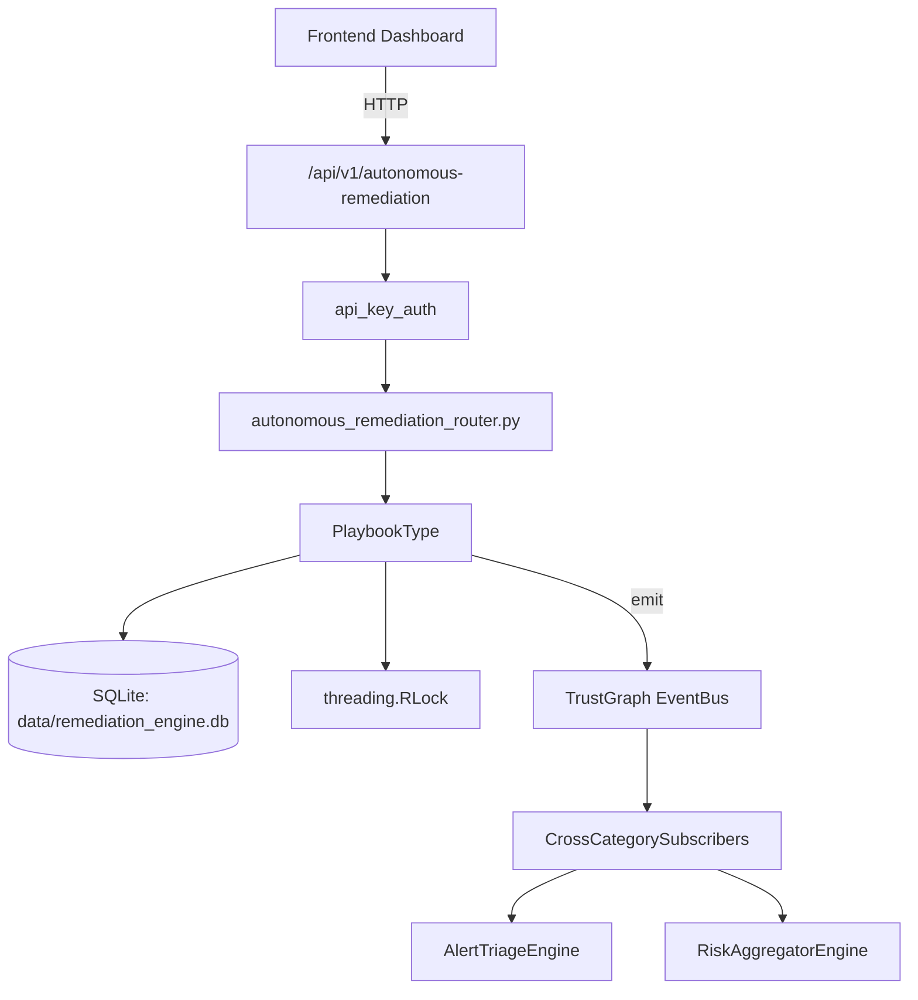

# US-0200: Remediation

## Sub-Epic: Advanced
**Master Goal**: ALDECI — $35/mo enterprise security intelligence platform replacing $50K-500K/yr tools

## User Story
As a **James Wilson (Security Engineer)**, I need to manage vulnerability remediation
so that the platform delivers enterprise-grade advanced capabilities at 1/1000th the cost of legacy tools.

## Why This Matters
Remediation replaces functionality found in enterprise tools like CrowdStrike, Wiz, Snyk, and Rapid7.
By building this into ALDECI's $35/mo stack, customers save $50K+/yr on standalone Advanced tooling.

## Architecture

## Current State: 95% Complete
- ✅ `create_playbook()` — Create and persist a new remediation playbook. (line 200)
- ✅ `get_playbook()` — Fetch a single playbook by ID. (line 237)
- ✅ `list_playbooks()` — List playbooks with optional org/type filters. (line 247)
- ✅ `execute_playbook()` — Start execution of a playbook. Creates an execution record. (line 269)
- ✅ `approve_execution()` — Approve a pending execution gate and begin running. (line 307)
- ✅ `reject_execution()` — Reject a pending execution gate. (line 333)
- ❌ TrustGraph event emission — not yet verified

## Key Functions (from `suite-core/core/remediation_engine.py` — 1178 lines)
- `RemediationEngine.create_playbook()` — Create and persist a new remediation playbook. (line 200)
- `RemediationEngine.get_playbook()` — Fetch a single playbook by ID. (line 237)
- `RemediationEngine.list_playbooks()` — List playbooks with optional org/type filters. (line 247)
- `RemediationEngine.execute_playbook()` — Start execution of a playbook. Creates an execution record. (line 269)
- `RemediationEngine.approve_execution()` — Approve a pending execution gate and begin running. (line 307)
- `RemediationEngine.reject_execution()` — Reject a pending execution gate. (line 333)
- `RemediationEngine.get_execution()` — Fetch a single execution by ID. (line 356)
- `RemediationEngine.list_executions()` — List executions with optional org/status filters. (line 366)

## Dependencies
- **Depends on**: standalone
- **Depended by**: Routers, TrustGraph EventBus, CrossCategorySubscribers
- **TrustGraph**: Event emission wired via ResponseInterceptorMiddleware
- **Source file**: `suite-core/core/remediation_engine.py` (1178 lines)
- **Router file**: `suite-api/apps/api/autonomous_remediation_router.py`

## API Endpoints
| Method | Path | Description |
|--------|------|-------------|
| POST | `/api/v1/autonomous-remediation/workflows` | create workflow |
| GET | `/api/v1/autonomous-remediation/workflows` | list workflows |
| GET | `/api/v1/autonomous-remediation/workflows/{workflow_id}` | get workflow |
| PUT | `/api/v1/autonomous-remediation/workflows/{workflow_id}/activate` | activate workflow |
| POST | `/api/v1/autonomous-remediation/executions` | record execution |
| GET | `/api/v1/autonomous-remediation/executions` | list executions |
| POST | `/api/v1/autonomous-remediation/playbooks` | create playbook |
| GET | `/api/v1/autonomous-remediation/playbooks` | list playbooks |
| PUT | `/api/v1/autonomous-remediation/playbooks/{playbook_id}/run` | run playbook |
| GET | `/api/v1/autonomous-remediation/stats` | get remediation stats |

## Tasks Remaining
1. Verify TrustGraph event emission works end-to-end (2h)
2. Add integration test with real persona workflow (2h)
3. Wire CrossCategorySubscriber consumer chain (1h)
4. Validate with 30-persona walkthrough (1h)
5. Optimize query performance for large datasets (2h)
6. Expand test coverage to edge cases (2h)

## Definition of Done
- [ ] James Wilson (Security Engineer) can access /api/v1/autonomous-remediation and get meaningful data
- [ ] All CRUD operations return correct HTTP status codes
- [ ] TrustGraph receives events from this engine
- [ ] 95+ tests passing in `tests/test_remediation_engine.py`
- [ ] 30-persona walkthrough includes this endpoint at 100%
- [ ] No hardcoded org_id — all queries are org-scoped

## Sprint: Wave 48 (est. April 24-26, 2026)

## Test Coverage
- **Test file**: `tests/test_remediation_engine.py`
- **Tests**: 95 tests
- **Status**: Passing
