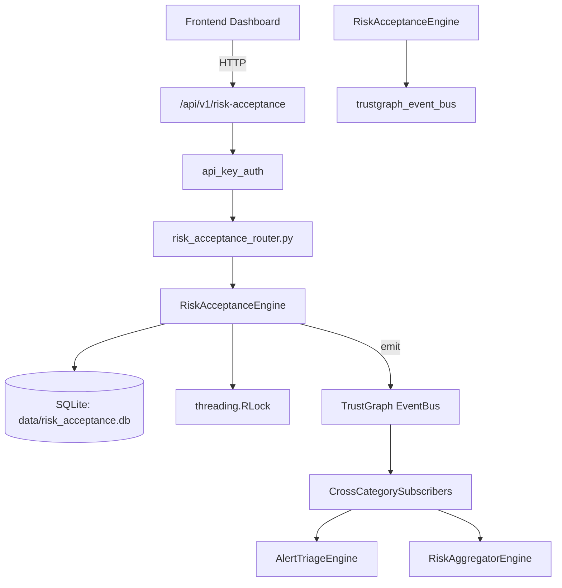

# US-0201: Risk Acceptance

## Sub-Epic: Executive
**Master Goal**: ALDECI — $35/mo enterprise security intelligence platform replacing $50K-500K/yr tools

## User Story
As a **David Park (Risk Manager)**, I need to quantify and manage security risk
so that the platform delivers enterprise-grade executive capabilities at 1/1000th the cost of legacy tools.

## Why This Matters
Risk Acceptance replaces functionality found in enterprise tools like CrowdStrike, Wiz, Snyk, and Rapid7.
By building this into ALDECI's $35/mo stack, customers save $50K+/yr on standalone Executive tooling.

## Architecture

## Current State: 95% Complete
- ✅ `submit_acceptance()` — Submit a risk acceptance request. (line 98)
- ✅ `approve()` — Approve a pending acceptance. (line 150)
- ✅ `reject()` — Reject a pending acceptance. (line 179)
- ✅ `revoke()` — Revoke an approved acceptance before expiry. (line 208)
- ✅ `get_acceptance()` — Get single acceptance record with full audit trail. (line 237)
- ✅ `get_by_finding()` — Get active acceptance for a finding (most recent non-rejected). (line 257)
- ❌ TrustGraph event emission — not yet verified

## Key Functions (from `suite-core/core/risk_acceptance_engine.py` — 377 lines)
- `RiskAcceptanceEngine.submit_acceptance()` — Submit a risk acceptance request. (line 98)
- `RiskAcceptanceEngine.approve()` — Approve a pending acceptance. (line 150)
- `RiskAcceptanceEngine.reject()` — Reject a pending acceptance. (line 179)
- `RiskAcceptanceEngine.revoke()` — Revoke an approved acceptance before expiry. (line 208)
- `RiskAcceptanceEngine.get_acceptance()` — Get single acceptance record with full audit trail. (line 237)
- `RiskAcceptanceEngine.get_by_finding()` — Get active acceptance for a finding (most recent non-rejected). (line 257)
- `RiskAcceptanceEngine.list_acceptances()` — List acceptances filtered by state. (line 279)
- `RiskAcceptanceEngine.check_expired()` — Find and mark expired acceptances. Returns list of newly expired. (line 297)

## Dependencies
- **Depends on**: trustgraph_event_bus
- **Depended by**: Routers, TrustGraph EventBus, CrossCategorySubscribers
- **TrustGraph**: Event emission wired via ResponseInterceptorMiddleware
- **Source file**: `suite-core/core/risk_acceptance_engine.py` (377 lines)
- **Router file**: `suite-api/apps/api/risk_acceptance_router.py`

## API Endpoints
| Method | Path | Description |
|--------|------|-------------|
| POST | `/api/v1/risk-acceptance/request` | request acceptance |
| GET | `/api/v1/risk-acceptance` | list acceptances |
| GET | `/api/v1/risk-acceptance/pending` | list pending |
| GET | `/api/v1/risk-acceptance/expiring` | list expiring |
| GET | `/api/v1/risk-acceptance/stats` | acceptance stats |
| POST | `/api/v1/risk-acceptance/expire` | expire overdue |
| GET | `/api/v1/risk-acceptance/{acceptance_id}` | get acceptance |
| POST | `/api/v1/risk-acceptance/{acceptance_id}/approve` | approve acceptance |
| POST | `/api/v1/risk-acceptance/{acceptance_id}/reject` | reject acceptance |
| POST | `/api/v1/risk-acceptance/{acceptance_id}/revoke` | revoke acceptance |
| GET | `/api/v1/risk-acceptance/{acceptance_id}/history` | review history |

## Tasks Remaining
1. Verify TrustGraph event emission works end-to-end (2h)
2. Add integration test with real persona workflow (2h)
3. Wire CrossCategorySubscriber consumer chain (1h)
4. Validate with 30-persona walkthrough (1h)
5. Optimize query performance for large datasets (2h)
6. Expand test coverage to edge cases (2h)

## Definition of Done
- [ ] David Park (Risk Manager) can access /api/v1/risk-acceptance and get meaningful data
- [ ] All CRUD operations return correct HTTP status codes
- [ ] TrustGraph receives events from this engine
- [ ] 62+ tests passing in `tests/test_risk_acceptance_engine.py`
- [ ] 30-persona walkthrough includes this endpoint at 100%
- [ ] No hardcoded org_id — all queries are org-scoped

## Sprint: Wave 48 (est. April 24-26, 2026)

## Test Coverage
- **Test file**: `tests/test_risk_acceptance_engine.py`
- **Tests**: 62 tests
- **Status**: Passing
