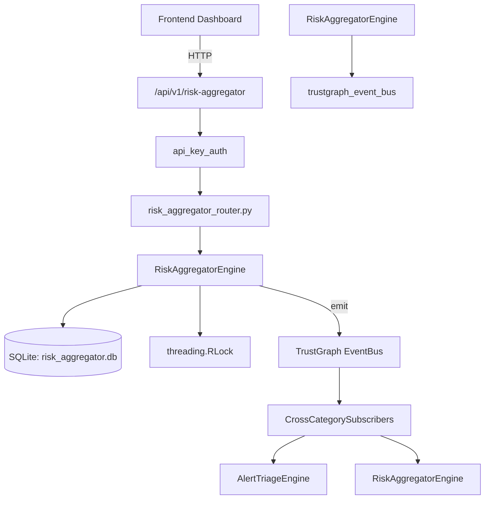

# US-0202: Risk Aggregator

## Sub-Epic: Executive
**Master Goal**: ALDECI — $35/mo enterprise security intelligence platform replacing $50K-500K/yr tools

## User Story
As a **David Park (Risk Manager)**, I need to quantify and manage security risk
so that the platform delivers enterprise-grade executive capabilities at 1/1000th the cost of legacy tools.

## Why This Matters
Risk Aggregator replaces functionality found in enterprise tools like CrowdStrike, Wiz, Snyk, and Rapid7.
By building this into ALDECI's $35/mo stack, customers save $50K+/yr on standalone Executive tooling.

## Architecture

## Current State: 95% Complete
- ✅ `record_risk_score()` — Record a risk score for an entity. (line 143)
- ✅ `list_risk_scores()` — List latest risk scores, optionally filtered. (line 201)
- ✅ `get_entity_risk()` — Return the latest risk score and full history for an entity. (line 223)
- ✅ `get_risk_heatmap()` — Return counts per entity_type per severity bucket. (line 247)
- ✅ `get_top_risks()` — Return the highest risk entities (latest score per entity). (line 270)
- ✅ `calculate_org_risk_score()` — Calculate composite organisational risk score (0-100) with trend. (line 292)
- ❌ TrustGraph event emission — not yet verified

## Key Functions (from `suite-core/core/risk_aggregator_engine.py` — 468 lines)
- `RiskAggregatorEngine.record_risk_score()` — Record a risk score for an entity. (line 143)
- `RiskAggregatorEngine.list_risk_scores()` — List latest risk scores, optionally filtered. (line 201)
- `RiskAggregatorEngine.get_entity_risk()` — Return the latest risk score and full history for an entity. (line 223)
- `RiskAggregatorEngine.get_risk_heatmap()` — Return counts per entity_type per severity bucket. (line 247)
- `RiskAggregatorEngine.get_top_risks()` — Return the highest risk entities (latest score per entity). (line 270)
- `RiskAggregatorEngine.calculate_org_risk_score()` — Calculate composite organisational risk score (0-100) with trend. (line 292)
- `RiskAggregatorEngine.create_risk_threshold()` — Create a risk threshold rule. (line 376)
- `RiskAggregatorEngine.list_risk_thresholds()` — List all risk thresholds for an org. (line 418)

## Dependencies
- **Depends on**: trustgraph_event_bus
- **Depended by**: Routers, TrustGraph EventBus, CrossCategorySubscribers
- **TrustGraph**: Event emission wired via ResponseInterceptorMiddleware
- **Source file**: `suite-core/core/risk_aggregator_engine.py` (468 lines)
- **Router file**: `suite-api/apps/api/risk_aggregator_router.py`

## API Endpoints
| Method | Path | Description |
|--------|------|-------------|
| POST | `/api/v1/risk-aggregator/scores` | record risk score |
| GET | `/api/v1/risk-aggregator/scores` | list risk scores |
| GET | `/api/v1/risk-aggregator/scores/entity/{entity_id}` | get entity risk |
| GET | `/api/v1/risk-aggregator/heatmap` | get risk heatmap |
| GET | `/api/v1/risk-aggregator/top-risks` | get top risks |
| GET | `/api/v1/risk-aggregator/org-score` | calculate org risk score |
| POST | `/api/v1/risk-aggregator/thresholds` | create risk threshold |
| GET | `/api/v1/risk-aggregator/thresholds` | list risk thresholds |
| GET | `/api/v1/risk-aggregator/stats` | get aggregator stats |

## Tasks Remaining
1. Verify TrustGraph event emission works end-to-end (2h)
2. Add integration test with real persona workflow (2h)
3. Wire CrossCategorySubscriber consumer chain (1h)
4. Validate with 30-persona walkthrough (1h)
5. Optimize query performance for large datasets (2h)
6. Expand test coverage to edge cases (2h)

## Definition of Done
- [ ] David Park (Risk Manager) can access /api/v1/risk-aggregator and get meaningful data
- [ ] All CRUD operations return correct HTTP status codes
- [ ] TrustGraph receives events from this engine
- [ ] 39+ tests passing in `tests/test_risk_aggregator_engine.py`
- [ ] 30-persona walkthrough includes this endpoint at 100%
- [ ] No hardcoded org_id — all queries are org-scoped

## Sprint: Wave 48 (est. April 24-26, 2026)

## Test Coverage
- **Test file**: `tests/test_risk_aggregator_engine.py`
- **Tests**: 39 tests
- **Status**: Passing
