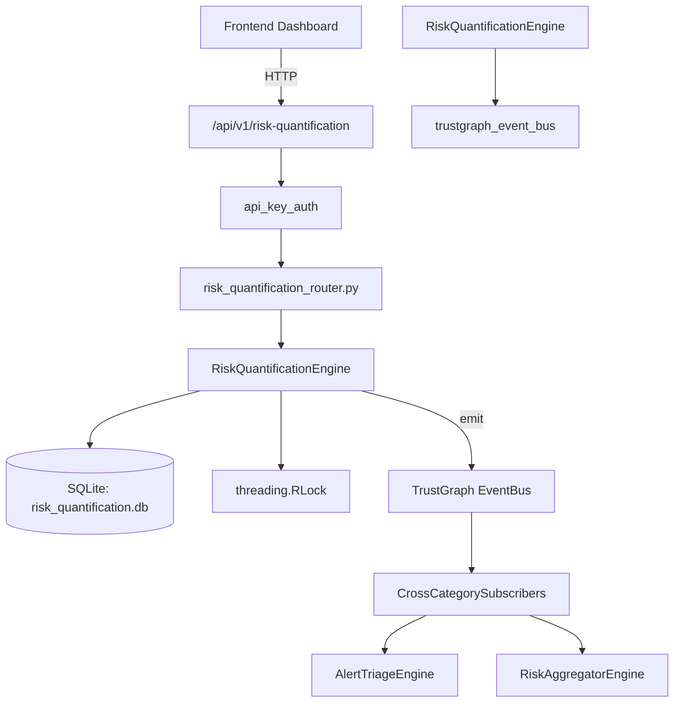

# US-0203: Risk Quantification

## Sub-Epic: Executive
**Master Goal**: ALDECI — $35/mo enterprise security intelligence platform replacing $50K-500K/yr tools

## User Story
As a **David Park (Risk Manager)**, I need to quantify and manage security risk
so that the platform delivers enterprise-grade executive capabilities at 1/1000th the cost of legacy tools.

## Why This Matters
Risk Quantification replaces functionality found in enterprise tools like CrowdStrike, Wiz, Snyk, and Rapid7.
By building this into ALDECI's $35/mo stack, customers save $50K+/yr on standalone Executive tooling.

## Architecture

## Current State: 95% Complete
- ✅ `create_scenario()` — Create a new risk scenario. Returns the full scenario dict. (line 164)
- ✅ `get_scenario()` — implemented (line 215)
- ✅ `list_scenarios()` — implemented (line 223)
- ✅ `update_scenario()` — Update allowed fields on a scenario. Returns True if updated. (line 231)
- ✅ `run_monte_carlo()` — Run a Monte Carlo simulation on the scenario's loss distribution. (line 278)
- ✅ `create_treatment()` — Create a risk treatment. ROI = (expected_loss × risk_reduction_pct/100) / cost. (line 348)
- ❌ TrustGraph event emission — not yet verified

## Key Functions (from `suite-core/core/risk_quantification_engine.py` — 551 lines)
- `RiskQuantificationEngine.create_scenario()` — Create a new risk scenario. Returns the full scenario dict. (line 164)
- `RiskQuantificationEngine.get_scenario()` — Handle get scenario (line 215)
- `RiskQuantificationEngine.list_scenarios()` — Handle list scenarios (line 223)
- `RiskQuantificationEngine.update_scenario()` — Update allowed fields on a scenario. Returns True if updated. (line 231)
- `RiskQuantificationEngine.run_monte_carlo()` — Run a Monte Carlo simulation on the scenario's loss distribution. (line 278)
- `RiskQuantificationEngine.create_treatment()` — Create a risk treatment. ROI = (expected_loss × risk_reduction_pct/100) / cost. (line 348)
- `RiskQuantificationEngine.list_treatments()` — Handle list treatments (line 398)
- `RiskQuantificationEngine.record_financial_impact()` — Record a financial impact from an actual incident. (line 419)

## Dependencies
- **Depends on**: trustgraph_event_bus
- **Depended by**: Routers, TrustGraph EventBus, CrossCategorySubscribers
- **TrustGraph**: Event emission wired via ResponseInterceptorMiddleware
- **Source file**: `suite-core/core/risk_quantification_engine.py` (551 lines)
- **Router file**: `suite-api/apps/api/risk_quantification_router.py`

## API Endpoints
| Method | Path | Description |
|--------|------|-------------|
| GET | `/api/v1/risk-quantification/scenarios` | list scenarios |
| POST | `/api/v1/risk-quantification/scenarios` | create scenario |
| PATCH | `/api/v1/risk-quantification/scenarios/{scenario_id}` | update scenario |
| POST | `/api/v1/risk-quantification/scenarios/{scenario_id}/monte-carlo` | run monte carlo |
| GET | `/api/v1/risk-quantification/treatments` | list treatments |
| POST | `/api/v1/risk-quantification/treatments` | create treatment |
| GET | `/api/v1/risk-quantification/financial-impacts` | list financial impacts |
| POST | `/api/v1/risk-quantification/financial-impacts` | record financial impact |
| GET | `/api/v1/risk-quantification/stats` | get risk stats |

## Tasks Remaining
1. Verify TrustGraph event emission works end-to-end (2h)
2. Add integration test with real persona workflow (2h)
3. Wire CrossCategorySubscriber consumer chain (1h)
4. Validate with 30-persona walkthrough (1h)
5. Optimize query performance for large datasets (2h)
6. Expand test coverage to edge cases (2h)

## Definition of Done
- [ ] David Park (Risk Manager) can access /api/v1/risk-quantification and get meaningful data
- [ ] All CRUD operations return correct HTTP status codes
- [ ] TrustGraph receives events from this engine
- [ ] 33+ tests passing in `tests/test_risk_quantification_engine.py`
- [ ] 30-persona walkthrough includes this endpoint at 100%
- [ ] No hardcoded org_id — all queries are org-scoped

## Sprint: Wave 48 (est. April 24-26, 2026)

## Test Coverage
- **Test file**: `tests/test_risk_quantification_engine.py`
- **Tests**: 33 tests
- **Status**: Passing
