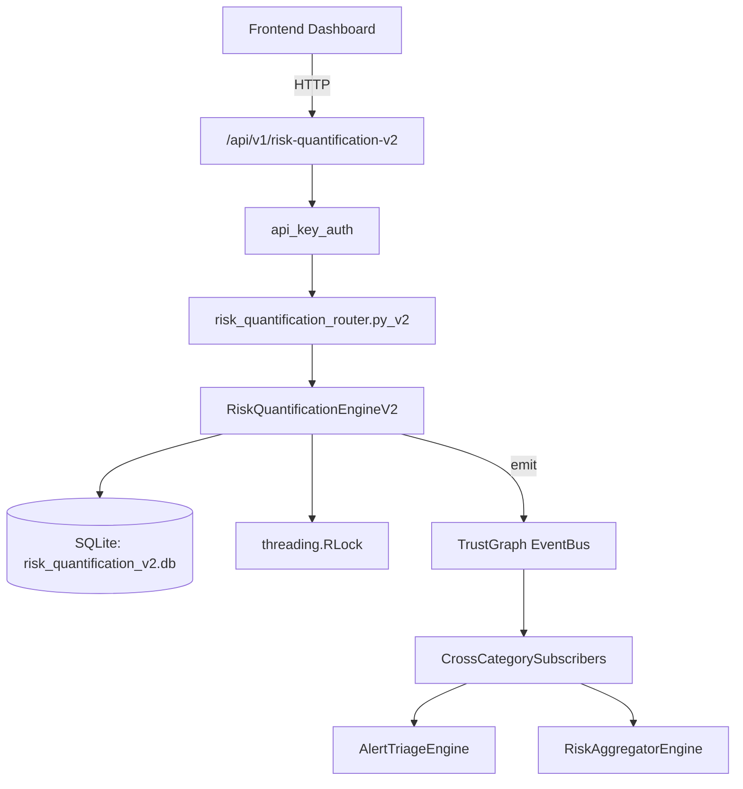

# US-0204: Risk Quantification V2

## Sub-Epic: Executive
**Master Goal**: ALDECI — $35/mo enterprise security intelligence platform replacing $50K-500K/yr tools

## User Story
As a **David Park (Risk Manager)**, I need to quantify and manage security risk
so that the platform delivers enterprise-grade executive capabilities at 1/1000th the cost of legacy tools.

## Why This Matters
Risk Quantification V2 replaces functionality found in enterprise tools like CrowdStrike, Wiz, Snyk, and Rapid7.
By building this into ALDECI's $35/mo stack, customers save $50K+/yr on standalone Executive tooling.

## Architecture

## Current State: 85% Complete
- ✅ `create_scenario()` — Create a FAIR risk scenario with computed SLE and ALE. (line 189)
- ✅ `add_control()` — Add a control to a scenario; compute ROI; recompute scenario metrics. (line 244)
- ✅ `update_rates()` — Update scenario rate fields and recompute SLE/ALE/residual_ale/risk_level. (line 303)
- ✅ `take_snapshot()` — Take a portfolio snapshot for the org. (line 343)
- ✅ `get_portfolio_summary()` — Return aggregate portfolio summary for an org. (line 385)
- ✅ `get_scenario_detail()` — Return scenario with all controls and recommended controls. (line 415)
- ❌ No dedicated router — endpoint may be in gap_router.py
- ❌ TrustGraph event emission — not yet verified

## Key Functions (from `suite-core/core/risk_quantification_engine_v2.py` — 466 lines)
- `RiskQuantificationEngineV2.create_scenario()` — Create a FAIR risk scenario with computed SLE and ALE. (line 189)
- `RiskQuantificationEngineV2.add_control()` — Add a control to a scenario; compute ROI; recompute scenario metrics. (line 244)
- `RiskQuantificationEngineV2.update_rates()` — Update scenario rate fields and recompute SLE/ALE/residual_ale/risk_level. (line 303)
- `RiskQuantificationEngineV2.take_snapshot()` — Take a portfolio snapshot for the org. (line 343)
- `RiskQuantificationEngineV2.get_portfolio_summary()` — Return aggregate portfolio summary for an org. (line 385)
- `RiskQuantificationEngineV2.get_scenario_detail()` — Return scenario with all controls and recommended controls. (line 415)
- `RiskQuantificationEngineV2.get_snapshot_history()` — Return snapshots for the org within the last N days, newest first. (line 435)
- `RiskQuantificationEngineV2.get_roi_analysis()` — Return all controls with positive ROI across the org, ordered by ROI DESC. (line 454)

## Dependencies
- **Depends on**: standalone
- **Depended by**: Routers, TrustGraph EventBus, CrossCategorySubscribers
- **TrustGraph**: Event emission wired via ResponseInterceptorMiddleware
- **Source file**: `suite-core/core/risk_quantification_engine_v2.py` (466 lines)
- **Router file**: `suite-api/apps/api/N/A`

## API Endpoints
| Method | Path | Description |
|--------|------|-------------|
| GET | `/api/v1/risk-quantification-v2` | List resources |

## Tasks Remaining
1. Verify TrustGraph event emission works end-to-end (2h)
2. Add integration test with real persona workflow (2h)
3. Wire CrossCategorySubscriber consumer chain (1h)
4. Validate with 30-persona walkthrough (1h)
5. Create dedicated router (needs wiring in app.py) (3h)
6. Expand test coverage to edge cases (2h)

## Definition of Done
- [ ] David Park (Risk Manager) can access /api/v1/risk-quantification-v2 and get meaningful data
- [ ] All CRUD operations return correct HTTP status codes
- [ ] TrustGraph receives events from this engine
- [ ] 48+ tests passing in `tests/test_risk_quantification_engine_v2.py`
- [ ] 30-persona walkthrough includes this endpoint at 100%
- [ ] No hardcoded org_id — all queries are org-scoped

## Sprint: Wave 48 (est. April 24-26, 2026)

## Test Coverage
- **Test file**: `tests/test_risk_quantification_engine_v2.py`
- **Tests**: 48 tests
- **Status**: Passing
