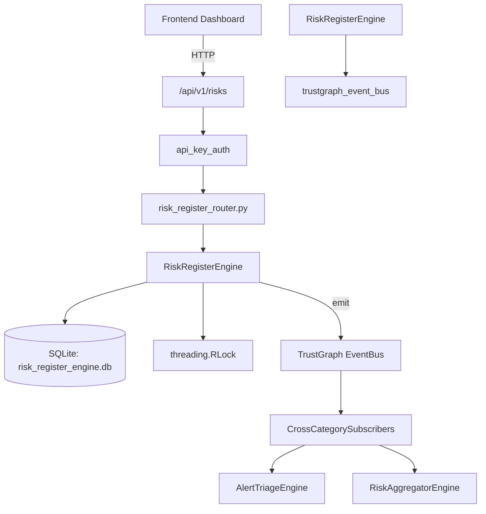

# US-0205: Risk Register

## Sub-Epic: Executive
**Master Goal**: ALDECI — $35/mo enterprise security intelligence platform replacing $50K-500K/yr tools

## User Story
As a **David Park (Risk Manager)**, I need to quantify and manage security risk
so that the platform delivers enterprise-grade executive capabilities at 1/1000th the cost of legacy tools.

## Why This Matters
Risk Register replaces functionality found in enterprise tools like CrowdStrike, Wiz, Snyk, and Rapid7.
By building this into ALDECI's $35/mo stack, customers save $50K+/yr on standalone Executive tooling.

## Architecture

## Current State: 95% Complete
- ✅ `create_risk()` — Create a new risk record with auto-computed score and level. (line 136)
- ✅ `list_risks()` — List risks with optional filters. (line 210)
- ✅ `get_risk()` — Retrieve a single risk by ID within the org. (line 234)
- ✅ `update_risk_status()` — Update status (and optionally treatment_plan) for a risk. (line 243)
- ✅ `add_risk_treatment()` — Add a treatment record for a risk. (line 271)
- ✅ `list_treatments()` — List treatments, optionally filtered by risk_id. (line 310)
- ❌ TrustGraph event emission — not yet verified

## Key Functions (from `suite-core/core/risk_register_engine.py` — 446 lines)
- `RiskRegisterEngine.create_risk()` — Create a new risk record with auto-computed score and level. (line 136)
- `RiskRegisterEngine.list_risks()` — List risks with optional filters. (line 210)
- `RiskRegisterEngine.get_risk()` — Retrieve a single risk by ID within the org. (line 234)
- `RiskRegisterEngine.update_risk_status()` — Update status (and optionally treatment_plan) for a risk. (line 243)
- `RiskRegisterEngine.add_risk_treatment()` — Add a treatment record for a risk. (line 271)
- `RiskRegisterEngine.list_treatments()` — List treatments, optionally filtered by risk_id. (line 310)
- `RiskRegisterEngine.get_risk_context()` — Query TrustGraph for cross-domain context about a risk. (line 330)
- `RiskRegisterEngine.get_risk_stats()` — Return aggregated risk statistics for an org. (line 386)

## Dependencies
- **Depends on**: trustgraph_event_bus
- **Depended by**: Routers, TrustGraph EventBus, CrossCategorySubscribers
- **TrustGraph**: Event emission wired via ResponseInterceptorMiddleware
- **Source file**: `suite-core/core/risk_register_engine.py` (446 lines)
- **Router file**: `suite-api/apps/api/risk_register_router.py`

## API Endpoints
| Method | Path | Description |
|--------|------|-------------|
| POST | `/api/v1/risks` | create risk |
| GET | `/api/v1/risks` | list risks |
| POST | `/api/v1/risks/controls` | create control |
| GET | `/api/v1/risks/controls/list` | list controls |
| POST | `/api/v1/risks/treatments` | create treatment |
| PATCH | `/api/v1/risks/treatments/{plan_id}/status` | update treatment status |
| POST | `/api/v1/risks/kris` | create kri |
| GET | `/api/v1/risks/kris/list` | list kris |
| PATCH | `/api/v1/risks/kris/{kri_id}/value` | update kri value |
| POST | `/api/v1/risks/appetite` | set appetite |
| GET | `/api/v1/risks/appetite/list` | list appetites |
| GET | `/api/v1/risks/heatmap` | get heat map |

## Tasks Remaining
1. Verify TrustGraph event emission works end-to-end (2h)
2. Add integration test with real persona workflow (2h)
3. Wire CrossCategorySubscriber consumer chain (1h)
4. Validate with 30-persona walkthrough (1h)
5. Optimize query performance for large datasets (2h)
6. Expand test coverage to edge cases (2h)

## Definition of Done
- [ ] David Park (Risk Manager) can access /api/v1/risks and get meaningful data
- [ ] All CRUD operations return correct HTTP status codes
- [ ] TrustGraph receives events from this engine
- [ ] 47+ tests passing in `tests/test_risk_register_engine.py`
- [ ] 30-persona walkthrough includes this endpoint at 100%
- [ ] No hardcoded org_id — all queries are org-scoped

## Sprint: Wave 48 (est. April 24-26, 2026)

## Test Coverage
- **Test file**: `tests/test_risk_register_engine.py`
- **Tests**: 47 tests
- **Status**: Passing
