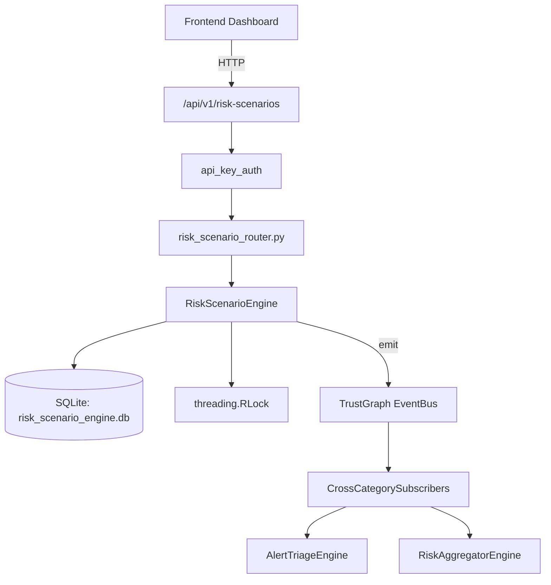

# US-0206: Risk Scenario

## Sub-Epic: Executive
**Master Goal**: ALDECI — $35/mo enterprise security intelligence platform replacing $50K-500K/yr tools

## User Story
As a **David Park (Risk Manager)**, I need to quantify and manage security risk
so that the platform delivers enterprise-grade executive capabilities at 1/1000th the cost of legacy tools.

## Why This Matters
Risk Scenario replaces functionality found in enterprise tools like CrowdStrike, Wiz, Snyk, and Rapid7.
By building this into ALDECI's $35/mo stack, customers save $50K+/yr on standalone Executive tooling.

## Architecture

## Current State: 95% Complete
- ✅ `create_scenario()` — Create a risk scenario with auto-computed inherent and residual risk. (line 175)
- ✅ `add_mitigation()` — Add a mitigation to a scenario; recomputes residual_risk. (line 228)
- ✅ `implement_mitigation()` — Mark a mitigation as implemented; recomputes residual_risk and risk_level. (line 270)
- ✅ `review_scenario()` — Create a review; adjusts likelihood/impact; recomputes all risk fields. (line 290)
- ✅ `get_scenario()` — Get scenario with its mitigations and reviews. (line 342)
- ✅ `list_scenarios()` — List scenarios for an org with optional filters. (line 366)
- ❌ TrustGraph event emission — not yet verified

## Key Functions (from `suite-core/core/risk_scenario_engine.py` — 463 lines)
- `RiskScenarioEngine.create_scenario()` — Create a risk scenario with auto-computed inherent and residual risk. (line 175)
- `RiskScenarioEngine.add_mitigation()` — Add a mitigation to a scenario; recomputes residual_risk. (line 228)
- `RiskScenarioEngine.implement_mitigation()` — Mark a mitigation as implemented; recomputes residual_risk and risk_level. (line 270)
- `RiskScenarioEngine.review_scenario()` — Create a review; adjusts likelihood/impact; recomputes all risk fields. (line 290)
- `RiskScenarioEngine.get_scenario()` — Get scenario with its mitigations and reviews. (line 342)
- `RiskScenarioEngine.list_scenarios()` — List scenarios for an org with optional filters. (line 366)
- `RiskScenarioEngine.get_top_risks()` — Return top N scenarios ordered by residual_risk DESC. (line 386)
- `RiskScenarioEngine.get_risk_reduction_summary()` — Per scenario: inherent_risk, residual_risk, reduction_pct. (line 396)

## Dependencies
- **Depends on**: standalone
- **Depended by**: Routers, TrustGraph EventBus, CrossCategorySubscribers
- **TrustGraph**: Event emission wired via ResponseInterceptorMiddleware
- **Source file**: `suite-core/core/risk_scenario_engine.py` (463 lines)
- **Router file**: `suite-api/apps/api/risk_scenario_router.py`

## API Endpoints
| Method | Path | Description |
|--------|------|-------------|
| POST | `/api/v1/risk-scenarios/scenarios` | create scenario |
| GET | `/api/v1/risk-scenarios/scenarios` | list scenarios |
| GET | `/api/v1/risk-scenarios/scenarios/{scenario_id}` | get scenario |
| POST | `/api/v1/risk-scenarios/scenarios/{scenario_id}/mitigations` | add mitigation |
| POST | `/api/v1/risk-scenarios/scenarios/{scenario_id}/mitigations/{mitigation_id}/implement` | implement mitigation |
| POST | `/api/v1/risk-scenarios/scenarios/{scenario_id}/reviews` | review scenario |
| GET | `/api/v1/risk-scenarios/top-risks` | get top risks |
| GET | `/api/v1/risk-scenarios/risk-reduction` | get risk reduction summary |
| GET | `/api/v1/risk-scenarios/stats` | get scenario stats |

## Tasks Remaining
1. Verify TrustGraph event emission works end-to-end (2h)
2. Add integration test with real persona workflow (2h)
3. Wire CrossCategorySubscriber consumer chain (1h)
4. Validate with 30-persona walkthrough (1h)
5. Optimize query performance for large datasets (2h)
6. Expand test coverage to edge cases (2h)

## Definition of Done
- [ ] David Park (Risk Manager) can access /api/v1/risk-scenarios and get meaningful data
- [ ] All CRUD operations return correct HTTP status codes
- [ ] TrustGraph receives events from this engine
- [ ] 47+ tests passing in `tests/test_risk_scenario_engine.py`
- [ ] 30-persona walkthrough includes this endpoint at 100%
- [ ] No hardcoded org_id — all queries are org-scoped

## Sprint: Wave 48 (est. April 24-26, 2026)

## Test Coverage
- **Test file**: `tests/test_risk_scenario_engine.py`
- **Tests**: 47 tests
- **Status**: Passing
