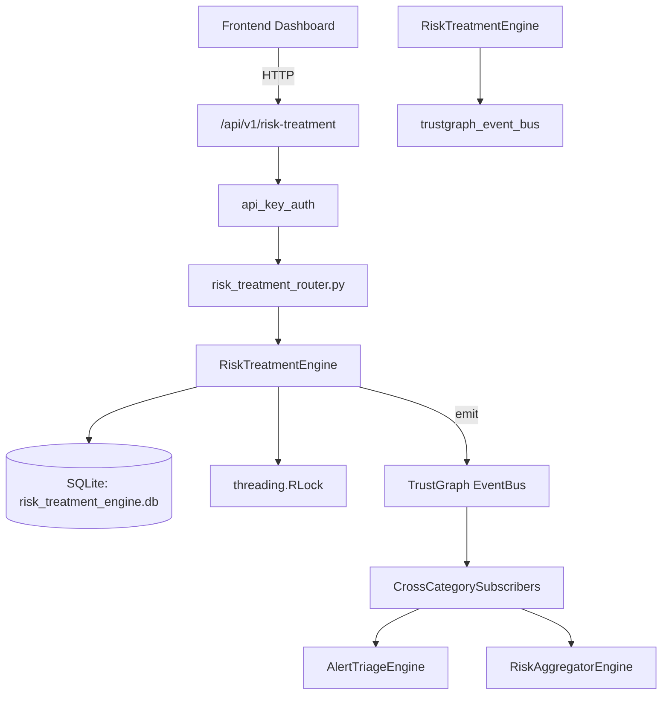

# US-0207: Risk Treatment

## Sub-Epic: Executive
**Master Goal**: ALDECI — $35/mo enterprise security intelligence platform replacing $50K-500K/yr tools

## User Story
As a **David Park (Risk Manager)**, I need to quantify and manage security risk
so that the platform delivers enterprise-grade executive capabilities at 1/1000th the cost of legacy tools.

## Why This Matters
Risk Treatment replaces functionality found in enterprise tools like CrowdStrike, Wiz, Snyk, and Rapid7.
By building this into ALDECI's $35/mo stack, customers save $50K+/yr on standalone Executive tooling.

## Architecture

## Current State: 95% Complete
- ✅ `create_treatment()` — Create a new risk treatment record. (line 115)
- ✅ `list_treatments()` — List treatments with optional filters. (line 190)
- ✅ `get_treatment()` — Retrieve a single treatment by ID within the org. (line 214)
- ✅ `update_treatment_status()` — Update treatment_status (and optionally progress_pct). Sets completed_at if comp (line 223)
- ✅ `add_progress_note()` — Add a progress note to a treatment. (line 264)
- ✅ `list_progress_notes()` — List progress notes for a treatment, ordered by created_at DESC. (line 304)
- ❌ TrustGraph event emission — not yet verified

## Key Functions (from `suite-core/core/risk_treatment_engine.py` — 393 lines)
- `RiskTreatmentEngine.create_treatment()` — Create a new risk treatment record. (line 115)
- `RiskTreatmentEngine.list_treatments()` — List treatments with optional filters. (line 190)
- `RiskTreatmentEngine.get_treatment()` — Retrieve a single treatment by ID within the org. (line 214)
- `RiskTreatmentEngine.update_treatment_status()` — Update treatment_status (and optionally progress_pct). Sets completed_at if comp (line 223)
- `RiskTreatmentEngine.add_progress_note()` — Add a progress note to a treatment. (line 264)
- `RiskTreatmentEngine.list_progress_notes()` — List progress notes for a treatment, ordered by created_at DESC. (line 304)
- `RiskTreatmentEngine.get_treatment_stats()` — Return aggregated treatment statistics for an org. (line 323)

## Dependencies
- **Depends on**: trustgraph_event_bus
- **Depended by**: Routers, TrustGraph EventBus, CrossCategorySubscribers
- **TrustGraph**: Event emission wired via ResponseInterceptorMiddleware
- **Source file**: `suite-core/core/risk_treatment_engine.py` (393 lines)
- **Router file**: `suite-api/apps/api/risk_treatment_router.py`

## API Endpoints
| Method | Path | Description |
|--------|------|-------------|
| POST | `/api/v1/risk-treatment/treatments` | create treatment |
| GET | `/api/v1/risk-treatment/treatments` | list treatments |
| GET | `/api/v1/risk-treatment/treatments/{treatment_id}` | get treatment |
| PATCH | `/api/v1/risk-treatment/treatments/{treatment_id}/status` | update treatment status |
| POST | `/api/v1/risk-treatment/treatments/{treatment_id}/notes` | add progress note |
| GET | `/api/v1/risk-treatment/treatments/{treatment_id}/notes` | list progress notes |
| GET | `/api/v1/risk-treatment/stats` | get treatment stats |

## Tasks Remaining
1. Verify TrustGraph event emission works end-to-end (2h)
2. Add integration test with real persona workflow (2h)
3. Wire CrossCategorySubscriber consumer chain (1h)
4. Validate with 30-persona walkthrough (1h)
5. Optimize query performance for large datasets (2h)
6. Expand test coverage to edge cases (2h)

## Definition of Done
- [ ] David Park (Risk Manager) can access /api/v1/risk-treatment and get meaningful data
- [ ] All CRUD operations return correct HTTP status codes
- [ ] TrustGraph receives events from this engine
- [ ] 43+ tests passing in `tests/test_risk_treatment_engine.py`
- [ ] 30-persona walkthrough includes this endpoint at 100%
- [ ] No hardcoded org_id — all queries are org-scoped

## Sprint: Wave 48 (est. April 24-26, 2026)

## Test Coverage
- **Test file**: `tests/test_risk_treatment_engine.py`
- **Tests**: 43 tests
- **Status**: Passing
