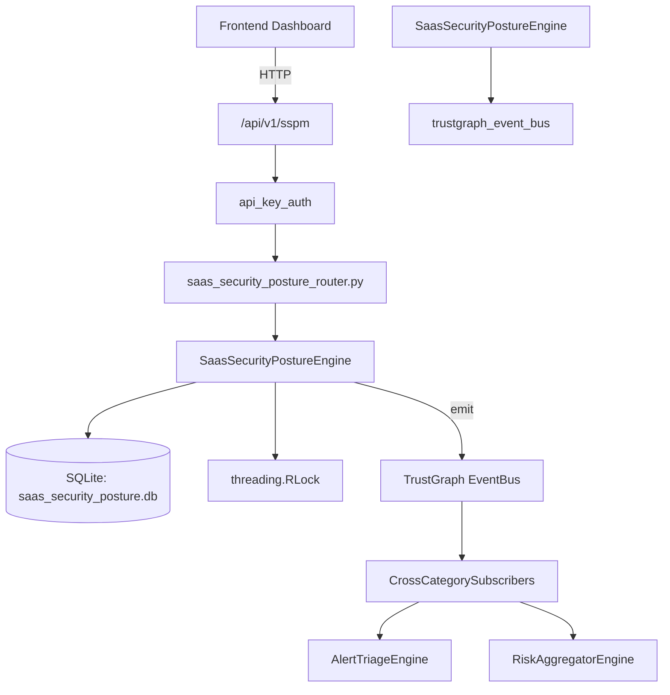

# US-0208: Saas Security Posture

## Sub-Epic: CSPM
**Master Goal**: ALDECI — $35/mo enterprise security intelligence platform replacing $50K-500K/yr tools

## User Story
As a **Jennifer Wu (Cloud Security Architect)**, I need to assess SaaS security posture
so that the platform delivers enterprise-grade cspm capabilities at 1/1000th the cost of legacy tools.

## Why This Matters
Saas Security Posture replaces functionality found in enterprise tools like CrowdStrike, Wiz, Snyk, and Rapid7.
By building this into ALDECI's $35/mo stack, customers save $50K+/yr on standalone CSPM tooling.

## Architecture

## Current State: 95% Complete
- ✅ `register_app()` — Register a new SaaS application. (line 144)
- ✅ `list_apps()` — List SaaS apps with optional filters. (line 192)
- ✅ `get_app()` — Get a single SaaS app by ID. (line 213)
- ✅ `assess_app()` — Conduct a security assessment for a SaaS app. (line 227)
- ✅ `list_assessments()` — List assessments with optional app filter. (line 272)
- ✅ `record_finding()` — Record a security finding for a SaaS app. (line 293)
- ❌ TrustGraph event emission — not yet verified

## Key Functions (from `suite-core/core/saas_security_posture_engine.py` — 405 lines)
- `SaasSecurityPostureEngine.register_app()` — Register a new SaaS application. (line 144)
- `SaasSecurityPostureEngine.list_apps()` — List SaaS apps with optional filters. (line 192)
- `SaasSecurityPostureEngine.get_app()` — Get a single SaaS app by ID. (line 213)
- `SaasSecurityPostureEngine.assess_app()` — Conduct a security assessment for a SaaS app. (line 227)
- `SaasSecurityPostureEngine.list_assessments()` — List assessments with optional app filter. (line 272)
- `SaasSecurityPostureEngine.record_finding()` — Record a security finding for a SaaS app. (line 293)
- `SaasSecurityPostureEngine.list_findings()` — List findings with optional filters. (line 325)
- `SaasSecurityPostureEngine.get_sspm_stats()` — Return aggregated SSPM statistics for the org. (line 354)

## Dependencies
- **Depends on**: trustgraph_event_bus
- **Depended by**: Routers, TrustGraph EventBus, CrossCategorySubscribers
- **TrustGraph**: Event emission wired via ResponseInterceptorMiddleware
- **Source file**: `suite-core/core/saas_security_posture_engine.py` (405 lines)
- **Router file**: `suite-api/apps/api/saas_security_posture_router.py`

## API Endpoints
| Method | Path | Description |
|--------|------|-------------|
| POST | `/api/v1/sspm/apps` | register app |
| GET | `/api/v1/sspm/apps` | list apps |
| GET | `/api/v1/sspm/apps/{app_id}` | get app |
| POST | `/api/v1/sspm/apps/{app_id}/assess` | assess app |
| GET | `/api/v1/sspm/assessments` | list assessments |
| POST | `/api/v1/sspm/apps/{app_id}/findings` | record finding |
| GET | `/api/v1/sspm/findings` | list findings |
| GET | `/api/v1/sspm/stats` | get sspm stats |

## Tasks Remaining
1. Verify TrustGraph event emission works end-to-end (2h)
2. Add integration test with real persona workflow (2h)
3. Wire CrossCategorySubscriber consumer chain (1h)
4. Validate with 30-persona walkthrough (1h)
5. Optimize query performance for large datasets (2h)
6. Expand test coverage to edge cases (2h)

## Definition of Done
- [ ] Jennifer Wu (Cloud Security Architect) can access /api/v1/sspm and get meaningful data
- [ ] All CRUD operations return correct HTTP status codes
- [ ] TrustGraph receives events from this engine
- [ ] 40+ tests passing in `tests/test_saas_security_posture_engine.py`
- [ ] 30-persona walkthrough includes this endpoint at 100%
- [ ] No hardcoded org_id — all queries are org-scoped

## Sprint: Wave 48 (est. April 24-26, 2026)

## Test Coverage
- **Test file**: `tests/test_saas_security_posture_engine.py`
- **Tests**: 40 tests
- **Status**: Passing
