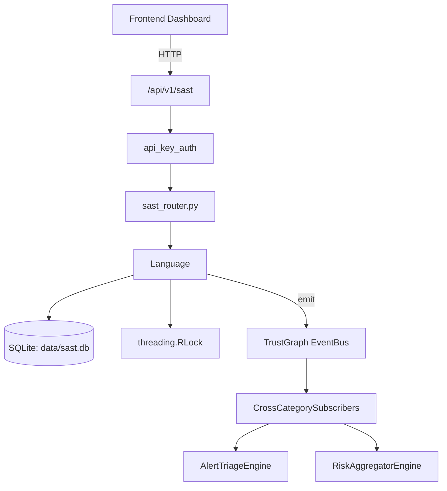

# US-0209: Sast

## Sub-Epic: ASPM
**Master Goal**: ALDECI — $35/mo enterprise security intelligence platform replacing $50K-500K/yr tools

## User Story
As a **Emma Davis (DevSecOps Engineer)**, I need to run static application security tests
so that the platform delivers enterprise-grade aspm capabilities at 1/1000th the cost of legacy tools.

## Why This Matters
Sast replaces functionality found in enterprise tools like CrowdStrike, Wiz, Snyk, and Rapid7.
By building this into ALDECI's $35/mo stack, customers save $50K+/yr on standalone ASPM tooling.

## Architecture

## Current State: 95% Complete
- ✅ `to_dict()` — implemented (line 74)
- ✅ `to_dict()` — implemented (line 1612)
- ✅ `to_dict()` — implemented (line 1696)
- ✅ `add_semgrep_rules()` — Parse and register Semgrep-format YAML rules. Returns added rules. (line 1772)
- ✅ `get_custom_rules()` — Return all registered custom Semgrep rules. (line 1785)
- ✅ `clear_custom_rules()` — Remove all custom rules. (line 1790)
- ❌ TrustGraph event emission — not yet verified

## Key Functions (from `suite-core/core/sast_engine.py` — 2215 lines)
- `SastFinding.to_dict()` — Handle to dict (line 74)
- `SemgrepRule.to_dict()` — Handle to dict (line 1612)
- `SastScanResult.to_dict()` — Handle to dict (line 1696)
- `SASTEngine.add_semgrep_rules()` — Parse and register Semgrep-format YAML rules. Returns added rules. (line 1772)
- `SASTEngine.get_custom_rules()` — Return all registered custom Semgrep rules. (line 1785)
- `SASTEngine.clear_custom_rules()` — Remove all custom rules. (line 1790)
- `SASTEngine.clear_cache()` — Clear the incremental scan file-hash cache. (line 1798)
- `SASTEngine.get_supported_languages()` — Return supported languages with rule counts and file extensions. (line 1809)

## Dependencies
- **Depends on**: standalone
- **Depended by**: Routers, TrustGraph EventBus, CrossCategorySubscribers
- **TrustGraph**: Event emission wired via ResponseInterceptorMiddleware
- **Source file**: `suite-core/core/sast_engine.py` (2215 lines)
- **Router file**: `suite-api/apps/api/sast_router.py`

## API Endpoints
| Method | Path | Description |
|--------|------|-------------|
| POST | `/api/v1/sast/scan` | trigger scan |
| GET | `/api/v1/sast/languages` | list languages |
| GET | `/api/v1/sast/summary` | scan summary |
| POST | `/api/v1/sast/rules/custom` | add custom rule |
| POST | `/api/v1/sast/scan/code` | scan code |
| POST | `/api/v1/sast/scan/files` | scan files |
| GET | `/api/v1/sast/findings` | list sast findings |
| GET | `/api/v1/sast/rules` | list rules |
| GET | `/api/v1/sast/status` | sast status |
| GET | `/api/v1/sast/health` | sast health |

## Tasks Remaining
1. Verify TrustGraph event emission works end-to-end (2h)
2. Add integration test with real persona workflow (2h)
3. Wire CrossCategorySubscriber consumer chain (1h)
4. Validate with 30-persona walkthrough (1h)
5. Optimize query performance for large datasets (2h)
6. Expand test coverage to edge cases (2h)

## Definition of Done
- [ ] Emma Davis (DevSecOps Engineer) can access /api/v1/sast and get meaningful data
- [ ] All CRUD operations return correct HTTP status codes
- [ ] TrustGraph receives events from this engine
- [ ] 112+ tests passing in `tests/test_sast_engine.py`
- [ ] 30-persona walkthrough includes this endpoint at 100%
- [ ] No hardcoded org_id — all queries are org-scoped

## Sprint: Wave 48 (est. April 24-26, 2026)

## Test Coverage
- **Test file**: `tests/test_sast_engine.py`
- **Tests**: 112 tests
- **Status**: Passing
