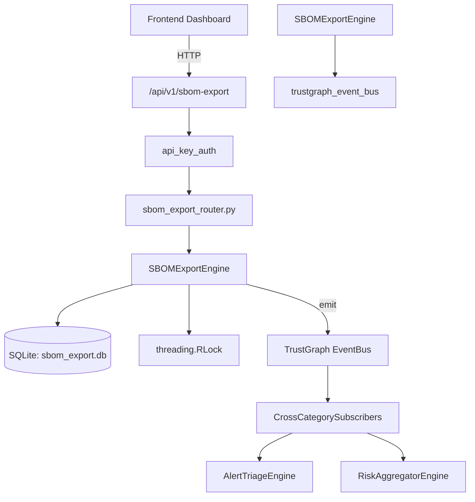

# US-0211: Sbom Export

## Sub-Epic: ASPM
**Master Goal**: ALDECI — $35/mo enterprise security intelligence platform replacing $50K-500K/yr tools

## User Story
As a **Amanda Scott (Supply Chain Security)**, I need to manage software bill of materials
so that the platform delivers enterprise-grade aspm capabilities at 1/1000th the cost of legacy tools.

## Why This Matters
Sbom Export replaces functionality found in enterprise tools like CrowdStrike, Wiz, Snyk, and Rapid7.
By building this into ALDECI's $35/mo stack, customers save $50K+/yr on standalone ASPM tooling.

## Architecture

## Current State: 95% Complete
- ✅ `register_component()` — Register a component; dedup on (org_id, project_name, name, version). (line 133)
- ✅ `list_components()` — List components, optionally filtered by project. (line 193)
- ✅ `get_component()` — Return a single component or None. (line 209)
- ✅ `add_vuln()` — Add a vulnerability to a component and recompute vuln_count. (line 222)
- ✅ `list_vulns()` — List vulnerabilities for an org, optionally filtered by component. (line 272)
- ✅ `generate_cyclonedx()` — Generate a CycloneDX 1.4 SBOM and record the export. (line 288)
- ❌ TrustGraph event emission — not yet verified

## Key Functions (from `suite-core/core/sbom_export_engine.py` — 571 lines)
- `SBOMExportEngine.register_component()` — Register a component; dedup on (org_id, project_name, name, version). (line 133)
- `SBOMExportEngine.list_components()` — List components, optionally filtered by project. (line 193)
- `SBOMExportEngine.get_component()` — Return a single component or None. (line 209)
- `SBOMExportEngine.add_vuln()` — Add a vulnerability to a component and recompute vuln_count. (line 222)
- `SBOMExportEngine.list_vulns()` — List vulnerabilities for an org, optionally filtered by component. (line 272)
- `SBOMExportEngine.generate_cyclonedx()` — Generate a CycloneDX 1.4 SBOM and record the export. (line 288)
- `SBOMExportEngine.generate_spdx()` — Generate an SPDX 2.3 SBOM and record the export. (line 389)
- `SBOMExportEngine.get_project_summary()` — Return aggregated summary for a project. (line 472)

## Dependencies
- **Depends on**: trustgraph_event_bus
- **Depended by**: Routers, TrustGraph EventBus, CrossCategorySubscribers
- **TrustGraph**: Event emission wired via ResponseInterceptorMiddleware
- **Source file**: `suite-core/core/sbom_export_engine.py` (571 lines)
- **Router file**: `suite-api/apps/api/sbom_export_router.py`

## API Endpoints
| Method | Path | Description |
|--------|------|-------------|
| POST | `/api/v1/sbom-export/components` | register component |
| POST | `/api/v1/sbom-export/components/{component_id}/vulns` | add vuln |
| POST | `/api/v1/sbom-export/generate/cyclonedx` | generate cyclonedx |
| POST | `/api/v1/sbom-export/generate/spdx` | generate spdx |
| GET | `/api/v1/sbom-export/projects` | list projects |
| GET | `/api/v1/sbom-export/projects/{project_name}/summary` | get project summary |
| GET | `/api/v1/sbom-export/projects/{project_name}/history` | get export history |
| GET | `/api/v1/sbom-export/search` | search component |

## Tasks Remaining
1. Verify TrustGraph event emission works end-to-end (2h)
2. Add integration test with real persona workflow (2h)
3. Wire CrossCategorySubscriber consumer chain (1h)
4. Validate with 30-persona walkthrough (1h)
5. Optimize query performance for large datasets (2h)
6. Expand test coverage to edge cases (2h)

## Definition of Done
- [ ] Amanda Scott (Supply Chain Security) can access /api/v1/sbom-export and get meaningful data
- [ ] All CRUD operations return correct HTTP status codes
- [ ] TrustGraph receives events from this engine
- [ ] 34+ tests passing in `tests/test_sbom_export_engine.py`
- [ ] 30-persona walkthrough includes this endpoint at 100%
- [ ] No hardcoded org_id — all queries are org-scoped

## Sprint: Wave 49 (est. April 25-27, 2026)

## Test Coverage
- **Test file**: `tests/test_sbom_export_engine.py`
- **Tests**: 34 tests
- **Status**: Passing
