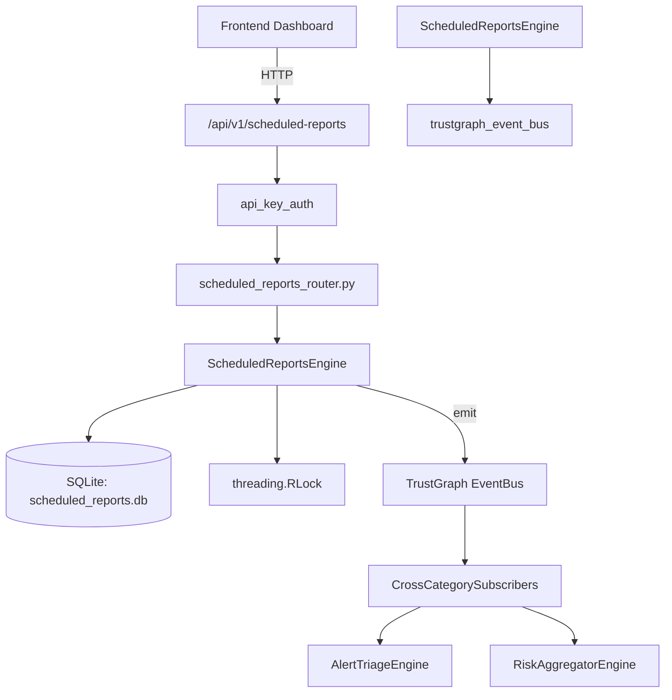

# US-0212: Scheduled Reports

## Sub-Epic: Advanced
**Master Goal**: ALDECI — $35/mo enterprise security intelligence platform replacing $50K-500K/yr tools

## User Story
As a **Daniel Thompson (SecOps Manager)**, I need to schedule automated security reports
so that the platform delivers enterprise-grade advanced capabilities at 1/1000th the cost of legacy tools.

## Why This Matters
Scheduled Reports replaces functionality found in enterprise tools like CrowdStrike, Wiz, Snyk, and Rapid7.
By building this into ALDECI's $35/mo stack, customers save $50K+/yr on standalone Advanced tooling.

## Architecture

## Current State: 95% Complete
- ✅ `create_schedule()` — Create a new report schedule. Returns the created record. (line 209)
- ✅ `list_schedules()` — List report schedules with optional filters. (line 291)
- ✅ `get_schedule()` — Retrieve a single schedule by ID. (line 313)
- ✅ `update_schedule()` — Update schedule fields. Recalculates next_run_at if frequency/timing changed. (line 326)
- ✅ `pause_schedule()` — Pause a schedule (enabled=0, status='paused'). (line 384)
- ✅ `resume_schedule()` — Resume a paused schedule (enabled=1, status='active', recalc next_run_at). (line 399)
- ❌ TrustGraph event emission — not yet verified

## Key Functions (from `suite-core/core/scheduled_reports_engine.py` — 753 lines)
- `ScheduledReportsEngine.create_schedule()` — Create a new report schedule. Returns the created record. (line 209)
- `ScheduledReportsEngine.list_schedules()` — List report schedules with optional filters. (line 291)
- `ScheduledReportsEngine.get_schedule()` — Retrieve a single schedule by ID. (line 313)
- `ScheduledReportsEngine.update_schedule()` — Update schedule fields. Recalculates next_run_at if frequency/timing changed. (line 326)
- `ScheduledReportsEngine.pause_schedule()` — Pause a schedule (enabled=0, status='paused'). (line 384)
- `ScheduledReportsEngine.resume_schedule()` — Resume a paused schedule (enabled=1, status='active', recalc next_run_at). (line 399)
- `ScheduledReportsEngine.delete_schedule()` — Delete a schedule. Returns True if found and deleted. (line 424)
- `ScheduledReportsEngine.trigger_report()` — Trigger an immediate report run for a schedule. (line 438)

## Dependencies
- **Depends on**: trustgraph_event_bus
- **Depended by**: Routers, TrustGraph EventBus, CrossCategorySubscribers
- **TrustGraph**: Event emission wired via ResponseInterceptorMiddleware
- **Source file**: `suite-core/core/scheduled_reports_engine.py` (753 lines)
- **Router file**: `suite-api/apps/api/scheduled_reports_router.py`

## API Endpoints
| Method | Path | Description |
|--------|------|-------------|
| GET | `/api/v1/scheduled-reports/schedules` | list schedules |
| POST | `/api/v1/scheduled-reports/schedules` | create schedule |
| GET | `/api/v1/scheduled-reports/schedules/{schedule_id}` | get schedule |
| PATCH | `/api/v1/scheduled-reports/schedules/{schedule_id}` | update schedule |
| POST | `/api/v1/scheduled-reports/schedules/{schedule_id}/pause` | pause schedule |
| POST | `/api/v1/scheduled-reports/schedules/{schedule_id}/resume` | resume schedule |
| DELETE | `/api/v1/scheduled-reports/schedules/{schedule_id}` | delete schedule |
| POST | `/api/v1/scheduled-reports/schedules/{schedule_id}/trigger` | trigger report |
| GET | `/api/v1/scheduled-reports/runs` | list runs |
| GET | `/api/v1/scheduled-reports/runs/{run_id}` | get run |
| GET | `/api/v1/scheduled-reports/templates` | list templates |
| POST | `/api/v1/scheduled-reports/templates` | create template |

## Tasks Remaining
1. Verify TrustGraph event emission works end-to-end (2h)
2. Add integration test with real persona workflow (2h)
3. Wire CrossCategorySubscriber consumer chain (1h)
4. Validate with 30-persona walkthrough (1h)
5. Optimize query performance for large datasets (2h)
6. Expand test coverage to edge cases (2h)

## Definition of Done
- [ ] Daniel Thompson (SecOps Manager) can access /api/v1/scheduled-reports and get meaningful data
- [ ] All CRUD operations return correct HTTP status codes
- [ ] TrustGraph receives events from this engine
- [ ] 62+ tests passing in `tests/test_scheduled_reports_engine.py`
- [ ] 30-persona walkthrough includes this endpoint at 100%
- [ ] No hardcoded org_id — all queries are org-scoped

## Sprint: Wave 49 (est. April 25-27, 2026)

## Test Coverage
- **Test file**: `tests/test_scheduled_reports_engine.py`
- **Tests**: 62 tests
- **Status**: Passing
