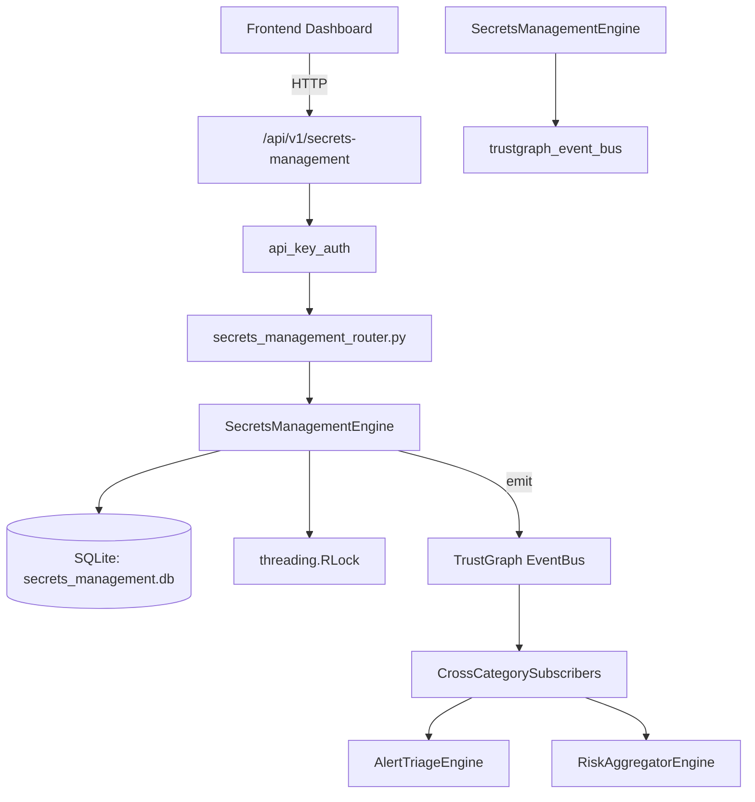

# US-0214: Secrets Management

## Sub-Epic: ASPM
**Master Goal**: ALDECI — $35/mo enterprise security intelligence platform replacing $50K-500K/yr tools

## User Story
As a **Emma Davis (DevSecOps Engineer)**, I need to detect and manage secrets exposure
so that the platform delivers enterprise-grade aspm capabilities at 1/1000th the cost of legacy tools.

## Why This Matters
Secrets Management replaces functionality found in enterprise tools like CrowdStrike, Wiz, Snyk, and Rapid7.
By building this into ALDECI's $35/mo stack, customers save $50K+/yr on standalone ASPM tooling.

## Architecture

## Current State: 95% Complete
- ✅ `store_secret()` — Store secret metadata. The actual secret value is never persisted. (line 127)
- ✅ `list_secrets()` — List secret metadata for org. Secret values are never returned. (line 177)
- ✅ `get_secret_metadata()` — Retrieve metadata for a single secret. No value returned. (line 190)
- ✅ `rotate_secret()` — Record secret rotation — updates last_rotated timestamp. (line 203)
- ✅ `revoke_secret()` — Revoke a secret permanently with a stated reason. (line 227)
- ✅ `get_expiring_secrets()` — Return active secrets that are past or approaching their rotation window. (line 249)
- ❌ TrustGraph event emission — not yet verified

## Key Functions (from `suite-core/core/secrets_management_engine.py` — 343 lines)
- `SecretsManagementEngine.store_secret()` — Store secret metadata. The actual secret value is never persisted. (line 127)
- `SecretsManagementEngine.list_secrets()` — List secret metadata for org. Secret values are never returned. (line 177)
- `SecretsManagementEngine.get_secret_metadata()` — Retrieve metadata for a single secret. No value returned. (line 190)
- `SecretsManagementEngine.rotate_secret()` — Record secret rotation — updates last_rotated timestamp. (line 203)
- `SecretsManagementEngine.revoke_secret()` — Revoke a secret permanently with a stated reason. (line 227)
- `SecretsManagementEngine.get_expiring_secrets()` — Return active secrets that are past or approaching their rotation window. (line 249)
- `SecretsManagementEngine.record_access()` — Record an access event for audit purposes. (line 270)
- `SecretsManagementEngine.get_access_log()` — Return recent access events for a secret. (line 292)

## Dependencies
- **Depends on**: trustgraph_event_bus
- **Depended by**: Routers, TrustGraph EventBus, CrossCategorySubscribers
- **TrustGraph**: Event emission wired via ResponseInterceptorMiddleware
- **Source file**: `suite-core/core/secrets_management_engine.py` (343 lines)
- **Router file**: `suite-api/apps/api/secrets_management_router.py`

## API Endpoints
| Method | Path | Description |
|--------|------|-------------|
| POST | `/api/v1/secrets-management/secrets` | store secret |
| GET | `/api/v1/secrets-management/secrets` | list secrets |
| GET | `/api/v1/secrets-management/secrets/{secret_id}` | get secret metadata |
| POST | `/api/v1/secrets-management/secrets/{secret_id}/rotate` | rotate secret |
| POST | `/api/v1/secrets-management/secrets/{secret_id}/revoke` | revoke secret |
| GET | `/api/v1/secrets-management/expiring` | get expiring secrets |
| GET | `/api/v1/secrets-management/stats` | get secrets stats |
| POST | `/api/v1/secrets-management/secrets/{secret_id}/access` | record access |
| GET | `/api/v1/secrets-management/secrets/{secret_id}/access` | get access log |

## Tasks Remaining
1. Verify TrustGraph event emission works end-to-end (2h)
2. Add integration test with real persona workflow (2h)
3. Wire CrossCategorySubscriber consumer chain (1h)
4. Validate with 30-persona walkthrough (1h)
5. Optimize query performance for large datasets (2h)
6. Expand test coverage to edge cases (2h)

## Definition of Done
- [ ] Emma Davis (DevSecOps Engineer) can access /api/v1/secrets-management and get meaningful data
- [ ] All CRUD operations return correct HTTP status codes
- [ ] TrustGraph receives events from this engine
- [ ] 29+ tests passing in `tests/test_secrets_management_engine.py`
- [ ] 30-persona walkthrough includes this endpoint at 100%
- [ ] No hardcoded org_id — all queries are org-scoped

## Sprint: Wave 49 (est. April 25-27, 2026)

## Test Coverage
- **Test file**: `tests/test_secrets_management_engine.py`
- **Tests**: 29 tests
- **Status**: Passing
