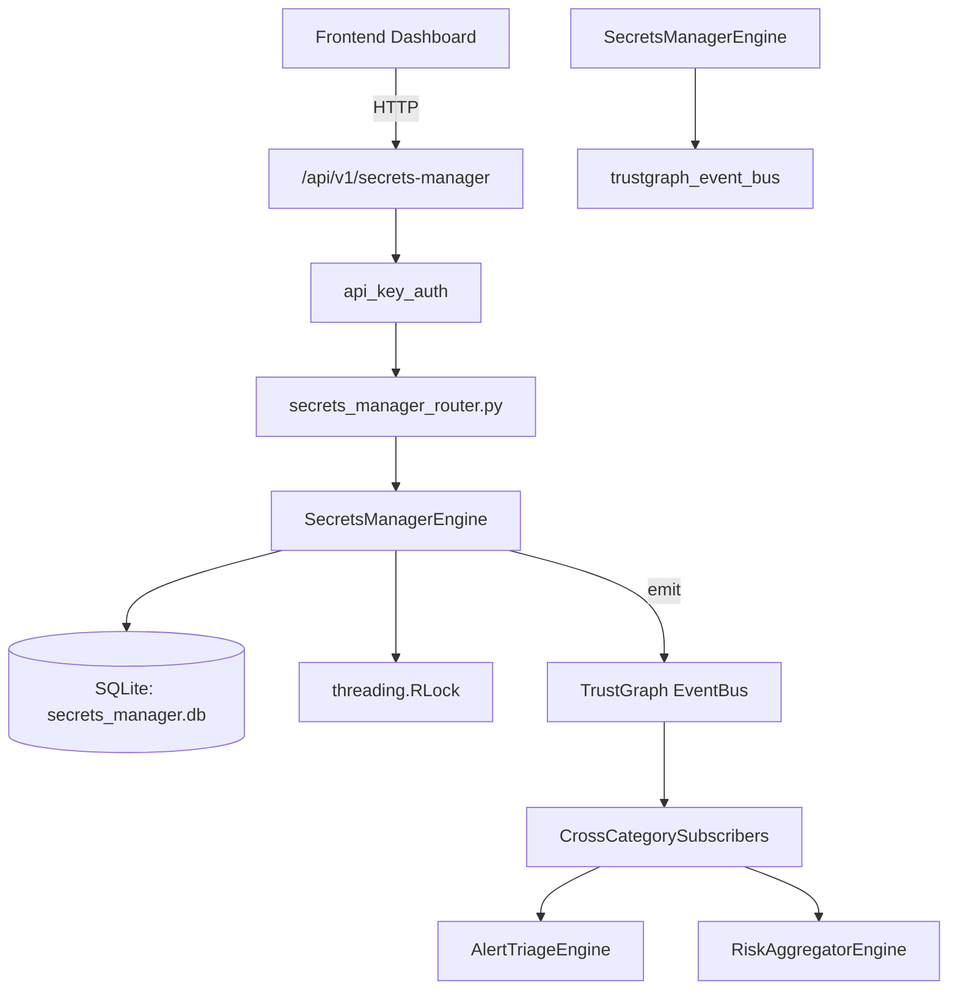

# US-0215: Secrets Manager

## Sub-Epic: ASPM
**Master Goal**: ALDECI — $35/mo enterprise security intelligence platform replacing $50K-500K/yr tools

## User Story
As a **Emma Davis (DevSecOps Engineer)**, I need to detect and manage secrets exposure
so that the platform delivers enterprise-grade aspm capabilities at 1/1000th the cost of legacy tools.

## Why This Matters
Secrets Manager replaces functionality found in enterprise tools like CrowdStrike, Wiz, Snyk, and Rapid7.
By building this into ALDECI's $35/mo stack, customers save $50K+/yr on standalone ASPM tooling.

## Architecture

## Current State: 95% Complete
- ✅ `create_vault()` — Create a new secret vault for an org. (line 141)
- ✅ `list_vaults()` — List all vaults for an org. (line 183)
- ✅ `get_vault()` — Retrieve a vault by ID, scoped to org. (line 192)
- ✅ `add_secret()` — Add a secret to a vault. (line 205)
- ✅ `list_secrets()` — List secrets for an org, optionally filtered by vault or status. (line 265)
- ✅ `get_secret()` — Retrieve a secret by ID, scoped to org. (line 288)
- ❌ TrustGraph event emission — not yet verified

## Key Functions (from `suite-core/core/secrets_manager_engine.py` — 485 lines)
- `SecretsManagerEngine.create_vault()` — Create a new secret vault for an org. (line 141)
- `SecretsManagerEngine.list_vaults()` — List all vaults for an org. (line 183)
- `SecretsManagerEngine.get_vault()` — Retrieve a vault by ID, scoped to org. (line 192)
- `SecretsManagerEngine.add_secret()` — Add a secret to a vault. (line 205)
- `SecretsManagerEngine.list_secrets()` — List secrets for an org, optionally filtered by vault or status. (line 265)
- `SecretsManagerEngine.get_secret()` — Retrieve a secret by ID, scoped to org. (line 288)
- `SecretsManagerEngine.schedule_rotation()` — Set or update the rotation schedule for a secret. (line 301)
- `SecretsManagerEngine.record_rotation()` — Record that a secret was rotated and update its metadata. (line 350)

## Dependencies
- **Depends on**: trustgraph_event_bus
- **Depended by**: Routers, TrustGraph EventBus, CrossCategorySubscribers
- **TrustGraph**: Event emission wired via ResponseInterceptorMiddleware
- **Source file**: `suite-core/core/secrets_manager_engine.py` (485 lines)
- **Router file**: `suite-api/apps/api/secrets_manager_router.py`

## API Endpoints
| Method | Path | Description |
|--------|------|-------------|
| GET | `/api/v1/secrets-manager/vaults` | list vaults |
| POST | `/api/v1/secrets-manager/vaults` | create vault |
| GET | `/api/v1/secrets-manager/secrets` | list secrets |
| POST | `/api/v1/secrets-manager/secrets` | add secret |
| GET | `/api/v1/secrets-manager/secrets/expiring` | get expiring secrets |
| POST | `/api/v1/secrets-manager/secrets/{secret_id}/rotate` | record rotation |
| POST | `/api/v1/secrets-manager/secrets/{secret_id}/schedule` | schedule rotation |
| GET | `/api/v1/secrets-manager/secrets/{secret_id}/history` | get rotation history |
| GET | `/api/v1/secrets-manager/stats` | get stats |

## Tasks Remaining
1. Verify TrustGraph event emission works end-to-end (2h)
2. Add integration test with real persona workflow (2h)
3. Wire CrossCategorySubscriber consumer chain (1h)
4. Validate with 30-persona walkthrough (1h)
5. Optimize query performance for large datasets (2h)
6. Expand test coverage to edge cases (2h)

## Definition of Done
- [ ] Emma Davis (DevSecOps Engineer) can access /api/v1/secrets-manager and get meaningful data
- [ ] All CRUD operations return correct HTTP status codes
- [ ] TrustGraph receives events from this engine
- [ ] 25+ tests passing in `tests/test_secrets_manager_engine.py`
- [ ] 30-persona walkthrough includes this endpoint at 100%
- [ ] No hardcoded org_id — all queries are org-scoped

## Sprint: Wave 49 (est. April 25-27, 2026)

## Test Coverage
- **Test file**: `tests/test_secrets_manager_engine.py`
- **Tests**: 25 tests
- **Status**: Passing
