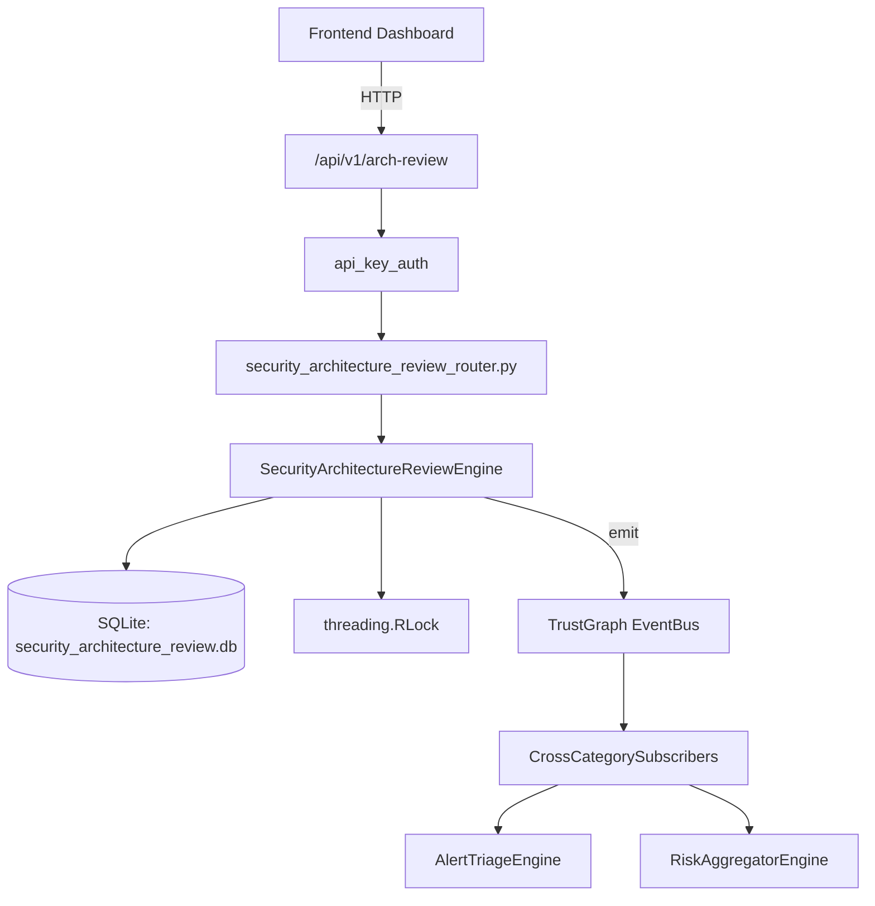

# US-0216: Security Architecture Review

## Sub-Epic: Advanced
**Master Goal**: ALDECI — $35/mo enterprise security intelligence platform replacing $50K-500K/yr tools

## User Story
As a **Richard Adams (Security Architect)**, I need to review security architecture
so that the platform delivers enterprise-grade advanced capabilities at 1/1000th the cost of legacy tools.

## Why This Matters
Security Architecture Review replaces functionality found in enterprise tools like CrowdStrike, Wiz, Snyk, and Rapid7.
By building this into ALDECI's $35/mo stack, customers save $50K+/yr on standalone Advanced tooling.

## Architecture

## Current State: 95% Complete
- ✅ `create_review()` — Create a new architecture review in draft status. (line 138)
- ✅ `add_finding()` — Add a finding to a review. Increments finding/critical counts and recomputes ris (line 168)
- ✅ `add_control()` — Add a control assessment to a review. Effectiveness is clamped 0–100. (line 239)
- ✅ `complete_review()` — Complete a review. Computes overall_score = AVG(effectiveness of controls). (line 290)
- ✅ `get_review()` — Return review dict with nested findings and controls lists. (line 321)
- ✅ `list_reviews()` — List reviews for an org, optionally filtered by status. (line 345)
- ❌ TrustGraph event emission — not yet verified

## Key Functions (from `suite-core/core/security_architecture_review_engine.py` — 406 lines)
- `SecurityArchitectureReviewEngine.create_review()` — Create a new architecture review in draft status. (line 138)
- `SecurityArchitectureReviewEngine.add_finding()` — Add a finding to a review. Increments finding/critical counts and recomputes ris (line 168)
- `SecurityArchitectureReviewEngine.add_control()` — Add a control assessment to a review. Effectiveness is clamped 0–100. (line 239)
- `SecurityArchitectureReviewEngine.complete_review()` — Complete a review. Computes overall_score = AVG(effectiveness of controls). (line 290)
- `SecurityArchitectureReviewEngine.get_review()` — Return review dict with nested findings and controls lists. (line 321)
- `SecurityArchitectureReviewEngine.list_reviews()` — List reviews for an org, optionally filtered by status. (line 345)
- `SecurityArchitectureReviewEngine.get_control_gaps()` — Return all controls where implementation_status != 'implemented', ordered by eff (line 361)
- `SecurityArchitectureReviewEngine.get_summary()` — Return aggregate summary: counts, by_status, by_risk_level, avg_score, critical_ (line 372)

## Dependencies
- **Depends on**: standalone
- **Depended by**: Routers, TrustGraph EventBus, CrossCategorySubscribers
- **TrustGraph**: Event emission wired via ResponseInterceptorMiddleware
- **Source file**: `suite-core/core/security_architecture_review_engine.py` (406 lines)
- **Router file**: `suite-api/apps/api/security_architecture_review_router.py`

## API Endpoints
| Method | Path | Description |
|--------|------|-------------|
| POST | `/api/v1/arch-review/reviews` | create review |
| GET | `/api/v1/arch-review/reviews` | list reviews |
| GET | `/api/v1/arch-review/reviews/{review_id}` | get review |
| POST | `/api/v1/arch-review/reviews/{review_id}/findings` | add finding |
| POST | `/api/v1/arch-review/reviews/{review_id}/controls` | add control |
| POST | `/api/v1/arch-review/reviews/{review_id}/complete` | complete review |
| GET | `/api/v1/arch-review/control-gaps` | get control gaps |
| GET | `/api/v1/arch-review/summary` | get summary |

## Tasks Remaining
1. Verify TrustGraph event emission works end-to-end (2h)
2. Add integration test with real persona workflow (2h)
3. Wire CrossCategorySubscriber consumer chain (1h)
4. Validate with 30-persona walkthrough (1h)
5. Optimize query performance for large datasets (2h)
6. Expand test coverage to edge cases (2h)

## Definition of Done
- [ ] Richard Adams (Security Architect) can access /api/v1/arch-review and get meaningful data
- [ ] All CRUD operations return correct HTTP status codes
- [ ] TrustGraph receives events from this engine
- [ ] 40+ tests passing in `tests/test_security_architecture_review_engine.py`
- [ ] 30-persona walkthrough includes this endpoint at 100%
- [ ] No hardcoded org_id — all queries are org-scoped

## Sprint: Wave 49 (est. April 25-27, 2026)

## Test Coverage
- **Test file**: `tests/test_security_architecture_review_engine.py`
- **Tests**: 40 tests
- **Status**: Passing
