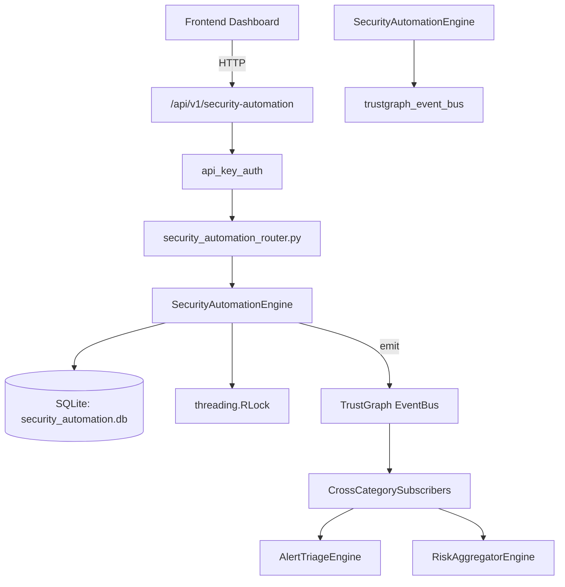

# US-0217: Security Automation

## Sub-Epic: Advanced
**Master Goal**: ALDECI — $35/mo enterprise security intelligence platform replacing $50K-500K/yr tools

## User Story
As a **Daniel Thompson (SecOps Manager)**, I need to automate security workflows
so that the platform delivers enterprise-grade advanced capabilities at 1/1000th the cost of legacy tools.

## Why This Matters
Security Automation replaces functionality found in enterprise tools like CrowdStrike, Wiz, Snyk, and Rapid7.
By building this into ALDECI's $35/mo stack, customers save $50K+/yr on standalone Advanced tooling.

## Architecture

## Current State: 95% Complete
- ✅ `create_automation_rule()` — Create a new automation rule. (line 132)
- ✅ `list_automation_rules()` — List automation rules, optionally filtered by enabled state. (line 182)
- ✅ `get_rule()` — Retrieve a single rule by ID. Returns None if not found. (line 195)
- ✅ `enable_rule()` — Enable an automation rule. Returns None if not found. (line 204)
- ✅ `disable_rule()` — Disable an automation rule. Returns None if not found. (line 222)
- ✅ `execute_rule()` — Execute a rule against a context dict. (line 244)
- ❌ TrustGraph event emission — not yet verified

## Key Functions (from `suite-core/core/security_automation_engine.py` — 387 lines)
- `SecurityAutomationEngine.create_automation_rule()` — Create a new automation rule. (line 132)
- `SecurityAutomationEngine.list_automation_rules()` — List automation rules, optionally filtered by enabled state. (line 182)
- `SecurityAutomationEngine.get_rule()` — Retrieve a single rule by ID. Returns None if not found. (line 195)
- `SecurityAutomationEngine.enable_rule()` — Enable an automation rule. Returns None if not found. (line 204)
- `SecurityAutomationEngine.disable_rule()` — Disable an automation rule. Returns None if not found. (line 222)
- `SecurityAutomationEngine.execute_rule()` — Execute a rule against a context dict. (line 244)
- `SecurityAutomationEngine.list_executions()` — List execution history for an org, with optional filters. (line 317)
- `SecurityAutomationEngine.get_automation_stats()` — Return aggregated automation statistics for an org. (line 342)

## Dependencies
- **Depends on**: trustgraph_event_bus
- **Depended by**: Routers, TrustGraph EventBus, CrossCategorySubscribers
- **TrustGraph**: Event emission wired via ResponseInterceptorMiddleware
- **Source file**: `suite-core/core/security_automation_engine.py` (387 lines)
- **Router file**: `suite-api/apps/api/security_automation_router.py`

## API Endpoints
| Method | Path | Description |
|--------|------|-------------|
| POST | `/api/v1/security-automation/rules` | create automation rule |
| GET | `/api/v1/security-automation/rules` | list automation rules |
| GET | `/api/v1/security-automation/rules/{rule_id}` | get rule |
| PATCH | `/api/v1/security-automation/rules/{rule_id}/enable` | enable rule |
| PATCH | `/api/v1/security-automation/rules/{rule_id}/disable` | disable rule |
| POST | `/api/v1/security-automation/rules/{rule_id}/execute` | execute rule |
| GET | `/api/v1/security-automation/executions` | list executions |
| GET | `/api/v1/security-automation/stats` | get automation stats |

## Tasks Remaining
1. Verify TrustGraph event emission works end-to-end (2h)
2. Add integration test with real persona workflow (2h)
3. Wire CrossCategorySubscriber consumer chain (1h)
4. Validate with 30-persona walkthrough (1h)
5. Optimize query performance for large datasets (2h)
6. Expand test coverage to edge cases (2h)

## Definition of Done
- [ ] Daniel Thompson (SecOps Manager) can access /api/v1/security-automation and get meaningful data
- [ ] All CRUD operations return correct HTTP status codes
- [ ] TrustGraph receives events from this engine
- [ ] 32+ tests passing in `tests/test_security_automation_engine.py`
- [ ] 30-persona walkthrough includes this endpoint at 100%
- [ ] No hardcoded org_id — all queries are org-scoped

## Sprint: Wave 49 (est. April 25-27, 2026)

## Test Coverage
- **Test file**: `tests/test_security_automation_engine.py`
- **Tests**: 32 tests
- **Status**: Passing
