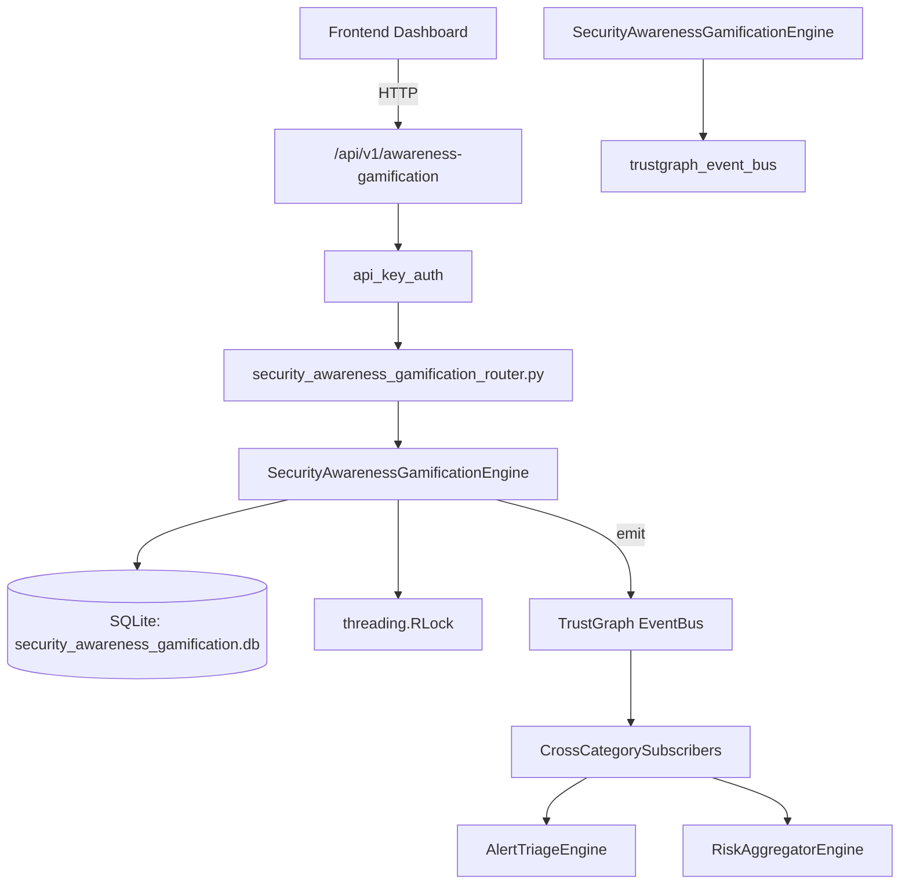

# US-0218: Security Awareness Gamification

## Sub-Epic: Advanced
**Master Goal**: ALDECI — $35/mo enterprise security intelligence platform replacing $50K-500K/yr tools

## User Story
As a **Emily Chang (Developer Security Champion)**, I need to run awareness programs
so that the platform delivers enterprise-grade advanced capabilities at 1/1000th the cost of legacy tools.

## Why This Matters
Security Awareness Gamification replaces functionality found in enterprise tools like CrowdStrike, Wiz, Snyk, and Rapid7.
By building this into ALDECI's $35/mo stack, customers save $50K+/yr on standalone Advanced tooling.

## Architecture

## Current State: 95% Complete
- ✅ `create_challenge()` — Create a new challenge. Validates title required, challenge_type and difficulty. (line 115)
- ✅ `list_challenges()` — List challenges with optional filters. (line 167)
- ✅ `record_completion()` — Record a challenge completion. If passed=True, add points to user_points. (line 193)
- ✅ `get_leaderboard()` — Return leaderboard ordered by total_points DESC with ranks. (line 247)
- ✅ `get_user_profile()` — Return user profile with points, completions, badges, challenges_passed. (line 300)
- ✅ `award_badge()` — Award a badge to a user. Validates badge_type. (line 337)
- ❌ TrustGraph event emission — not yet verified

## Key Functions (from `suite-core/core/security_awareness_gamification_engine.py` — 435 lines)
- `SecurityAwarenessGamificationEngine.create_challenge()` — Create a new challenge. Validates title required, challenge_type and difficulty. (line 115)
- `SecurityAwarenessGamificationEngine.list_challenges()` — List challenges with optional filters. (line 167)
- `SecurityAwarenessGamificationEngine.record_completion()` — Record a challenge completion. If passed=True, add points to user_points. (line 193)
- `SecurityAwarenessGamificationEngine.get_leaderboard()` — Return leaderboard ordered by total_points DESC with ranks. (line 247)
- `SecurityAwarenessGamificationEngine.get_user_profile()` — Return user profile with points, completions, badges, challenges_passed. (line 300)
- `SecurityAwarenessGamificationEngine.award_badge()` — Award a badge to a user. Validates badge_type. (line 337)
- `SecurityAwarenessGamificationEngine.get_gamification_stats()` — Return org-wide gamification stats. (line 376)

## Dependencies
- **Depends on**: trustgraph_event_bus
- **Depended by**: Routers, TrustGraph EventBus, CrossCategorySubscribers
- **TrustGraph**: Event emission wired via ResponseInterceptorMiddleware
- **Source file**: `suite-core/core/security_awareness_gamification_engine.py` (435 lines)
- **Router file**: `suite-api/apps/api/security_awareness_gamification_router.py`

## API Endpoints
| Method | Path | Description |
|--------|------|-------------|
| POST | `/api/v1/awareness-gamification/challenges` | create challenge |
| GET | `/api/v1/awareness-gamification/challenges` | list challenges |
| POST | `/api/v1/awareness-gamification/completions` | record completion |
| GET | `/api/v1/awareness-gamification/leaderboard` | get leaderboard |
| GET | `/api/v1/awareness-gamification/users/{user_id}` | get user profile |
| POST | `/api/v1/awareness-gamification/users/{user_id}/badges` | award badge |
| GET | `/api/v1/awareness-gamification/stats` | get gamification stats |

## Tasks Remaining
1. Verify TrustGraph event emission works end-to-end (2h)
2. Add integration test with real persona workflow (2h)
3. Wire CrossCategorySubscriber consumer chain (1h)
4. Validate with 30-persona walkthrough (1h)
5. Optimize query performance for large datasets (2h)
6. Expand test coverage to edge cases (2h)

## Definition of Done
- [ ] Emily Chang (Developer Security Champion) can access /api/v1/awareness-gamification and get meaningful data
- [ ] All CRUD operations return correct HTTP status codes
- [ ] TrustGraph receives events from this engine
- [ ] 36+ tests passing in `tests/test_security_awareness_gamification_engine.py`
- [ ] 30-persona walkthrough includes this endpoint at 100%
- [ ] No hardcoded org_id — all queries are org-scoped

## Sprint: Wave 49 (est. April 25-27, 2026)

## Test Coverage
- **Test file**: `tests/test_security_awareness_gamification_engine.py`
- **Tests**: 36 tests
- **Status**: Passing
