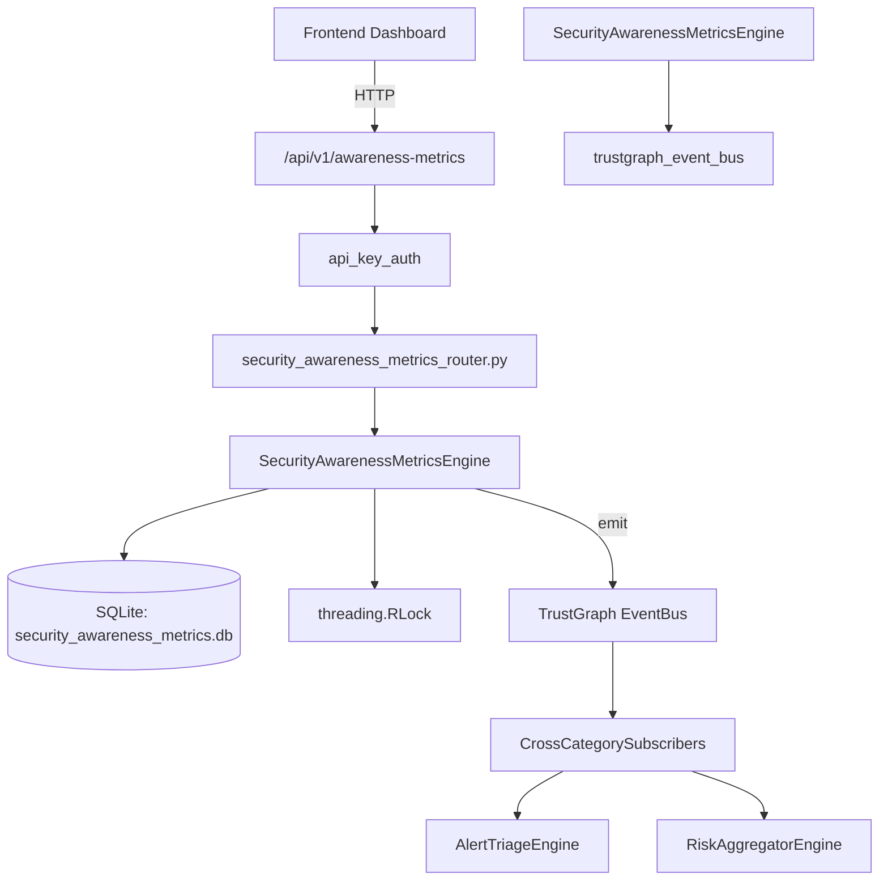

# US-0219: Security Awareness Metrics

## Sub-Epic: Advanced
**Master Goal**: ALDECI — $35/mo enterprise security intelligence platform replacing $50K-500K/yr tools

## User Story
As a **Emily Chang (Developer Security Champion)**, I need to run awareness programs
so that the platform delivers enterprise-grade advanced capabilities at 1/1000th the cost of legacy tools.

## Why This Matters
Security Awareness Metrics replaces functionality found in enterprise tools like CrowdStrike, Wiz, Snyk, and Rapid7.
By building this into ALDECI's $35/mo stack, customers save $50K+/yr on standalone Advanced tooling.

## Architecture

## Current State: 95% Complete
- ✅ `record_metric()` — Record a new awareness metric data point. (line 107)
- ✅ `list_metrics()` — List metrics with optional filters, newest first. (line 153)
- ✅ `get_latest_metric()` — Return the most recent metric record for a given type and department. (line 176)
- ✅ `get_trend()` — Return last N records and computed trend (improving/declining/stable). (line 198)
- ✅ `set_benchmark()` — Create or update a benchmark for a metric type (UPSERT). (line 241)
- ✅ `list_benchmarks()` — List all benchmarks for the org. (line 301)
- ❌ TrustGraph event emission — not yet verified

## Key Functions (from `suite-core/core/security_awareness_metrics_engine.py` — 380 lines)
- `SecurityAwarenessMetricsEngine.record_metric()` — Record a new awareness metric data point. (line 107)
- `SecurityAwarenessMetricsEngine.list_metrics()` — List metrics with optional filters, newest first. (line 153)
- `SecurityAwarenessMetricsEngine.get_latest_metric()` — Return the most recent metric record for a given type and department. (line 176)
- `SecurityAwarenessMetricsEngine.get_trend()` — Return last N records and computed trend (improving/declining/stable). (line 198)
- `SecurityAwarenessMetricsEngine.set_benchmark()` — Create or update a benchmark for a metric type (UPSERT). (line 241)
- `SecurityAwarenessMetricsEngine.list_benchmarks()` — List all benchmarks for the org. (line 301)
- `SecurityAwarenessMetricsEngine.get_awareness_stats()` — Return aggregate awareness statistics for the org. (line 310)

## Dependencies
- **Depends on**: trustgraph_event_bus
- **Depended by**: Routers, TrustGraph EventBus, CrossCategorySubscribers
- **TrustGraph**: Event emission wired via ResponseInterceptorMiddleware
- **Source file**: `suite-core/core/security_awareness_metrics_engine.py` (380 lines)
- **Router file**: `suite-api/apps/api/security_awareness_metrics_router.py`

## API Endpoints
| Method | Path | Description |
|--------|------|-------------|
| POST | `/api/v1/awareness-metrics/metrics` | record metric |
| GET | `/api/v1/awareness-metrics/metrics` | list metrics |
| GET | `/api/v1/awareness-metrics/metrics/latest` | get latest metric |
| GET | `/api/v1/awareness-metrics/metrics/trend` | get trend |
| POST | `/api/v1/awareness-metrics/benchmarks` | set benchmark |
| GET | `/api/v1/awareness-metrics/benchmarks` | list benchmarks |
| GET | `/api/v1/awareness-metrics/stats` | get awareness stats |

## Tasks Remaining
1. Verify TrustGraph event emission works end-to-end (2h)
2. Add integration test with real persona workflow (2h)
3. Wire CrossCategorySubscriber consumer chain (1h)
4. Validate with 30-persona walkthrough (1h)
5. Optimize query performance for large datasets (2h)
6. Expand test coverage to edge cases (2h)

## Definition of Done
- [ ] Emily Chang (Developer Security Champion) can access /api/v1/awareness-metrics and get meaningful data
- [ ] All CRUD operations return correct HTTP status codes
- [ ] TrustGraph receives events from this engine
- [ ] 33+ tests passing in `tests/test_security_awareness_metrics_engine.py`
- [ ] 30-persona walkthrough includes this endpoint at 100%
- [ ] No hardcoded org_id — all queries are org-scoped

## Sprint: Wave 49 (est. April 25-27, 2026)

## Test Coverage
- **Test file**: `tests/test_security_awareness_metrics_engine.py`
- **Tests**: 33 tests
- **Status**: Passing
