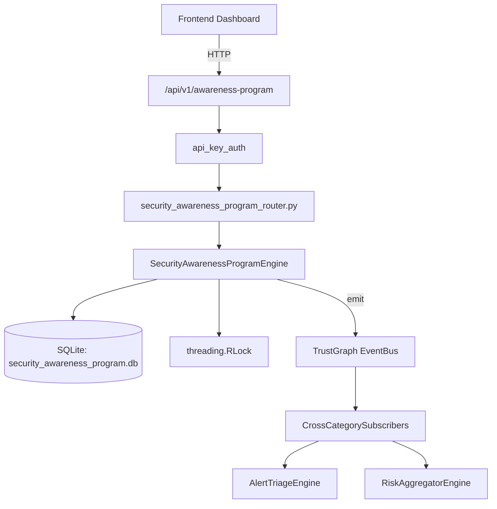

# US-0220: Security Awareness Program

## Sub-Epic: Advanced
**Master Goal**: ALDECI — $35/mo enterprise security intelligence platform replacing $50K-500K/yr tools

## User Story
As a **Emily Chang (Developer Security Champion)**, I need to run awareness programs
so that the platform delivers enterprise-grade advanced capabilities at 1/1000th the cost of legacy tools.

## Why This Matters
Security Awareness Program replaces functionality found in enterprise tools like CrowdStrike, Wiz, Snyk, and Rapid7.
By building this into ALDECI's $35/mo stack, customers save $50K+/yr on standalone Advanced tooling.

## Architecture

## Current State: 95% Complete
- ✅ `create_program()` — Create a new awareness program. (line 154)
- ✅ `enroll_user()` — Enroll a user in a program. Dedup via INSERT OR IGNORE on (program_id, org_id, u (line 214)
- ✅ `record_completion()` — Record completion of an enrollment. Recomputes program completed_count and pass_ (line 251)
- ✅ `record_event()` — Record an awareness event. (line 315)
- ✅ `get_program_stats()` — Return program details with completion_rate, pass_rate, dept_breakdown, low_scor (line 359)
- ✅ `get_department_compliance()` — Return per-department compliance: enrolled, completed, passed, compliance_rate. (line 411)
- ❌ TrustGraph event emission — not yet verified

## Key Functions (from `suite-core/core/security_awareness_program_engine.py` — 495 lines)
- `SecurityAwarenessProgramEngine.create_program()` — Create a new awareness program. (line 154)
- `SecurityAwarenessProgramEngine.enroll_user()` — Enroll a user in a program. Dedup via INSERT OR IGNORE on (program_id, org_id, u (line 214)
- `SecurityAwarenessProgramEngine.record_completion()` — Record completion of an enrollment. Recomputes program completed_count and pass_ (line 251)
- `SecurityAwarenessProgramEngine.record_event()` — Record an awareness event. (line 315)
- `SecurityAwarenessProgramEngine.get_program_stats()` — Return program details with completion_rate, pass_rate, dept_breakdown, low_scor (line 359)
- `SecurityAwarenessProgramEngine.get_department_compliance()` — Return per-department compliance: enrolled, completed, passed, compliance_rate. (line 411)
- `SecurityAwarenessProgramEngine.get_overdue_enrollments()` — Return enrollments where completed_at IS NULL and enrolled_at < 30 days ago. (line 440)
- `SecurityAwarenessProgramEngine.get_program_summary()` — Return org-level program summary. (line 452)

## Dependencies
- **Depends on**: standalone
- **Depended by**: Routers, TrustGraph EventBus, CrossCategorySubscribers
- **TrustGraph**: Event emission wired via ResponseInterceptorMiddleware
- **Source file**: `suite-core/core/security_awareness_program_engine.py` (495 lines)
- **Router file**: `suite-api/apps/api/security_awareness_program_router.py`

## API Endpoints
| Method | Path | Description |
|--------|------|-------------|
| POST | `/api/v1/awareness-program/programs` | create program |
| POST | `/api/v1/awareness-program/programs/{program_id}/enroll` | enroll user |
| PUT | `/api/v1/awareness-program/enrollments/{enrollment_id}/complete` | record completion |
| POST | `/api/v1/awareness-program/events` | record event |
| GET | `/api/v1/awareness-program/programs/{program_id}/stats` | get program stats |
| GET | `/api/v1/awareness-program/department-compliance` | get department compliance |
| GET | `/api/v1/awareness-program/overdue` | get overdue enrollments |
| GET | `/api/v1/awareness-program/summary` | get program summary |

## Tasks Remaining
1. Verify TrustGraph event emission works end-to-end (2h)
2. Add integration test with real persona workflow (2h)
3. Wire CrossCategorySubscriber consumer chain (1h)
4. Validate with 30-persona walkthrough (1h)
5. Optimize query performance for large datasets (2h)
6. Expand test coverage to edge cases (2h)

## Definition of Done
- [ ] Emily Chang (Developer Security Champion) can access /api/v1/awareness-program and get meaningful data
- [ ] All CRUD operations return correct HTTP status codes
- [ ] TrustGraph receives events from this engine
- [ ] 43+ tests passing in `tests/test_security_awareness_program_engine.py`
- [ ] 30-persona walkthrough includes this endpoint at 100%
- [ ] No hardcoded org_id — all queries are org-scoped

## Sprint: Wave 49 (est. April 25-27, 2026)

## Test Coverage
- **Test file**: `tests/test_security_awareness_program_engine.py`
- **Tests**: 43 tests
- **Status**: Passing
