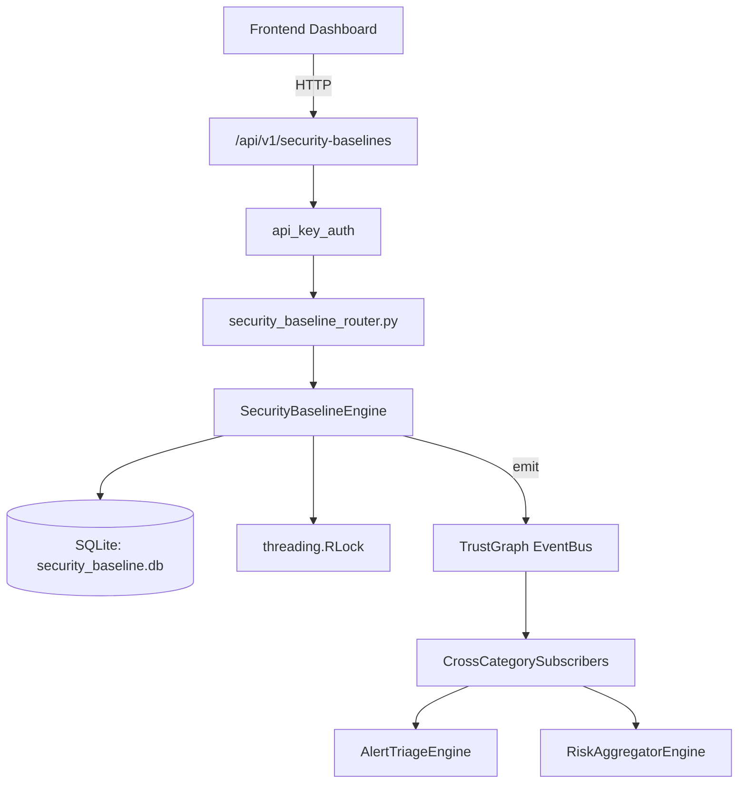

# US-0221: Security Baseline

## Sub-Epic: Advanced
**Master Goal**: ALDECI — $35/mo enterprise security intelligence platform replacing $50K-500K/yr tools

## User Story
As a **James Wilson (Security Engineer)**, I need to manage security baselines
so that the platform delivers enterprise-grade advanced capabilities at 1/1000th the cost of legacy tools.

## Why This Matters
Security Baseline replaces functionality found in enterprise tools like CrowdStrike, Wiz, Snyk, and Rapid7.
By building this into ALDECI's $35/mo stack, customers save $50K+/yr on standalone Advanced tooling.

## Architecture

## Current State: 95% Complete
- ✅ `create_baseline()` — Create a new security baseline in draft status. (line 143)
- ✅ `add_control()` — Add a control to a baseline and increment the control_count. (line 184)
- ✅ `publish_baseline()` — Publish a baseline (status=active, published_at=now). (line 237)
- ✅ `run_assessment()` — Run a baseline assessment against a target. (line 261)
- ✅ `get_baseline_detail()` — Return baseline + controls + last 5 assessments. (line 346)
- ✅ `get_drift_report()` — Compare the last 2 assessments and report control drift. (line 376)
- ❌ TrustGraph event emission — not yet verified

## Key Functions (from `suite-core/core/security_baseline_engine.py` — 474 lines)
- `SecurityBaselineEngine.create_baseline()` — Create a new security baseline in draft status. (line 143)
- `SecurityBaselineEngine.add_control()` — Add a control to a baseline and increment the control_count. (line 184)
- `SecurityBaselineEngine.publish_baseline()` — Publish a baseline (status=active, published_at=now). (line 237)
- `SecurityBaselineEngine.run_assessment()` — Run a baseline assessment against a target. (line 261)
- `SecurityBaselineEngine.get_baseline_detail()` — Return baseline + controls + last 5 assessments. (line 346)
- `SecurityBaselineEngine.get_drift_report()` — Compare the last 2 assessments and report control drift. (line 376)
- `SecurityBaselineEngine.get_compliance_trend()` — Return all assessments ordered by date with compliance_pct. (line 440)
- `SecurityBaselineEngine.list_baselines()` — List baselines for an org, optionally filtered by status. (line 455)

## Dependencies
- **Depends on**: standalone
- **Depended by**: Routers, TrustGraph EventBus, CrossCategorySubscribers
- **TrustGraph**: Event emission wired via ResponseInterceptorMiddleware
- **Source file**: `suite-core/core/security_baseline_engine.py` (474 lines)
- **Router file**: `suite-api/apps/api/security_baseline_router.py`

## API Endpoints
| Method | Path | Description |
|--------|------|-------------|
| POST | `/api/v1/security-baselines/baselines` | create baseline |
| POST | `/api/v1/security-baselines/baselines/{baseline_id}/controls` | add control |
| PUT | `/api/v1/security-baselines/baselines/{baseline_id}/publish` | publish baseline |
| POST | `/api/v1/security-baselines/baselines/{baseline_id}/assess` | run assessment |
| GET | `/api/v1/security-baselines/baselines/{baseline_id}` | get baseline detail |
| GET | `/api/v1/security-baselines/baselines/{baseline_id}/drift` | get drift report |
| GET | `/api/v1/security-baselines/baselines/{baseline_id}/trend` | get compliance trend |
| GET | `/api/v1/security-baselines/baselines` | list baselines |

## Tasks Remaining
1. Verify TrustGraph event emission works end-to-end (2h)
2. Add integration test with real persona workflow (2h)
3. Wire CrossCategorySubscriber consumer chain (1h)
4. Validate with 30-persona walkthrough (1h)
5. Optimize query performance for large datasets (2h)
6. Expand test coverage to edge cases (2h)

## Definition of Done
- [ ] James Wilson (Security Engineer) can access /api/v1/security-baselines and get meaningful data
- [ ] All CRUD operations return correct HTTP status codes
- [ ] TrustGraph receives events from this engine
- [ ] 37+ tests passing in `tests/test_security_baseline_engine.py`
- [ ] 30-persona walkthrough includes this endpoint at 100%
- [ ] No hardcoded org_id — all queries are org-scoped

## Sprint: Wave 49 (est. April 25-27, 2026)

## Test Coverage
- **Test file**: `tests/test_security_baseline_engine.py`
- **Tests**: 37 tests
- **Status**: Passing
