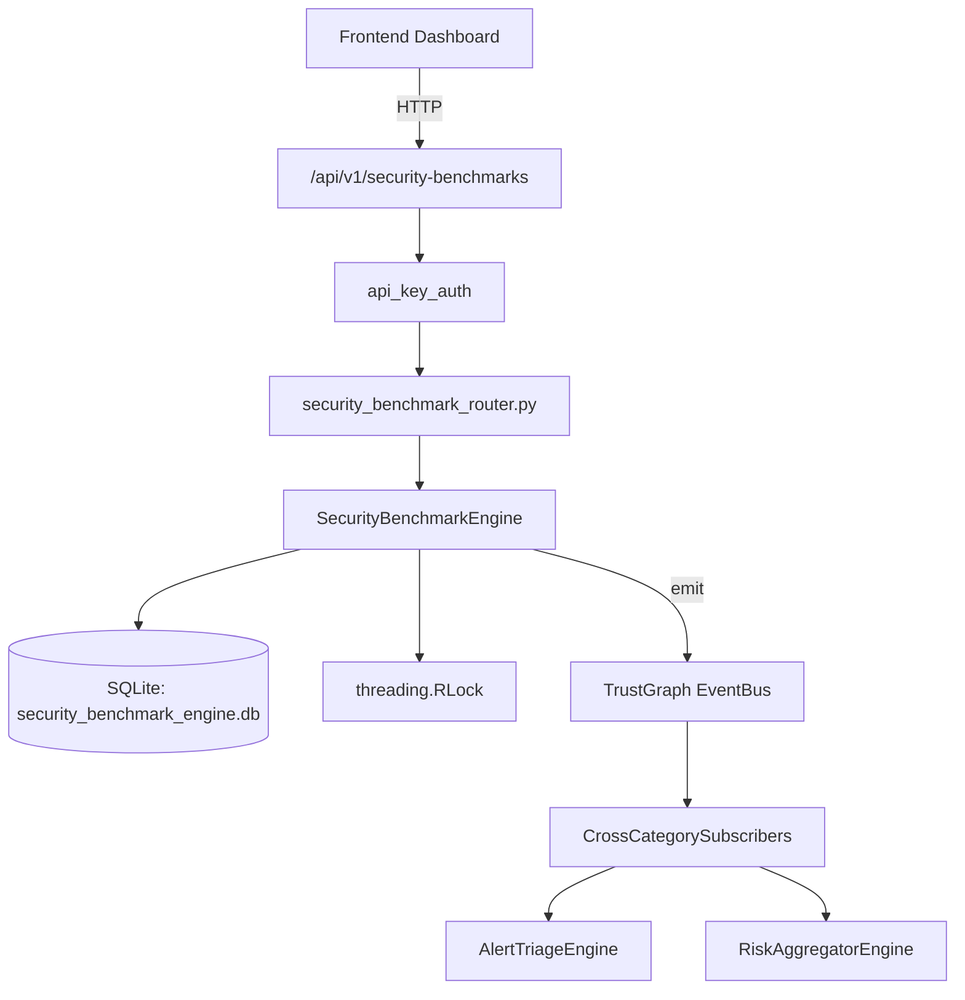

# US-0222: Security Benchmark

## Sub-Epic: Executive
**Master Goal**: ALDECI — $35/mo enterprise security intelligence platform replacing $50K-500K/yr tools

## User Story
As a **Sarah Chen (CISO)**, I need to benchmark against industry peers
so that the platform delivers enterprise-grade executive capabilities at 1/1000th the cost of legacy tools.

## Why This Matters
Security Benchmark replaces functionality found in enterprise tools like CrowdStrike, Wiz, Snyk, and Rapid7.
By building this into ALDECI's $35/mo stack, customers save $50K+/yr on standalone Executive tooling.

## Architecture

## Current State: 95% Complete
- ✅ `create_benchmark()` — Create an industry benchmark definition. (line 194)
- ✅ `list_benchmarks()` — List benchmarks with optional sector and category filters. (line 239)
- ✅ `record_org_metric()` — Record an org security metric measurement. (line 264)
- ✅ `get_metric_trend()` — Return org_metrics for a metric over the past N days, ordered by date. (line 293)
- ✅ `compare_to_benchmark()` — Compare an org metric to a benchmark and compute percentile rank. (line 314)
- ✅ `get_org_benchmark_summary()` — Return all comparisons with performance counts, best/worst metric, overall perce (line 373)
- ❌ TrustGraph event emission — not yet verified

## Key Functions (from `suite-core/core/security_benchmark_engine.py` — 416 lines)
- `SecurityBenchmarkEngine.create_benchmark()` — Create an industry benchmark definition. (line 194)
- `SecurityBenchmarkEngine.list_benchmarks()` — List benchmarks with optional sector and category filters. (line 239)
- `SecurityBenchmarkEngine.record_org_metric()` — Record an org security metric measurement. (line 264)
- `SecurityBenchmarkEngine.get_metric_trend()` — Return org_metrics for a metric over the past N days, ordered by date. (line 293)
- `SecurityBenchmarkEngine.compare_to_benchmark()` — Compare an org metric to a benchmark and compute percentile rank. (line 314)
- `SecurityBenchmarkEngine.get_org_benchmark_summary()` — Return all comparisons with performance counts, best/worst metric, overall perce (line 373)

## Dependencies
- **Depends on**: standalone
- **Depended by**: Routers, TrustGraph EventBus, CrossCategorySubscribers
- **TrustGraph**: Event emission wired via ResponseInterceptorMiddleware
- **Source file**: `suite-core/core/security_benchmark_engine.py` (416 lines)
- **Router file**: `suite-api/apps/api/security_benchmark_router.py`

## API Endpoints
| Method | Path | Description |
|--------|------|-------------|
| POST | `/api/v1/security-benchmarks/benchmarks` | create benchmark |
| GET | `/api/v1/security-benchmarks/benchmarks` | list benchmarks |
| POST | `/api/v1/security-benchmarks/metrics` | record org metric |
| GET | `/api/v1/security-benchmarks/metrics/{metric_name}/trend` | get metric trend |
| POST | `/api/v1/security-benchmarks/compare` | compare to benchmark |
| GET | `/api/v1/security-benchmarks/summary` | get org benchmark summary |

## Tasks Remaining
1. Verify TrustGraph event emission works end-to-end (2h)
2. Add integration test with real persona workflow (2h)
3. Wire CrossCategorySubscriber consumer chain (1h)
4. Validate with 30-persona walkthrough (1h)
5. Optimize query performance for large datasets (2h)
6. Expand test coverage to edge cases (2h)

## Definition of Done
- [ ] Sarah Chen (CISO) can access /api/v1/security-benchmarks and get meaningful data
- [ ] All CRUD operations return correct HTTP status codes
- [ ] TrustGraph receives events from this engine
- [ ] 40+ tests passing in `tests/test_security_benchmark_engine.py`
- [ ] 30-persona walkthrough includes this endpoint at 100%
- [ ] No hardcoded org_id — all queries are org-scoped

## Sprint: Wave 49 (est. April 25-27, 2026)

## Test Coverage
- **Test file**: `tests/test_security_benchmark_engine.py`
- **Tests**: 40 tests
- **Status**: Passing
