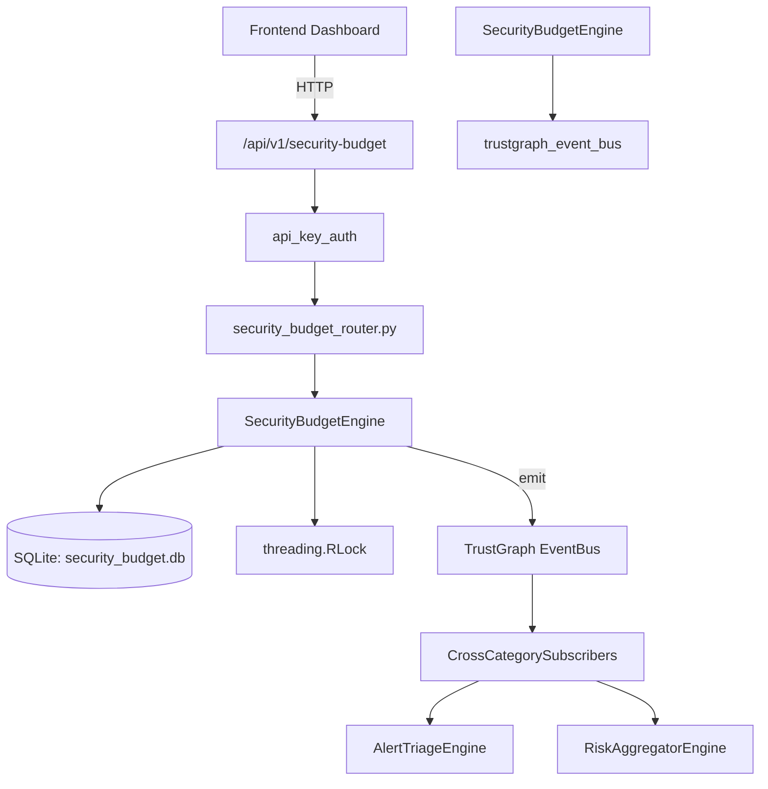

# US-0223: Security Budget

## Sub-Epic: Executive
**Master Goal**: ALDECI — $35/mo enterprise security intelligence platform replacing $50K-500K/yr tools

## User Story
As a **Sarah Chen (CISO)**, I need to manage security budget allocation
so that the platform delivers enterprise-grade executive capabilities at 1/1000th the cost of legacy tools.

## Why This Matters
Security Budget replaces functionality found in enterprise tools like CrowdStrike, Wiz, Snyk, and Rapid7.
By building this into ALDECI's $35/mo stack, customers save $50K+/yr on standalone Executive tooling.

## Architecture

## Current State: 95% Complete
- ✅ `create_allocation()` — Create a new budget allocation for a category. (line 123)
- ✅ `list_allocations()` — List allocations, optionally filtered by fiscal_year or category. (line 175)
- ✅ `get_allocation()` — Return a single allocation or None if not found / wrong org. (line 195)
- ✅ `record_spend()` — Record a spend transaction and increment allocation.spent_amount. (line 210)
- ✅ `approve_spend()` — Approve a spend transaction. (line 265)
- ✅ `list_transactions()` — List spend transactions with optional filters. (line 291)
- ❌ TrustGraph event emission — not yet verified

## Key Functions (from `suite-core/core/security_budget_engine.py` — 438 lines)
- `SecurityBudgetEngine.create_allocation()` — Create a new budget allocation for a category. (line 123)
- `SecurityBudgetEngine.list_allocations()` — List allocations, optionally filtered by fiscal_year or category. (line 175)
- `SecurityBudgetEngine.get_allocation()` — Return a single allocation or None if not found / wrong org. (line 195)
- `SecurityBudgetEngine.record_spend()` — Record a spend transaction and increment allocation.spent_amount. (line 210)
- `SecurityBudgetEngine.approve_spend()` — Approve a spend transaction. (line 265)
- `SecurityBudgetEngine.list_transactions()` — List spend transactions with optional filters. (line 291)
- `SecurityBudgetEngine.record_roi_assessment()` — Record an ROI assessment for a security initiative. (line 315)
- `SecurityBudgetEngine.list_roi_assessments()` — List all ROI assessments for an org. (line 370)

## Dependencies
- **Depends on**: trustgraph_event_bus
- **Depended by**: Routers, TrustGraph EventBus, CrossCategorySubscribers
- **TrustGraph**: Event emission wired via ResponseInterceptorMiddleware
- **Source file**: `suite-core/core/security_budget_engine.py` (438 lines)
- **Router file**: `suite-api/apps/api/security_budget_router.py`

## API Endpoints
| Method | Path | Description |
|--------|------|-------------|
| POST | `/api/v1/security-budget/allocations` | create allocation |
| GET | `/api/v1/security-budget/allocations` | list allocations |
| GET | `/api/v1/security-budget/allocations/{allocation_id}` | get allocation |
| POST | `/api/v1/security-budget/transactions` | record spend |
| PUT | `/api/v1/security-budget/transactions/{transaction_id}/approve` | approve spend |
| GET | `/api/v1/security-budget/transactions` | list transactions |
| POST | `/api/v1/security-budget/roi-assessments` | record roi assessment |
| GET | `/api/v1/security-budget/roi-assessments` | list roi assessments |
| GET | `/api/v1/security-budget/stats` | get budget stats |

## Tasks Remaining
1. Verify TrustGraph event emission works end-to-end (2h)
2. Add integration test with real persona workflow (2h)
3. Wire CrossCategorySubscriber consumer chain (1h)
4. Validate with 30-persona walkthrough (1h)
5. Optimize query performance for large datasets (2h)
6. Expand test coverage to edge cases (2h)

## Definition of Done
- [ ] Sarah Chen (CISO) can access /api/v1/security-budget and get meaningful data
- [ ] All CRUD operations return correct HTTP status codes
- [ ] TrustGraph receives events from this engine
- [ ] 38+ tests passing in `tests/test_security_budget_engine.py`
- [ ] 30-persona walkthrough includes this endpoint at 100%
- [ ] No hardcoded org_id — all queries are org-scoped

## Sprint: Wave 49 (est. April 25-27, 2026)

## Test Coverage
- **Test file**: `tests/test_security_budget_engine.py`
- **Tests**: 38 tests
- **Status**: Passing
