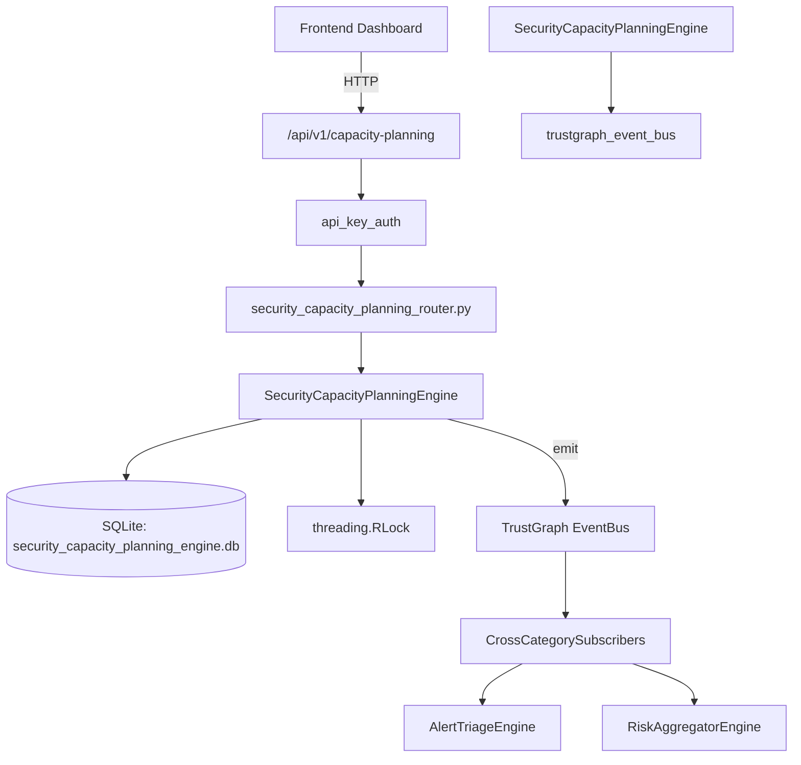

# US-0224: Security Capacity Planning

## Sub-Epic: Advanced
**Master Goal**: ALDECI — $35/mo enterprise security intelligence platform replacing $50K-500K/yr tools

## User Story
As a **Sarah Chen (CISO)**, I need to plan security team capacity
so that the platform delivers enterprise-grade advanced capabilities at 1/1000th the cost of legacy tools.

## Why This Matters
Security Capacity Planning replaces functionality found in enterprise tools like CrowdStrike, Wiz, Snyk, and Rapid7.
By building this into ALDECI's $35/mo stack, customers save $50K+/yr on standalone Advanced tooling.

## Architecture

## Current State: 95% Complete
- ✅ `register_resource()` — Register a new security team resource. (line 141)
- ✅ `update_utilization()` — Update utilization percentage for a resource (clamped 0-100). (line 192)
- ✅ `add_demand()` — Add a capacity demand with auto-computed gap_fte. (line 261)
- ✅ `assign_resource()` — Assign a resource to a demand and recompute gap_fte and status. (line 316)
- ✅ `take_snapshot()` — Take a capacity snapshot for the current date. (line 357)
- ✅ `get_capacity_summary()` — Return aggregated capacity summary for the org. (line 446)
- ❌ TrustGraph event emission — not yet verified

## Key Functions (from `suite-core/core/security_capacity_planning_engine.py` — 528 lines)
- `SecurityCapacityPlanningEngine.register_resource()` — Register a new security team resource. (line 141)
- `SecurityCapacityPlanningEngine.update_utilization()` — Update utilization percentage for a resource (clamped 0-100). (line 192)
- `SecurityCapacityPlanningEngine.add_demand()` — Add a capacity demand with auto-computed gap_fte. (line 261)
- `SecurityCapacityPlanningEngine.assign_resource()` — Assign a resource to a demand and recompute gap_fte and status. (line 316)
- `SecurityCapacityPlanningEngine.take_snapshot()` — Take a capacity snapshot for the current date. (line 357)
- `SecurityCapacityPlanningEngine.get_capacity_summary()` — Return aggregated capacity summary for the org. (line 446)
- `SecurityCapacityPlanningEngine.get_skill_gap_analysis()` — Return open demands with no assigned resource, showing skill gaps. (line 485)
- `SecurityCapacityPlanningEngine.get_team_breakdown()` — Return per-team resource count, total FTE, and avg utilization. (line 502)

## Dependencies
- **Depends on**: trustgraph_event_bus
- **Depended by**: Routers, TrustGraph EventBus, CrossCategorySubscribers
- **TrustGraph**: Event emission wired via ResponseInterceptorMiddleware
- **Source file**: `suite-core/core/security_capacity_planning_engine.py` (528 lines)
- **Router file**: `suite-api/apps/api/security_capacity_planning_router.py`

## API Endpoints
| Method | Path | Description |
|--------|------|-------------|
| POST | `/api/v1/capacity-planning/resources` | register resource |
| PUT | `/api/v1/capacity-planning/resources/{resource_id}/utilization` | update utilization |
| POST | `/api/v1/capacity-planning/demands` | add demand |
| PUT | `/api/v1/capacity-planning/demands/{demand_id}/assign` | assign resource |
| POST | `/api/v1/capacity-planning/snapshots` | take snapshot |
| GET | `/api/v1/capacity-planning/summary` | get capacity summary |
| GET | `/api/v1/capacity-planning/skill-gaps` | get skill gap analysis |
| GET | `/api/v1/capacity-planning/teams` | get team breakdown |

## Tasks Remaining
1. Verify TrustGraph event emission works end-to-end (2h)
2. Add integration test with real persona workflow (2h)
3. Wire CrossCategorySubscriber consumer chain (1h)
4. Validate with 30-persona walkthrough (1h)
5. Optimize query performance for large datasets (2h)
6. Expand test coverage to edge cases (2h)

## Definition of Done
- [ ] Sarah Chen (CISO) can access /api/v1/capacity-planning and get meaningful data
- [ ] All CRUD operations return correct HTTP status codes
- [ ] TrustGraph receives events from this engine
- [ ] 41+ tests passing in `tests/test_security_capacity_planning_engine.py`
- [ ] 30-persona walkthrough includes this endpoint at 100%
- [ ] No hardcoded org_id — all queries are org-scoped

## Sprint: Wave 49 (est. April 25-27, 2026)

## Test Coverage
- **Test file**: `tests/test_security_capacity_planning_engine.py`
- **Tests**: 41 tests
- **Status**: Passing
