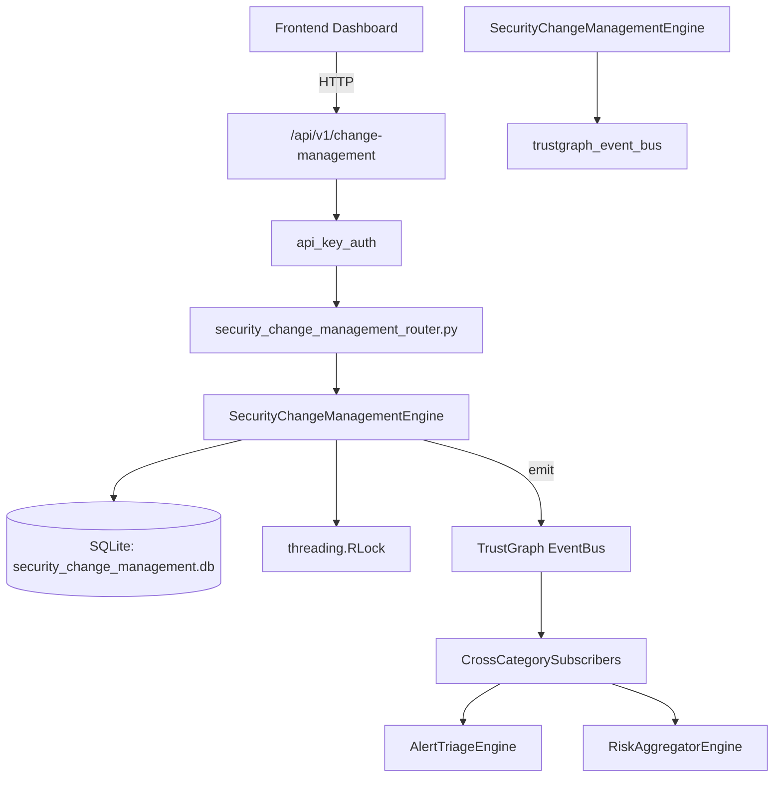

# US-0226: Security Change Management

## Sub-Epic: Advanced
**Master Goal**: ALDECI — $35/mo enterprise security intelligence platform replacing $50K-500K/yr tools

## User Story
As a **Daniel Thompson (SecOps Manager)**, I need to manage security changes
so that the platform delivers enterprise-grade advanced capabilities at 1/1000th the cost of legacy tools.

## Why This Matters
Security Change Management replaces functionality found in enterprise tools like CrowdStrike, Wiz, Snyk, and Rapid7.
By building this into ALDECI's $35/mo stack, customers save $50K+/yr on standalone Advanced tooling.

## Architecture

## Current State: 95% Complete
- ✅ `create_change()` — Create a new security change request in draft status. (line 125)
- ✅ `list_changes()` — List changes with optional filters. (line 194)
- ✅ `get_change()` — Retrieve a single change by ID within the org. (line 218)
- ✅ `update_change_status()` — Update change status. Sets completed_at if status=completed. (line 227)
- ✅ `add_approver()` — Add an approval record for a change. (line 264)
- ✅ `list_approvals()` — List approvals, optionally filtered by change_id. (line 301)
- ❌ TrustGraph event emission — not yet verified

## Key Functions (from `suite-core/core/security_change_management_engine.py` — 374 lines)
- `SecurityChangeManagementEngine.create_change()` — Create a new security change request in draft status. (line 125)
- `SecurityChangeManagementEngine.list_changes()` — List changes with optional filters. (line 194)
- `SecurityChangeManagementEngine.get_change()` — Retrieve a single change by ID within the org. (line 218)
- `SecurityChangeManagementEngine.update_change_status()` — Update change status. Sets completed_at if status=completed. (line 227)
- `SecurityChangeManagementEngine.add_approver()` — Add an approval record for a change. (line 264)
- `SecurityChangeManagementEngine.list_approvals()` — List approvals, optionally filtered by change_id. (line 301)
- `SecurityChangeManagementEngine.get_change_stats()` — Return aggregated change management statistics for an org. (line 321)

## Dependencies
- **Depends on**: trustgraph_event_bus
- **Depended by**: Routers, TrustGraph EventBus, CrossCategorySubscribers
- **TrustGraph**: Event emission wired via ResponseInterceptorMiddleware
- **Source file**: `suite-core/core/security_change_management_engine.py` (374 lines)
- **Router file**: `suite-api/apps/api/security_change_management_router.py`

## API Endpoints
| Method | Path | Description |
|--------|------|-------------|
| POST | `/api/v1/change-management/changes` | create change |
| GET | `/api/v1/change-management/changes` | list changes |
| GET | `/api/v1/change-management/changes/{change_id}` | get change |
| PATCH | `/api/v1/change-management/changes/{change_id}/status` | update change status |
| POST | `/api/v1/change-management/changes/{change_id}/approvals` | add approver |
| GET | `/api/v1/change-management/approvals` | list approvals |
| GET | `/api/v1/change-management/stats` | get change stats |

## Tasks Remaining
1. Verify TrustGraph event emission works end-to-end (2h)
2. Add integration test with real persona workflow (2h)
3. Wire CrossCategorySubscriber consumer chain (1h)
4. Validate with 30-persona walkthrough (1h)
5. Optimize query performance for large datasets (2h)
6. Expand test coverage to edge cases (2h)

## Definition of Done
- [ ] Daniel Thompson (SecOps Manager) can access /api/v1/change-management and get meaningful data
- [ ] All CRUD operations return correct HTTP status codes
- [ ] TrustGraph receives events from this engine
- [ ] 39+ tests passing in `tests/test_security_change_management_engine.py`
- [ ] 30-persona walkthrough includes this endpoint at 100%
- [ ] No hardcoded org_id — all queries are org-scoped

## Sprint: Wave 49 (est. April 25-27, 2026)

## Test Coverage
- **Test file**: `tests/test_security_change_management_engine.py`
- **Tests**: 39 tests
- **Status**: Passing
