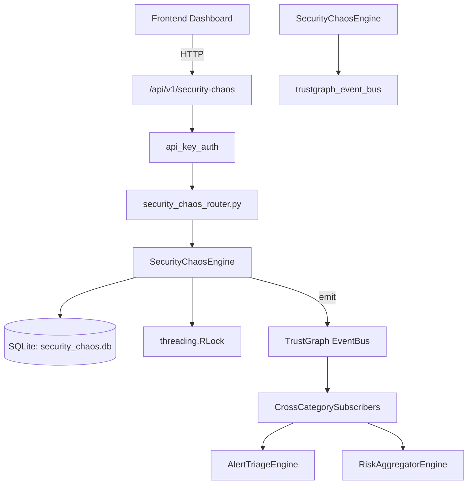

# US-0227: Security Chaos

## Sub-Epic: Advanced
**Master Goal**: ALDECI — $35/mo enterprise security intelligence platform replacing $50K-500K/yr tools

## User Story
As a **Lisa Zhang (Pentester)**, I need to run chaos engineering experiments
so that the platform delivers enterprise-grade advanced capabilities at 1/1000th the cost of legacy tools.

## Why This Matters
Security Chaos replaces functionality found in enterprise tools like CrowdStrike, Wiz, Snyk, and Rapid7.
By building this into ALDECI's $35/mo stack, customers save $50K+/yr on standalone Advanced tooling.

## Architecture

## Current State: 95% Complete
- ✅ `create_experiment()` — Create a new chaos experiment. (line 155)
- ✅ `list_experiments()` — List chaos experiments with optional filters. (line 211)
- ✅ `get_experiment()` — Get a single experiment by ID, scoped to org. (line 231)
- ✅ `start_experiment()` — Set experiment status to running. (line 240)
- ✅ `complete_experiment()` — Mark experiment completed with actual outcome and resilience score. (line 267)
- ✅ `add_observation()` — Add an observation to a chaos experiment. (line 298)
- ❌ TrustGraph event emission — not yet verified

## Key Functions (from `suite-core/core/security_chaos_engine.py` — 481 lines)
- `SecurityChaosEngine.create_experiment()` — Create a new chaos experiment. (line 155)
- `SecurityChaosEngine.list_experiments()` — List chaos experiments with optional filters. (line 211)
- `SecurityChaosEngine.get_experiment()` — Get a single experiment by ID, scoped to org. (line 231)
- `SecurityChaosEngine.start_experiment()` — Set experiment status to running. (line 240)
- `SecurityChaosEngine.complete_experiment()` — Mark experiment completed with actual outcome and resilience score. (line 267)
- `SecurityChaosEngine.add_observation()` — Add an observation to a chaos experiment. (line 298)
- `SecurityChaosEngine.list_observations()` — List observations for an experiment ordered by observed_at ASC. (line 341)
- `SecurityChaosEngine.add_remediation()` — Add a remediation item for a chaos experiment finding. (line 358)

## Dependencies
- **Depends on**: trustgraph_event_bus
- **Depended by**: Routers, TrustGraph EventBus, CrossCategorySubscribers
- **TrustGraph**: Event emission wired via ResponseInterceptorMiddleware
- **Source file**: `suite-core/core/security_chaos_engine.py` (481 lines)
- **Router file**: `suite-api/apps/api/security_chaos_router.py`

## API Endpoints
| Method | Path | Description |
|--------|------|-------------|
| POST | `/api/v1/security-chaos/experiments` | create experiment |
| GET | `/api/v1/security-chaos/experiments` | list experiments |
| GET | `/api/v1/security-chaos/experiments/{experiment_id}` | get experiment |
| PUT | `/api/v1/security-chaos/experiments/{experiment_id}/start` | start experiment |
| PUT | `/api/v1/security-chaos/experiments/{experiment_id}/complete` | complete experiment |
| POST | `/api/v1/security-chaos/experiments/{experiment_id}/observations` | add observation |
| GET | `/api/v1/security-chaos/experiments/{experiment_id}/observations` | list observations |
| POST | `/api/v1/security-chaos/experiments/{experiment_id}/remediations` | add remediation |
| PUT | `/api/v1/security-chaos/remediations/{remediation_id}/status` | update remediation status |
| GET | `/api/v1/security-chaos/stats` | get stats |

## Tasks Remaining
1. Verify TrustGraph event emission works end-to-end (2h)
2. Add integration test with real persona workflow (2h)
3. Wire CrossCategorySubscriber consumer chain (1h)
4. Validate with 30-persona walkthrough (1h)
5. Optimize query performance for large datasets (2h)
6. Expand test coverage to edge cases (2h)

## Definition of Done
- [ ] Lisa Zhang (Pentester) can access /api/v1/security-chaos and get meaningful data
- [ ] All CRUD operations return correct HTTP status codes
- [ ] TrustGraph receives events from this engine
- [ ] 36+ tests passing in `tests/test_security_chaos_engine.py`
- [ ] 30-persona walkthrough includes this endpoint at 100%
- [ ] No hardcoded org_id — all queries are org-scoped

## Sprint: Wave 49 (est. April 25-27, 2026)

## Test Coverage
- **Test file**: `tests/test_security_chaos_engine.py`
- **Tests**: 36 tests
- **Status**: Passing
