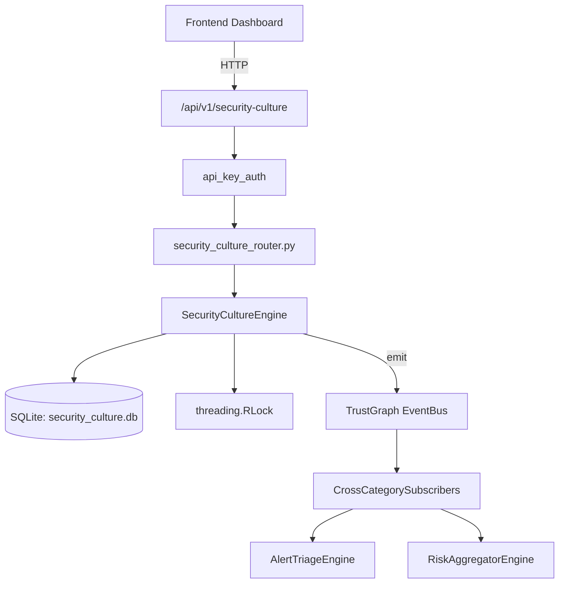

# US-0228: Security Culture

## Sub-Epic: Advanced
**Master Goal**: ALDECI — $35/mo enterprise security intelligence platform replacing $50K-500K/yr tools

## User Story
As a **Sarah Chen (CISO)**, I need to measure security culture maturity
so that the platform delivers enterprise-grade advanced capabilities at 1/1000th the cost of legacy tools.

## Why This Matters
Security Culture replaces functionality found in enterprise tools like CrowdStrike, Wiz, Snyk, and Rapid7.
By building this into ALDECI's $35/mo stack, customers save $50K+/yr on standalone Advanced tooling.

## Architecture

## Current State: 95% Complete
- ✅ `record_metric()` — Record a security culture metric data point. (line 171)
- ✅ `get_metric_trend()` — Return metric history and trend direction. (line 212)
- ✅ `create_initiative()` — Create a new culture initiative. (line 266)
- ✅ `update_initiative_progress()` — Update progress on an initiative. Auto-transitions status. (line 310)
- ✅ `list_initiatives()` — List initiatives with optional status filter. (line 368)
- ✅ `create_assessment()` — Create a culture maturity assessment. (line 386)
- ❌ TrustGraph event emission — not yet verified

## Key Functions (from `suite-core/core/security_culture_engine.py` — 537 lines)
- `SecurityCultureEngine.record_metric()` — Record a security culture metric data point. (line 171)
- `SecurityCultureEngine.get_metric_trend()` — Return metric history and trend direction. (line 212)
- `SecurityCultureEngine.create_initiative()` — Create a new culture initiative. (line 266)
- `SecurityCultureEngine.update_initiative_progress()` — Update progress on an initiative. Auto-transitions status. (line 310)
- `SecurityCultureEngine.list_initiatives()` — List initiatives with optional status filter. (line 368)
- `SecurityCultureEngine.create_assessment()` — Create a culture maturity assessment. (line 386)
- `SecurityCultureEngine.get_latest_assessment()` — Return the most recent assessment for the org. (line 431)
- `SecurityCultureEngine.get_department_culture_scores()` — Return per-department avg metric values and best/worst departments. (line 454)

## Dependencies
- **Depends on**: standalone
- **Depended by**: Routers, TrustGraph EventBus, CrossCategorySubscribers
- **TrustGraph**: Event emission wired via ResponseInterceptorMiddleware
- **Source file**: `suite-core/core/security_culture_engine.py` (537 lines)
- **Router file**: `suite-api/apps/api/security_culture_router.py`

## API Endpoints
| Method | Path | Description |
|--------|------|-------------|
| POST | `/api/v1/security-culture/metrics` | record metric |
| GET | `/api/v1/security-culture/metrics/{metric_name}/trend` | get metric trend |
| POST | `/api/v1/security-culture/initiatives` | create initiative |
| PATCH | `/api/v1/security-culture/initiatives/{initiative_id}/progress` | update initiative progress |
| POST | `/api/v1/security-culture/assessments` | create assessment |
| GET | `/api/v1/security-culture/assessments/latest` | get latest assessment |
| GET | `/api/v1/security-culture/departments` | get department culture scores |
| GET | `/api/v1/security-culture/summary` | get culture summary |

## Tasks Remaining
1. Verify TrustGraph event emission works end-to-end (2h)
2. Add integration test with real persona workflow (2h)
3. Wire CrossCategorySubscriber consumer chain (1h)
4. Validate with 30-persona walkthrough (1h)
5. Optimize query performance for large datasets (2h)
6. Expand test coverage to edge cases (2h)

## Definition of Done
- [ ] Sarah Chen (CISO) can access /api/v1/security-culture and get meaningful data
- [ ] All CRUD operations return correct HTTP status codes
- [ ] TrustGraph receives events from this engine
- [ ] 39+ tests passing in `tests/test_security_culture_engine.py`
- [ ] 30-persona walkthrough includes this endpoint at 100%
- [ ] No hardcoded org_id — all queries are org-scoped

## Sprint: Wave 49 (est. April 25-27, 2026)

## Test Coverage
- **Test file**: `tests/test_security_culture_engine.py`
- **Tests**: 39 tests
- **Status**: Passing
