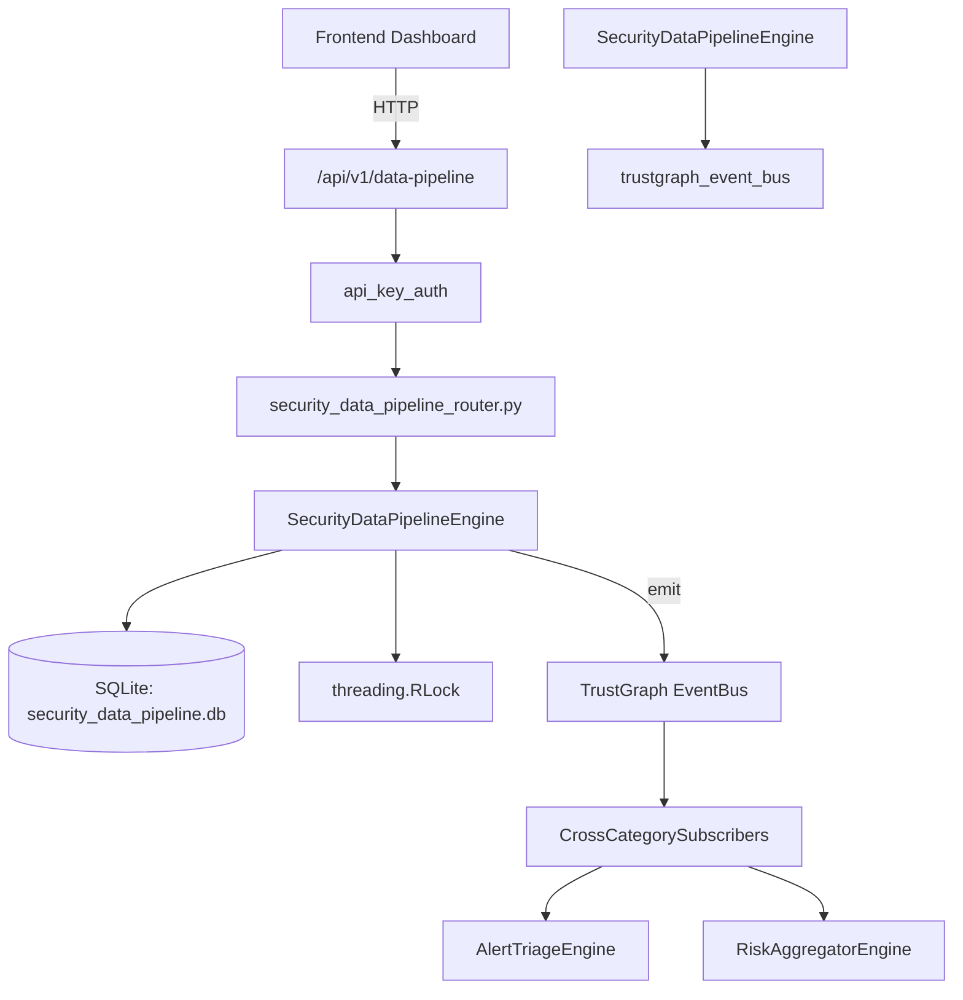

# US-0229: Security Data Pipeline

## Sub-Epic: Advanced
**Master Goal**: ALDECI — $35/mo enterprise security intelligence platform replacing $50K-500K/yr tools

## User Story
As a **Chris Lee (Security Data Scientist)**, I need to manage security data pipelines
so that the platform delivers enterprise-grade advanced capabilities at 1/1000th the cost of legacy tools.

## Why This Matters
Security Data Pipeline replaces functionality found in enterprise tools like CrowdStrike, Wiz, Snyk, and Rapid7.
By building this into ALDECI's $35/mo stack, customers save $50K+/yr on standalone Advanced tooling.

## Architecture

## Current State: 95% Complete
- ✅ `register_pipeline()` — Register a new data ingestion pipeline. (line 122)
- ✅ `list_pipelines()` — List pipelines for an org with optional filters. (line 184)
- ✅ `get_pipeline()` — Fetch a single pipeline or None if not found. (line 204)
- ✅ `update_pipeline_status()` — Update the operational status of a pipeline. (line 213)
- ✅ `record_pipeline_run()` — Record a pipeline execution run and update pipeline counters. (line 237)
- ✅ `list_runs()` — List runs with optional pipeline_id / run_status filters, newest first. (line 306)
- ❌ TrustGraph event emission — not yet verified

## Key Functions (from `suite-core/core/security_data_pipeline_engine.py` — 394 lines)
- `SecurityDataPipelineEngine.register_pipeline()` — Register a new data ingestion pipeline. (line 122)
- `SecurityDataPipelineEngine.list_pipelines()` — List pipelines for an org with optional filters. (line 184)
- `SecurityDataPipelineEngine.get_pipeline()` — Fetch a single pipeline or None if not found. (line 204)
- `SecurityDataPipelineEngine.update_pipeline_status()` — Update the operational status of a pipeline. (line 213)
- `SecurityDataPipelineEngine.record_pipeline_run()` — Record a pipeline execution run and update pipeline counters. (line 237)
- `SecurityDataPipelineEngine.list_runs()` — List runs with optional pipeline_id / run_status filters, newest first. (line 306)
- `SecurityDataPipelineEngine.get_pipeline_stats()` — Return aggregated pipeline statistics for the org. (line 330)

## Dependencies
- **Depends on**: trustgraph_event_bus
- **Depended by**: Routers, TrustGraph EventBus, CrossCategorySubscribers
- **TrustGraph**: Event emission wired via ResponseInterceptorMiddleware
- **Source file**: `suite-core/core/security_data_pipeline_engine.py` (394 lines)
- **Router file**: `suite-api/apps/api/security_data_pipeline_router.py`

## API Endpoints
| Method | Path | Description |
|--------|------|-------------|
| POST | `/api/v1/data-pipeline/pipelines` | register pipeline |
| GET | `/api/v1/data-pipeline/pipelines` | list pipelines |
| GET | `/api/v1/data-pipeline/pipelines/{pipeline_id}` | get pipeline |
| POST | `/api/v1/data-pipeline/pipelines/{pipeline_id}/runs` | record pipeline run |
| GET | `/api/v1/data-pipeline/runs` | list runs |
| PATCH | `/api/v1/data-pipeline/pipelines/{pipeline_id}/status` | update pipeline status |
| GET | `/api/v1/data-pipeline/stats` | get pipeline stats |

## Tasks Remaining
1. Verify TrustGraph event emission works end-to-end (2h)
2. Add integration test with real persona workflow (2h)
3. Wire CrossCategorySubscriber consumer chain (1h)
4. Validate with 30-persona walkthrough (1h)
5. Optimize query performance for large datasets (2h)
6. Expand test coverage to edge cases (2h)

## Definition of Done
- [ ] Chris Lee (Security Data Scientist) can access /api/v1/data-pipeline and get meaningful data
- [ ] All CRUD operations return correct HTTP status codes
- [ ] TrustGraph receives events from this engine
- [ ] 41+ tests passing in `tests/test_security_data_pipeline_engine.py`
- [ ] 30-persona walkthrough includes this endpoint at 100%
- [ ] No hardcoded org_id — all queries are org-scoped

## Sprint: Wave 49 (est. April 25-27, 2026)

## Test Coverage
- **Test file**: `tests/test_security_data_pipeline_engine.py`
- **Tests**: 41 tests
- **Status**: Passing
