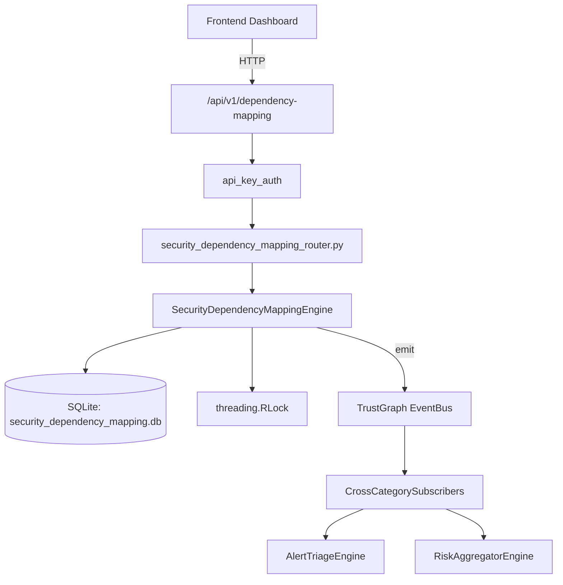

# US-0230: Security Dependency Mapping

## Sub-Epic: Advanced
**Master Goal**: ALDECI — $35/mo enterprise security intelligence platform replacing $50K-500K/yr tools

## User Story
As a **Emma Davis (DevSecOps Engineer)**, I need to map and assess dependency risks
so that the platform delivers enterprise-grade advanced capabilities at 1/1000th the cost of legacy tools.

## Why This Matters
Security Dependency Mapping replaces functionality found in enterprise tools like CrowdStrike, Wiz, Snyk, and Rapid7.
By building this into ALDECI's $35/mo stack, customers save $50K+/yr on standalone Advanced tooling.

## Architecture

## Current State: 95% Complete
- ✅ `register_service()` — Register a new service in the dependency map. (line 131)
- ✅ `add_dependency()` — Add a directed dependency: source depends on target. (line 183)
- ✅ `remove_dependency()` — Remove a dependency and decrement counters on both services. (line 250)
- ✅ `compute_blast_radius()` — BFS blast radius computation. (line 287)
- ✅ `get_service()` — Fetch service with its outgoing and incoming dependencies. (line 394)
- ✅ `list_services()` — List services for org, optionally filtered. (line 419)
- ❌ TrustGraph event emission — not yet verified

## Key Functions (from `suite-core/core/security_dependency_mapping_engine.py` — 487 lines)
- `SecurityDependencyMappingEngine.register_service()` — Register a new service in the dependency map. (line 131)
- `SecurityDependencyMappingEngine.add_dependency()` — Add a directed dependency: source depends on target. (line 183)
- `SecurityDependencyMappingEngine.remove_dependency()` — Remove a dependency and decrement counters on both services. (line 250)
- `SecurityDependencyMappingEngine.compute_blast_radius()` — BFS blast radius computation. (line 287)
- `SecurityDependencyMappingEngine.get_service()` — Fetch service with its outgoing and incoming dependencies. (line 394)
- `SecurityDependencyMappingEngine.list_services()` — List services for org, optionally filtered. (line 419)
- `SecurityDependencyMappingEngine.get_critical_paths()` — Return critical services ordered by dependent_count DESC (most depended-upon fir (line 439)
- `SecurityDependencyMappingEngine.get_summary()` — Return aggregate summary for org's dependency map. (line 450)

## Dependencies
- **Depends on**: standalone
- **Depended by**: Routers, TrustGraph EventBus, CrossCategorySubscribers
- **TrustGraph**: Event emission wired via ResponseInterceptorMiddleware
- **Source file**: `suite-core/core/security_dependency_mapping_engine.py` (487 lines)
- **Router file**: `suite-api/apps/api/security_dependency_mapping_router.py`

## API Endpoints
| Method | Path | Description |
|--------|------|-------------|
| POST | `/api/v1/dependency-mapping/services` | register service |
| GET | `/api/v1/dependency-mapping/services` | list services |
| GET | `/api/v1/dependency-mapping/services/{service_id}` | get service |
| POST | `/api/v1/dependency-mapping/dependencies` | add dependency |
| DELETE | `/api/v1/dependency-mapping/dependencies/{dependency_id}` | remove dependency |
| POST | `/api/v1/dependency-mapping/services/{service_id}/blast-radius` | compute blast radius |
| GET | `/api/v1/dependency-mapping/critical-paths` | get critical paths |
| GET | `/api/v1/dependency-mapping/summary` | get summary |

## Tasks Remaining
1. Verify TrustGraph event emission works end-to-end (2h)
2. Add integration test with real persona workflow (2h)
3. Wire CrossCategorySubscriber consumer chain (1h)
4. Validate with 30-persona walkthrough (1h)
5. Optimize query performance for large datasets (2h)
6. Expand test coverage to edge cases (2h)

## Definition of Done
- [ ] Emma Davis (DevSecOps Engineer) can access /api/v1/dependency-mapping and get meaningful data
- [ ] All CRUD operations return correct HTTP status codes
- [ ] TrustGraph receives events from this engine
- [ ] 48+ tests passing in `tests/test_security_dependency_mapping_engine.py`
- [ ] 30-persona walkthrough includes this endpoint at 100%
- [ ] No hardcoded org_id — all queries are org-scoped

## Sprint: Wave 49 (est. April 25-27, 2026)

## Test Coverage
- **Test file**: `tests/test_security_dependency_mapping_engine.py`
- **Tests**: 48 tests
- **Status**: Passing
