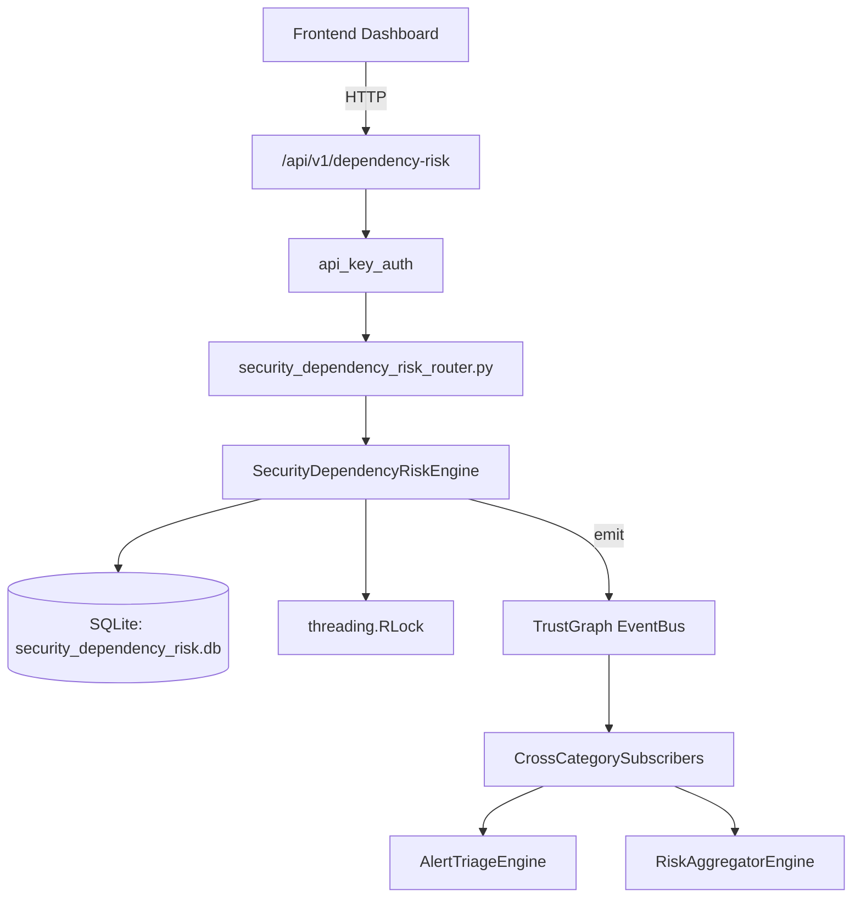

# US-0231: Security Dependency Risk

## Sub-Epic: Advanced
**Master Goal**: ALDECI — $35/mo enterprise security intelligence platform replacing $50K-500K/yr tools

## User Story
As a **Emma Davis (DevSecOps Engineer)**, I need to map and assess dependency risks
so that the platform delivers enterprise-grade advanced capabilities at 1/1000th the cost of legacy tools.

## Why This Matters
Security Dependency Risk replaces functionality found in enterprise tools like CrowdStrike, Wiz, Snyk, and Rapid7.
By building this into ALDECI's $35/mo stack, customers save $50K+/yr on standalone Advanced tooling.

## Architecture

## Current State: 95% Complete
- ✅ `register_dependency()` — Register a dependency (INSERT OR IGNORE on org+package+version). (line 157)
- ✅ `add_vuln()` — Add a vulnerability to a dependency and recompute risk_score. (line 189)
- ✅ `patch_vuln()` — Mark a vulnerability as patched and recompute parent dependency risk. (line 219)
- ✅ `flag_license_risk()` — Insert or replace a license risk record. (line 233)
- ✅ `get_dependency_summary()` — Aggregated summary of dependencies and vulnerabilities. (line 268)
- ✅ `get_risky_dependencies()` — Dependencies with risk_score >= min_risk, ordered DESC. (line 307)
- ❌ TrustGraph event emission — not yet verified

## Key Functions (from `suite-core/core/security_dependency_risk_engine.py` — 362 lines)
- `SecurityDependencyRiskEngine.register_dependency()` — Register a dependency (INSERT OR IGNORE on org+package+version). (line 157)
- `SecurityDependencyRiskEngine.add_vuln()` — Add a vulnerability to a dependency and recompute risk_score. (line 189)
- `SecurityDependencyRiskEngine.patch_vuln()` — Mark a vulnerability as patched and recompute parent dependency risk. (line 219)
- `SecurityDependencyRiskEngine.flag_license_risk()` — Insert or replace a license risk record. (line 233)
- `SecurityDependencyRiskEngine.get_dependency_summary()` — Aggregated summary of dependencies and vulnerabilities. (line 268)
- `SecurityDependencyRiskEngine.get_risky_dependencies()` — Dependencies with risk_score >= min_risk, ordered DESC. (line 307)
- `SecurityDependencyRiskEngine.get_license_conflicts()` — Dependencies whose license is flagged high-risk or copyleft+no-commercial. (line 320)
- `SecurityDependencyRiskEngine.get_vuln_list()` — All vulns with package_name join; optionally filter by patched. (line 337)

## Dependencies
- **Depends on**: standalone
- **Depended by**: Routers, TrustGraph EventBus, CrossCategorySubscribers
- **TrustGraph**: Event emission wired via ResponseInterceptorMiddleware
- **Source file**: `suite-core/core/security_dependency_risk_engine.py` (362 lines)
- **Router file**: `suite-api/apps/api/security_dependency_risk_router.py`

## API Endpoints
| Method | Path | Description |
|--------|------|-------------|
| POST | `/api/v1/dependency-risk/dependencies` | register dependency |
| POST | `/api/v1/dependency-risk/dependencies/{dep_id}/vulns` | add vuln |
| PUT | `/api/v1/dependency-risk/vulns/{vuln_id}/patch` | patch vuln |
| POST | `/api/v1/dependency-risk/license-risks` | flag license risk |
| GET | `/api/v1/dependency-risk/summary` | get dependency summary |
| GET | `/api/v1/dependency-risk/risky` | get risky dependencies |
| GET | `/api/v1/dependency-risk/license-conflicts` | get license conflicts |
| GET | `/api/v1/dependency-risk/vulns` | get vuln list |
| GET | `/api/v1/dependency-risk/graph/{package_name}` | get transitive graph |

## Tasks Remaining
1. Verify TrustGraph event emission works end-to-end (2h)
2. Add integration test with real persona workflow (2h)
3. Wire CrossCategorySubscriber consumer chain (1h)
4. Validate with 30-persona walkthrough (1h)
5. Optimize query performance for large datasets (2h)
6. Expand test coverage to edge cases (2h)

## Definition of Done
- [ ] Emma Davis (DevSecOps Engineer) can access /api/v1/dependency-risk and get meaningful data
- [ ] All CRUD operations return correct HTTP status codes
- [ ] TrustGraph receives events from this engine
- [ ] 39+ tests passing in `tests/test_security_dependency_risk_engine.py`
- [ ] 30-persona walkthrough includes this endpoint at 100%
- [ ] No hardcoded org_id — all queries are org-scoped

## Sprint: Wave 49 (est. April 25-27, 2026)

## Test Coverage
- **Test file**: `tests/test_security_dependency_risk_engine.py`
- **Tests**: 39 tests
- **Status**: Passing
