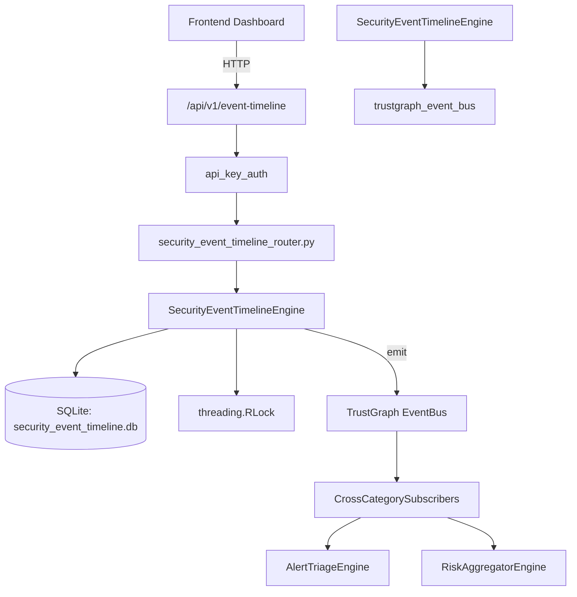

# US-0233: Security Event Timeline

## Sub-Epic: Advanced
**Master Goal**: ALDECI — $35/mo enterprise security intelligence platform replacing $50K-500K/yr tools

## User Story
As a **Priya Sharma (SOC T2 Analyst)**, I need to correlate security events
so that the platform delivers enterprise-grade advanced capabilities at 1/1000th the cost of legacy tools.

## Why This Matters
Security Event Timeline replaces functionality found in enterprise tools like CrowdStrike, Wiz, Snyk, and Rapid7.
By building this into ALDECI's $35/mo stack, customers save $50K+/yr on standalone Advanced tooling.

## Architecture

## Current State: 95% Complete
- ✅ `create_timeline()` — Create a new incident timeline. Returns status=open, event_count=0. (line 161)
- ✅ `close_timeline()` — Set timeline status to closed. (line 190)
- ✅ `add_event()` — Add a security event to the incident timeline. (line 214)
- ✅ `correlate_events()` — Create a correlation between two events. Confidence clamped 0.0-1.0. (line 324)
- ✅ `get_timeline()` — Return timeline header + events ordered by event_time + correlations. (line 362)
- ✅ `get_event_sequence()` — Return events filtered by optional time range, ordered by event_time. (line 390)
- ❌ TrustGraph event emission — not yet verified

## Key Functions (from `suite-core/core/security_event_timeline_engine.py` — 482 lines)
- `SecurityEventTimelineEngine.create_timeline()` — Create a new incident timeline. Returns status=open, event_count=0. (line 161)
- `SecurityEventTimelineEngine.close_timeline()` — Set timeline status to closed. (line 190)
- `SecurityEventTimelineEngine.add_event()` — Add a security event to the incident timeline. (line 214)
- `SecurityEventTimelineEngine.correlate_events()` — Create a correlation between two events. Confidence clamped 0.0-1.0. (line 324)
- `SecurityEventTimelineEngine.get_timeline()` — Return timeline header + events ordered by event_time + correlations. (line 362)
- `SecurityEventTimelineEngine.get_event_sequence()` — Return events filtered by optional time range, ordered by event_time. (line 390)
- `SecurityEventTimelineEngine.get_actor_activity()` — Return all events where actor matches, ordered by event_time. (line 411)
- `SecurityEventTimelineEngine.get_timeline_summary()` — Return org-level summary: totals, open count, by_event_type, recent_timelines. (line 424)

## Dependencies
- **Depends on**: trustgraph_event_bus
- **Depended by**: Routers, TrustGraph EventBus, CrossCategorySubscribers
- **TrustGraph**: Event emission wired via ResponseInterceptorMiddleware
- **Source file**: `suite-core/core/security_event_timeline_engine.py` (482 lines)
- **Router file**: `suite-api/apps/api/security_event_timeline_router.py`

## API Endpoints
| Method | Path | Description |
|--------|------|-------------|
| POST | `/api/v1/event-timeline/timelines` | create timeline |
| POST | `/api/v1/event-timeline/events` | add event |
| POST | `/api/v1/event-timeline/correlations` | correlate events |
| PUT | `/api/v1/event-timeline/timelines/{timeline_id}/close` | close timeline |
| GET | `/api/v1/event-timeline/timelines/{incident_id}` | get timeline |
| GET | `/api/v1/event-timeline/events/{incident_id}` | get event sequence |
| GET | `/api/v1/event-timeline/actor/{incident_id}/{actor}` | get actor activity |
| GET | `/api/v1/event-timeline/summary` | get timeline summary |
| GET | `/api/v1/event-timeline/search` | search events |

## Tasks Remaining
1. Verify TrustGraph event emission works end-to-end (2h)
2. Add integration test with real persona workflow (2h)
3. Wire CrossCategorySubscriber consumer chain (1h)
4. Validate with 30-persona walkthrough (1h)
5. Optimize query performance for large datasets (2h)
6. Expand test coverage to edge cases (2h)

## Definition of Done
- [ ] Priya Sharma (SOC T2 Analyst) can access /api/v1/event-timeline and get meaningful data
- [ ] All CRUD operations return correct HTTP status codes
- [ ] TrustGraph receives events from this engine
- [ ] 54+ tests passing in `tests/test_security_event_timeline_engine.py`
- [ ] 30-persona walkthrough includes this endpoint at 100%
- [ ] No hardcoded org_id — all queries are org-scoped

## Sprint: Wave 49 (est. April 25-27, 2026)

## Test Coverage
- **Test file**: `tests/test_security_event_timeline_engine.py`
- **Tests**: 54 tests
- **Status**: Passing
