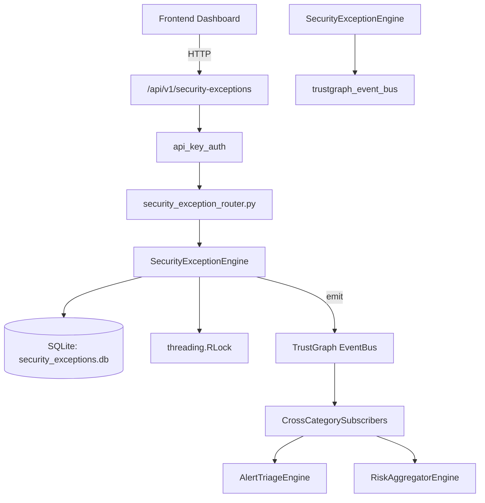

# US-0234: Security Exception

## Sub-Epic: Advanced
**Master Goal**: ALDECI — $35/mo enterprise security intelligence platform replacing $50K-500K/yr tools

## User Story
As a **David Park (Risk Manager)**, I need to manage security exceptions
so that the platform delivers enterprise-grade advanced capabilities at 1/1000th the cost of legacy tools.

## Why This Matters
Security Exception replaces functionality found in enterprise tools like CrowdStrike, Wiz, Snyk, and Rapid7.
By building this into ALDECI's $35/mo stack, customers save $50K+/yr on standalone Advanced tooling.

## Architecture

## Current State: 95% Complete
- ✅ `request_exception()` — Create a new exception request with status=pending. Logs creation notification. (line 161)
- ✅ `list_exceptions()` — List exceptions for an org with optional filters. (line 216)
- ✅ `get_exception()` — Get a single exception by ID. (line 238)
- ✅ `review_exception()` — Review an exception. Actions: approve, reject, request_info, extend. (line 252)
- ✅ `add_asset()` — Add an asset to an exception. (line 345)
- ✅ `list_assets()` — List assets attached to an exception. (line 378)
- ❌ TrustGraph event emission — not yet verified

## Key Functions (from `suite-core/core/security_exception_engine.py` — 532 lines)
- `SecurityExceptionEngine.request_exception()` — Create a new exception request with status=pending. Logs creation notification. (line 161)
- `SecurityExceptionEngine.list_exceptions()` — List exceptions for an org with optional filters. (line 216)
- `SecurityExceptionEngine.get_exception()` — Get a single exception by ID. (line 238)
- `SecurityExceptionEngine.review_exception()` — Review an exception. Actions: approve, reject, request_info, extend. (line 252)
- `SecurityExceptionEngine.add_asset()` — Add an asset to an exception. (line 345)
- `SecurityExceptionEngine.list_assets()` — List assets attached to an exception. (line 378)
- `SecurityExceptionEngine.check_expiring()` — Return approved exceptions expiring within days_ahead days. (line 392)
- `SecurityExceptionEngine.revoke_exception()` — Revoke an approved exception. Logs a review record. Returns True on success. (line 413)

## Dependencies
- **Depends on**: trustgraph_event_bus
- **Depended by**: Routers, TrustGraph EventBus, CrossCategorySubscribers
- **TrustGraph**: Event emission wired via ResponseInterceptorMiddleware
- **Source file**: `suite-core/core/security_exception_engine.py` (532 lines)
- **Router file**: `suite-api/apps/api/security_exception_router.py`

## API Endpoints
| Method | Path | Description |
|--------|------|-------------|
| POST | `/api/v1/security-exceptions/{org_id}` | request exception |
| GET | `/api/v1/security-exceptions/{org_id}` | list exceptions |
| GET | `/api/v1/security-exceptions/{org_id}/expiring` | check expiring |
| GET | `/api/v1/security-exceptions/{org_id}/stats` | get exception stats |
| GET | `/api/v1/security-exceptions/{org_id}/{exception_id}` | get exception |
| POST | `/api/v1/security-exceptions/{org_id}/{exception_id}/review` | review exception |
| POST | `/api/v1/security-exceptions/{org_id}/{exception_id}/assets` | add asset |
| GET | `/api/v1/security-exceptions/{org_id}/{exception_id}/assets` | list assets |
| POST | `/api/v1/security-exceptions/{org_id}/{exception_id}/revoke` | revoke exception |

## Tasks Remaining
1. Verify TrustGraph event emission works end-to-end (2h)
2. Add integration test with real persona workflow (2h)
3. Wire CrossCategorySubscriber consumer chain (1h)
4. Validate with 30-persona walkthrough (1h)
5. Optimize query performance for large datasets (2h)
6. Expand test coverage to edge cases (2h)

## Definition of Done
- [ ] David Park (Risk Manager) can access /api/v1/security-exceptions and get meaningful data
- [ ] All CRUD operations return correct HTTP status codes
- [ ] TrustGraph receives events from this engine
- [ ] 28+ tests passing in `tests/test_security_exception_engine.py`
- [ ] 30-persona walkthrough includes this endpoint at 100%
- [ ] No hardcoded org_id — all queries are org-scoped

## Sprint: Wave 49 (est. April 25-27, 2026)

## Test Coverage
- **Test file**: `tests/test_security_exception_engine.py`
- **Tests**: 28 tests
- **Status**: Passing
