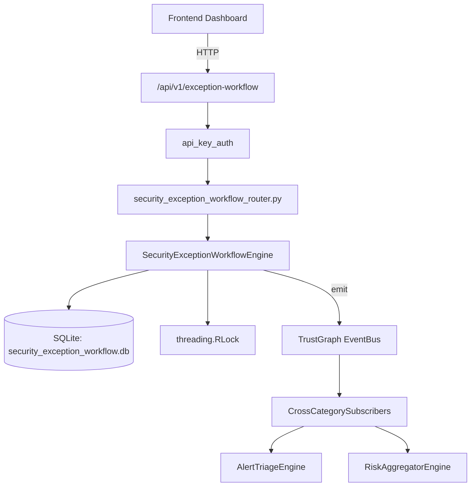

# US-0235: Security Exception Workflow

## Sub-Epic: Advanced
**Master Goal**: ALDECI — $35/mo enterprise security intelligence platform replacing $50K-500K/yr tools

## User Story
As a **David Park (Risk Manager)**, I need to manage security exceptions
so that the platform delivers enterprise-grade advanced capabilities at 1/1000th the cost of legacy tools.

## Why This Matters
Security Exception Workflow replaces functionality found in enterprise tools like CrowdStrike, Wiz, Snyk, and Rapid7.
By building this into ALDECI's $35/mo stack, customers save $50K+/yr on standalone Advanced tooling.

## Architecture

## Current State: 95% Complete
- ✅ `create_request()` — Create a new exception request with status=pending. (line 122)
- ✅ `review_request()` — Review an exception request. Updates request status based on decision. (line 153)
- ✅ `renew_exception()` — Renew an exception, extending its expiry and approved_until. (line 221)
- ✅ `revoke_exception()` — Revoke an approved exception. (line 258)
- ✅ `get_request()` — Get request with its reviews and renewals. (line 271)
- ✅ `list_requests()` — List exception requests with optional filters. (line 295)
- ❌ TrustGraph event emission — not yet verified

## Key Functions (from `suite-core/core/security_exception_workflow_engine.py` — 398 lines)
- `SecurityExceptionWorkflowEngine.create_request()` — Create a new exception request with status=pending. (line 122)
- `SecurityExceptionWorkflowEngine.review_request()` — Review an exception request. Updates request status based on decision. (line 153)
- `SecurityExceptionWorkflowEngine.renew_exception()` — Renew an exception, extending its expiry and approved_until. (line 221)
- `SecurityExceptionWorkflowEngine.revoke_exception()` — Revoke an approved exception. (line 258)
- `SecurityExceptionWorkflowEngine.get_request()` — Get request with its reviews and renewals. (line 271)
- `SecurityExceptionWorkflowEngine.list_requests()` — List exception requests with optional filters. (line 295)
- `SecurityExceptionWorkflowEngine.get_expiring_exceptions()` — Get approved exceptions expiring within days_ahead from now. (line 316)
- `SecurityExceptionWorkflowEngine.get_expired_exceptions()` — Get approved exceptions where approved_until has passed. (line 332)

## Dependencies
- **Depends on**: standalone
- **Depended by**: Routers, TrustGraph EventBus, CrossCategorySubscribers
- **TrustGraph**: Event emission wired via ResponseInterceptorMiddleware
- **Source file**: `suite-core/core/security_exception_workflow_engine.py` (398 lines)
- **Router file**: `suite-api/apps/api/security_exception_workflow_router.py`

## API Endpoints
| Method | Path | Description |
|--------|------|-------------|
| POST | `/api/v1/exception-workflow/requests` | create request |
| POST | `/api/v1/exception-workflow/requests/{request_id}/review` | review request |
| POST | `/api/v1/exception-workflow/requests/{request_id}/renew` | renew exception |
| POST | `/api/v1/exception-workflow/requests/{request_id}/revoke` | revoke exception |
| GET | `/api/v1/exception-workflow/requests/{request_id}` | get request |
| GET | `/api/v1/exception-workflow/requests` | list requests |
| GET | `/api/v1/exception-workflow/expiring` | get expiring |
| GET | `/api/v1/exception-workflow/expired` | get expired |
| GET | `/api/v1/exception-workflow/summary` | get summary |

## Tasks Remaining
1. Verify TrustGraph event emission works end-to-end (2h)
2. Add integration test with real persona workflow (2h)
3. Wire CrossCategorySubscriber consumer chain (1h)
4. Validate with 30-persona walkthrough (1h)
5. Optimize query performance for large datasets (2h)
6. Expand test coverage to edge cases (2h)

## Definition of Done
- [ ] David Park (Risk Manager) can access /api/v1/exception-workflow and get meaningful data
- [ ] All CRUD operations return correct HTTP status codes
- [ ] TrustGraph receives events from this engine
- [ ] 37+ tests passing in `tests/test_security_exception_workflow_engine.py`
- [ ] 30-persona walkthrough includes this endpoint at 100%
- [ ] No hardcoded org_id — all queries are org-scoped

## Sprint: Wave 49 (est. April 25-27, 2026)

## Test Coverage
- **Test file**: `tests/test_security_exception_workflow_engine.py`
- **Tests**: 37 tests
- **Status**: Passing
