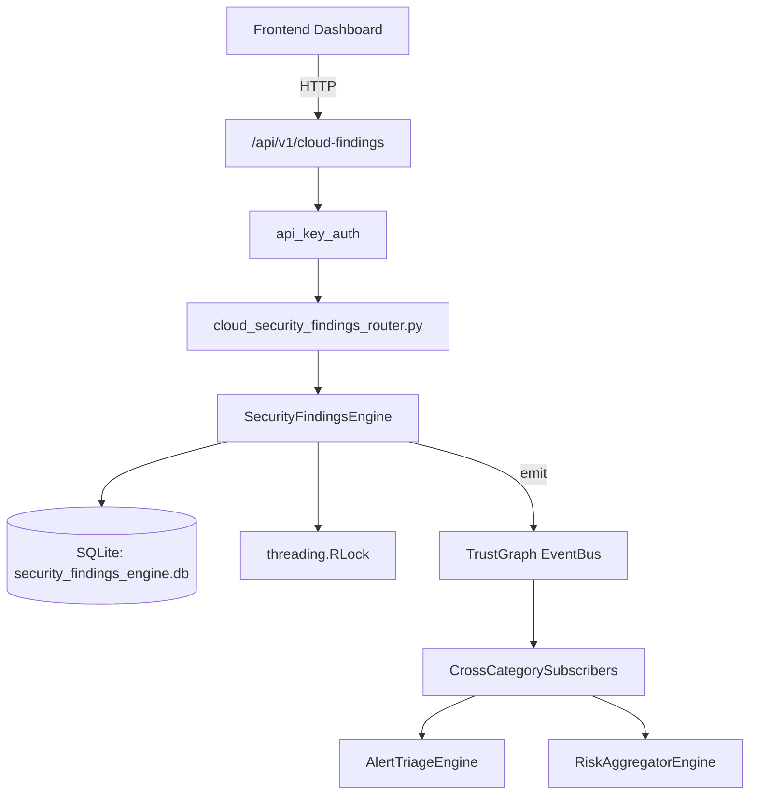

# US-0236: Security Findings

## Sub-Epic: Advanced
**Master Goal**: ALDECI — $35/mo enterprise security intelligence platform replacing $50K-500K/yr tools

## User Story
As a **James Wilson (Security Engineer)**, I need to manage security findings lifecycle
so that the platform delivers enterprise-grade advanced capabilities at 1/1000th the cost of legacy tools.

## Why This Matters
Security Findings replaces functionality found in enterprise tools like CrowdStrike, Wiz, Snyk, and Rapid7.
By building this into ALDECI's $35/mo stack, customers save $50K+/yr on standalone Advanced tooling.

## Architecture

## Current State: 95% Complete
- ✅ `record_finding()` — Record a finding; dedup if same (org+title+source_tool+asset_id) and not resolve (line 137)
- ✅ `update_status()` — Update finding status; if resolved, update last_seen to now. (line 213)
- ✅ `add_evidence()` — Add evidence to a finding. (line 254)
- ✅ `suppress_finding()` — Suppress a finding; updates finding status to suppressed. (line 281)
- ✅ `get_finding()` — Retrieve a finding with its evidence and suppression. (line 315)
- ✅ `list_findings()` — List findings with optional filters. (line 340)
- ❌ TrustGraph event emission — not yet verified

## Key Functions (from `suite-core/core/security_findings_engine.py` — 437 lines)
- `SecurityFindingsEngine.record_finding()` — Record a finding; dedup if same (org+title+source_tool+asset_id) and not resolve (line 137)
- `SecurityFindingsEngine.update_status()` — Update finding status; if resolved, update last_seen to now. (line 213)
- `SecurityFindingsEngine.add_evidence()` — Add evidence to a finding. (line 254)
- `SecurityFindingsEngine.suppress_finding()` — Suppress a finding; updates finding status to suppressed. (line 281)
- `SecurityFindingsEngine.get_finding()` — Retrieve a finding with its evidence and suppression. (line 315)
- `SecurityFindingsEngine.list_findings()` — List findings with optional filters. (line 340)
- `SecurityFindingsEngine.get_asset_findings()` — Get all findings for a specific asset. (line 364)
- `SecurityFindingsEngine.get_findings_summary()` — Summary: counts, severity breakdown, source breakdown, avg cvss, top assets. (line 375)

## Dependencies
- **Depends on**: standalone
- **Depended by**: Routers, TrustGraph EventBus, CrossCategorySubscribers
- **TrustGraph**: Event emission wired via ResponseInterceptorMiddleware
- **Source file**: `suite-core/core/security_findings_engine.py` (437 lines)
- **Router file**: `suite-api/apps/api/cloud_security_findings_router.py`

## API Endpoints
| Method | Path | Description |
|--------|------|-------------|
| POST | `/api/v1/cloud-findings/findings` | ingest finding |
| POST | `/api/v1/cloud-findings/findings/bulk` | bulk ingest |
| PUT | `/api/v1/cloud-findings/findings/{finding_id}/resolve` | resolve finding |
| POST | `/api/v1/cloud-findings/findings/{finding_id}/suppress` | suppress finding |
| POST | `/api/v1/cloud-findings/findings/{finding_id}/remediation` | assign remediation |
| PUT | `/api/v1/cloud-findings/remediation/{remediation_id}` | update remediation |
| GET | `/api/v1/cloud-findings/findings` | get findings |
| GET | `/api/v1/cloud-findings/summary` | get finding summary |
| GET | `/api/v1/cloud-findings/top-resources` | get top affected resources |

## Tasks Remaining
1. Verify TrustGraph event emission works end-to-end (2h)
2. Add integration test with real persona workflow (2h)
3. Wire CrossCategorySubscriber consumer chain (1h)
4. Validate with 30-persona walkthrough (1h)
5. Optimize query performance for large datasets (2h)
6. Expand test coverage to edge cases (2h)

## Definition of Done
- [ ] James Wilson (Security Engineer) can access /api/v1/cloud-findings and get meaningful data
- [ ] All CRUD operations return correct HTTP status codes
- [ ] TrustGraph receives events from this engine
- [ ] 36+ tests passing in `tests/test_security_findings_engine.py`
- [ ] 30-persona walkthrough includes this endpoint at 100%
- [ ] No hardcoded org_id — all queries are org-scoped

## Sprint: Wave 49 (est. April 25-27, 2026)

## Test Coverage
- **Test file**: `tests/test_security_findings_engine.py`
- **Tests**: 36 tests
- **Status**: Passing
