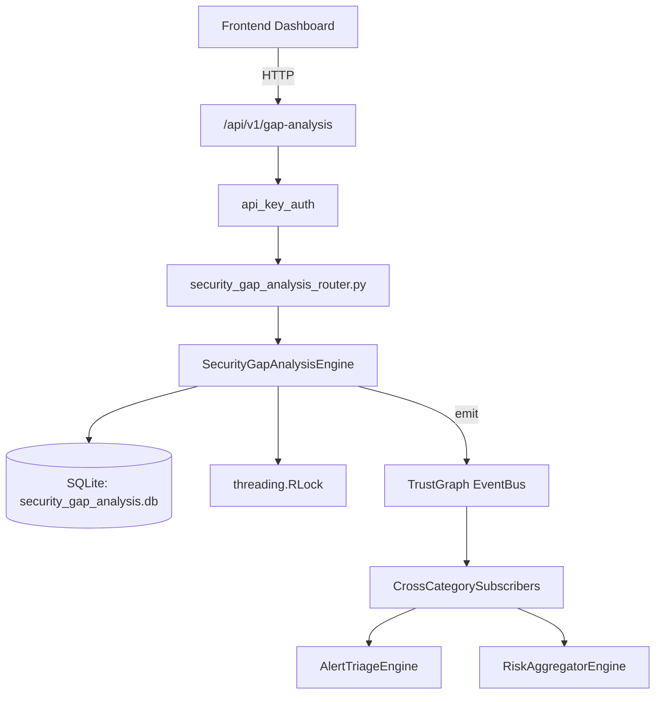

# US-0237: Security Gap Analysis

## Sub-Epic: Advanced
**Master Goal**: ALDECI — $35/mo enterprise security intelligence platform replacing $50K-500K/yr tools

## User Story
As a **Robert Kim (Compliance Officer)**, I need to analyze security gaps
so that the platform delivers enterprise-grade advanced capabilities at 1/1000th the cost of legacy tools.

## Why This Matters
Security Gap Analysis replaces functionality found in enterprise tools like CrowdStrike, Wiz, Snyk, and Rapid7.
By building this into ALDECI's $35/mo stack, customers save $50K+/yr on standalone Advanced tooling.

## Architecture

## Current State: 95% Complete
- ✅ `create_assessment()` — Create a new gap assessment. (line 197)
- ✅ `get_assessment()` — Return a single assessment or None. (line 248)
- ✅ `list_assessments()` — List assessments for an org. (line 257)
- ✅ `add_control_gap()` — Add a control gap and recompute assessment coverage. (line 277)
- ✅ `update_control_status()` — Update a control gap status and recompute parent assessment. (line 337)
- ✅ `list_gaps()` — List control gaps with optional filters. (line 362)
- ❌ TrustGraph event emission — not yet verified

## Key Functions (from `suite-core/core/security_gap_analysis_engine.py` — 592 lines)
- `SecurityGapAnalysisEngine.create_assessment()` — Create a new gap assessment. (line 197)
- `SecurityGapAnalysisEngine.get_assessment()` — Return a single assessment or None. (line 248)
- `SecurityGapAnalysisEngine.list_assessments()` — List assessments for an org. (line 257)
- `SecurityGapAnalysisEngine.add_control_gap()` — Add a control gap and recompute assessment coverage. (line 277)
- `SecurityGapAnalysisEngine.update_control_status()` — Update a control gap status and recompute parent assessment. (line 337)
- `SecurityGapAnalysisEngine.list_gaps()` — List control gaps with optional filters. (line 362)
- `SecurityGapAnalysisEngine.add_remediation_plan()` — Add a remediation plan for a gap. (line 390)
- `SecurityGapAnalysisEngine.complete_remediation()` — Mark a remediation plan as completed. (line 425)

## Dependencies
- **Depends on**: standalone
- **Depended by**: Routers, TrustGraph EventBus, CrossCategorySubscribers
- **TrustGraph**: Event emission wired via ResponseInterceptorMiddleware
- **Source file**: `suite-core/core/security_gap_analysis_engine.py` (592 lines)
- **Router file**: `suite-api/apps/api/security_gap_analysis_router.py`

## API Endpoints
| Method | Path | Description |
|--------|------|-------------|
| POST | `/api/v1/gap-analysis/assessments` | create assessment |
| GET | `/api/v1/gap-analysis/assessments` | list assessments |
| GET | `/api/v1/gap-analysis/assessments/{assessment_id}` | get assessment detail |
| POST | `/api/v1/gap-analysis/assessments/{assessment_id}/gaps` | add control gap |
| PUT | `/api/v1/gap-analysis/gaps/{gap_id}/status` | update control status |
| POST | `/api/v1/gap-analysis/gaps/{gap_id}/plans` | add remediation plan |
| PUT | `/api/v1/gap-analysis/plans/{plan_id}/complete` | complete remediation |
| GET | `/api/v1/gap-analysis/summary` | get gap summary |
| GET | `/api/v1/gap-analysis/overdue` | get overdue gaps |
| GET | `/api/v1/gap-analysis/framework-coverage` | get framework coverage |

## Tasks Remaining
1. Verify TrustGraph event emission works end-to-end (2h)
2. Add integration test with real persona workflow (2h)
3. Wire CrossCategorySubscriber consumer chain (1h)
4. Validate with 30-persona walkthrough (1h)
5. Optimize query performance for large datasets (2h)
6. Expand test coverage to edge cases (2h)

## Definition of Done
- [ ] Robert Kim (Compliance Officer) can access /api/v1/gap-analysis and get meaningful data
- [ ] All CRUD operations return correct HTTP status codes
- [ ] TrustGraph receives events from this engine
- [ ] 34+ tests passing in `tests/test_security_gap_analysis_engine.py`
- [ ] 30-persona walkthrough includes this endpoint at 100%
- [ ] No hardcoded org_id — all queries are org-scoped

## Sprint: Wave 49 (est. April 25-27, 2026)

## Test Coverage
- **Test file**: `tests/test_security_gap_analysis_engine.py`
- **Tests**: 34 tests
- **Status**: Passing
