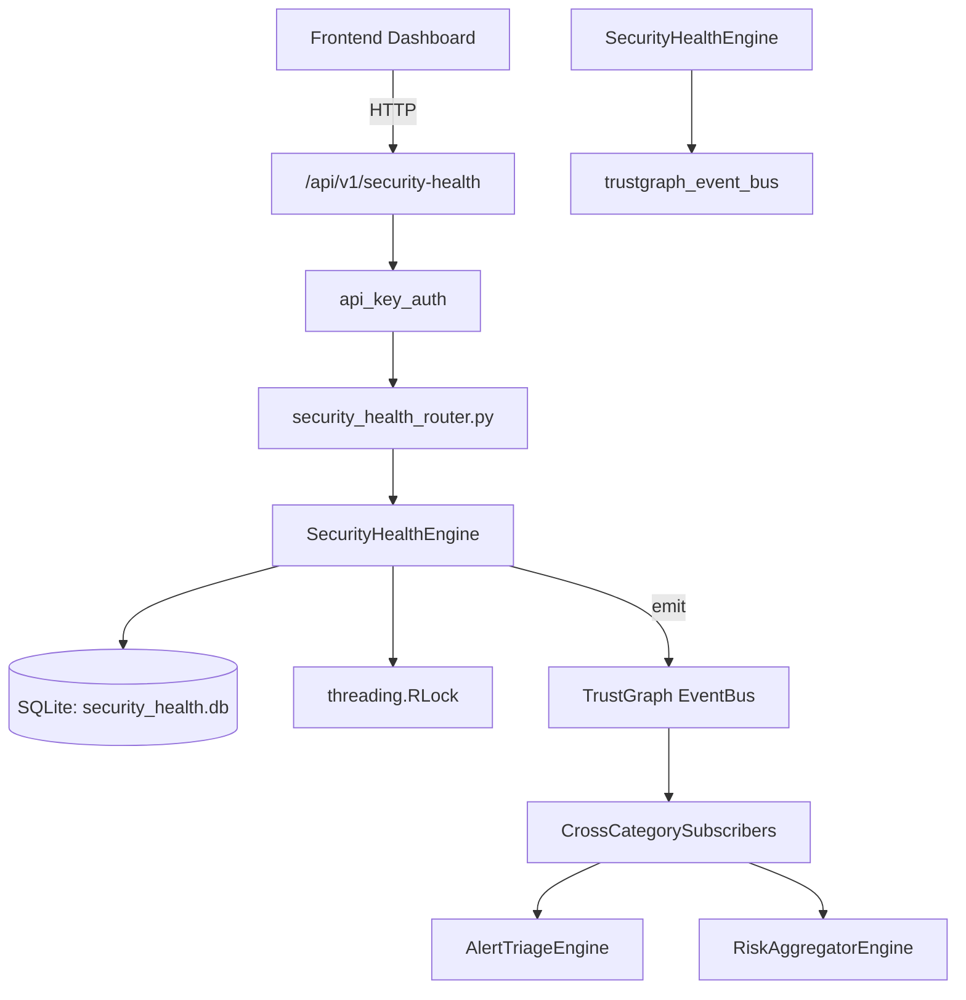

# US-0238: Security Health

## Sub-Epic: Executive
**Master Goal**: ALDECI — $35/mo enterprise security intelligence platform replacing $50K-500K/yr tools

## User Story
As a **Sarah Chen (CISO)**, I need to monitor security program health
so that the platform delivers enterprise-grade executive capabilities at 1/1000th the cost of legacy tools.

## Why This Matters
Security Health replaces functionality found in enterprise tools like CrowdStrike, Wiz, Snyk, and Rapid7.
By building this into ALDECI's $35/mo stack, customers save $50K+/yr on standalone Executive tooling.

## Architecture

## Current State: 95% Complete
- ✅ `register_check()` — Register a new health check. Returns the created record. (line 118)
- ✅ `update_check_status()` — Update the status, score, and details of an existing check. (line 171)
- ✅ `list_checks()` — List health checks with optional category/status filters. (line 200)
- ✅ `run_health_snapshot()` — Calculate current health scores, save a snapshot, and return it. (line 225)
- ✅ `get_latest_snapshot()` — Return the most recent health snapshot for an org. (line 285)
- ✅ `list_snapshots()` — Return the last N health snapshots for an org. (line 301)
- ❌ TrustGraph event emission — not yet verified

## Key Functions (from `suite-core/core/security_health_engine.py` — 439 lines)
- `SecurityHealthEngine.register_check()` — Register a new health check. Returns the created record. (line 118)
- `SecurityHealthEngine.update_check_status()` — Update the status, score, and details of an existing check. (line 171)
- `SecurityHealthEngine.list_checks()` — List health checks with optional category/status filters. (line 200)
- `SecurityHealthEngine.run_health_snapshot()` — Calculate current health scores, save a snapshot, and return it. (line 225)
- `SecurityHealthEngine.get_latest_snapshot()` — Return the most recent health snapshot for an org. (line 285)
- `SecurityHealthEngine.list_snapshots()` — Return the last N health snapshots for an org. (line 301)
- `SecurityHealthEngine.log_incident()` — Log a health incident linked to a check. (line 322)
- `SecurityHealthEngine.resolve_incident()` — Mark an incident as resolved. Returns True if found and updated. (line 360)

## Dependencies
- **Depends on**: trustgraph_event_bus
- **Depended by**: Routers, TrustGraph EventBus, CrossCategorySubscribers
- **TrustGraph**: Event emission wired via ResponseInterceptorMiddleware
- **Source file**: `suite-core/core/security_health_engine.py` (439 lines)
- **Router file**: `suite-api/apps/api/security_health_router.py`

## API Endpoints
| Method | Path | Description |
|--------|------|-------------|
| POST | `/api/v1/security-health/checks` | register check |
| GET | `/api/v1/security-health/checks` | list checks |
| PATCH | `/api/v1/security-health/checks/{check_id}/status` | update check status |
| POST | `/api/v1/security-health/snapshots` | run snapshot |
| GET | `/api/v1/security-health/snapshots/latest` | get latest snapshot |
| GET | `/api/v1/security-health/snapshots` | list snapshots |
| POST | `/api/v1/security-health/checks/{check_id}/incidents` | log incident |
| POST | `/api/v1/security-health/incidents/{incident_id}/resolve` | resolve incident |
| GET | `/api/v1/security-health/incidents` | list incidents |
| GET | `/api/v1/security-health/stats` | get health stats |

## Tasks Remaining
1. Verify TrustGraph event emission works end-to-end (2h)
2. Add integration test with real persona workflow (2h)
3. Wire CrossCategorySubscriber consumer chain (1h)
4. Validate with 30-persona walkthrough (1h)
5. Optimize query performance for large datasets (2h)
6. Expand test coverage to edge cases (2h)

## Definition of Done
- [ ] Sarah Chen (CISO) can access /api/v1/security-health and get meaningful data
- [ ] All CRUD operations return correct HTTP status codes
- [ ] TrustGraph receives events from this engine
- [ ] 35+ tests passing in `tests/test_security_health_engine.py`
- [ ] 30-persona walkthrough includes this endpoint at 100%
- [ ] No hardcoded org_id — all queries are org-scoped

## Sprint: Wave 49 (est. April 25-27, 2026)

## Test Coverage
- **Test file**: `tests/test_security_health_engine.py`
- **Tests**: 35 tests
- **Status**: Passing
