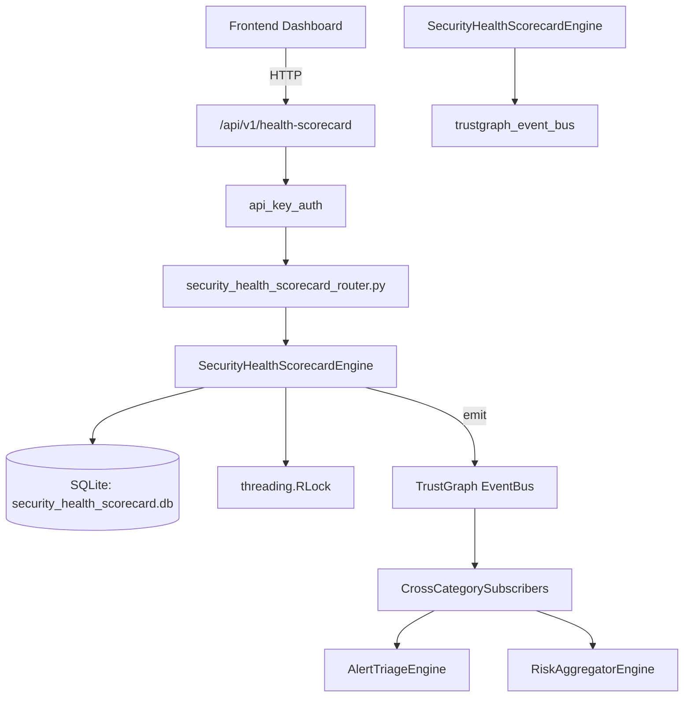

# US-0239: Security Health Scorecard

## Sub-Epic: Executive
**Master Goal**: ALDECI — $35/mo enterprise security intelligence platform replacing $50K-500K/yr tools

## User Story
As a **Sarah Chen (CISO)**, I need to monitor security program health
so that the platform delivers enterprise-grade executive capabilities at 1/1000th the cost of legacy tools.

## Why This Matters
Security Health Scorecard replaces functionality found in enterprise tools like CrowdStrike, Wiz, Snyk, and Rapid7.
By building this into ALDECI's $35/mo stack, customers save $50K+/yr on standalone Executive tooling.

## Architecture

## Current State: 95% Complete
- ✅ `upsert_domain()` — Upsert a scorecard domain. Weight clamped 0-1. Status auto-computed. (line 159)
- ✅ `get_domain()` — implemented (line 215)
- ✅ `get_domains()` — List domains for org, optionally filtered by status. (line 223)
- ✅ `take_snapshot()` — Compute and persist a scorecard snapshot. (line 235)
- ✅ `get_snapshot()` — implemented (line 292)
- ✅ `set_target()` — Upsert a target for a domain. (line 305)
- ❌ TrustGraph event emission — not yet verified

## Key Functions (from `suite-core/core/security_health_scorecard_engine.py` — 420 lines)
- `SecurityHealthScorecardEngine.upsert_domain()` — Upsert a scorecard domain. Weight clamped 0-1. Status auto-computed. (line 159)
- `SecurityHealthScorecardEngine.get_domain()` — Handle get domain (line 215)
- `SecurityHealthScorecardEngine.get_domains()` — List domains for org, optionally filtered by status. (line 223)
- `SecurityHealthScorecardEngine.take_snapshot()` — Compute and persist a scorecard snapshot. (line 235)
- `SecurityHealthScorecardEngine.get_snapshot()` — Handle get snapshot (line 292)
- `SecurityHealthScorecardEngine.set_target()` — Upsert a target for a domain. (line 305)
- `SecurityHealthScorecardEngine.get_current_scorecard()` — Return latest snapshot + all domains + targets. (line 353)
- `SecurityHealthScorecardEngine.get_snapshot_history()` — Return snapshots within the past `days` days, newest first. (line 386)

## Dependencies
- **Depends on**: trustgraph_event_bus
- **Depended by**: Routers, TrustGraph EventBus, CrossCategorySubscribers
- **TrustGraph**: Event emission wired via ResponseInterceptorMiddleware
- **Source file**: `suite-core/core/security_health_scorecard_engine.py` (420 lines)
- **Router file**: `suite-api/apps/api/security_health_scorecard_router.py`

## API Endpoints
| Method | Path | Description |
|--------|------|-------------|
| POST | `/api/v1/health-scorecard/domains` | upsert domain |
| POST | `/api/v1/health-scorecard/snapshots` | take snapshot |
| POST | `/api/v1/health-scorecard/targets` | set target |
| GET | `/api/v1/health-scorecard/current` | get current scorecard |
| GET | `/api/v1/health-scorecard/history` | get snapshot history |
| GET | `/api/v1/health-scorecard/grade-trend` | get grade trend |
| GET | `/api/v1/health-scorecard/domains` | get domains |

## Tasks Remaining
1. Verify TrustGraph event emission works end-to-end (2h)
2. Add integration test with real persona workflow (2h)
3. Wire CrossCategorySubscriber consumer chain (1h)
4. Validate with 30-persona walkthrough (1h)
5. Optimize query performance for large datasets (2h)
6. Expand test coverage to edge cases (2h)

## Definition of Done
- [ ] Sarah Chen (CISO) can access /api/v1/health-scorecard and get meaningful data
- [ ] All CRUD operations return correct HTTP status codes
- [ ] TrustGraph receives events from this engine
- [ ] 35+ tests passing in `tests/test_security_health_scorecard_engine.py`
- [ ] 30-persona walkthrough includes this endpoint at 100%
- [ ] No hardcoded org_id — all queries are org-scoped

## Sprint: Wave 49 (est. April 25-27, 2026)

## Test Coverage
- **Test file**: `tests/test_security_health_scorecard_engine.py`
- **Tests**: 35 tests
- **Status**: Passing
