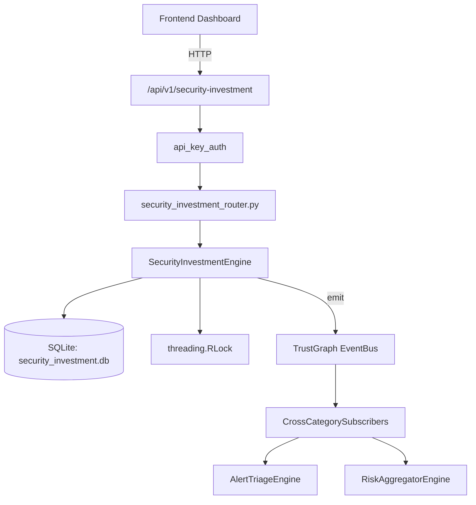

# US-0240: Security Investment

## Sub-Epic: Executive
**Master Goal**: ALDECI — $35/mo enterprise security intelligence platform replacing $50K-500K/yr tools

## User Story
As a **Sarah Chen (CISO)**, I need to track security investment ROI
so that the platform delivers enterprise-grade executive capabilities at 1/1000th the cost of legacy tools.

## Why This Matters
Security Investment replaces functionality found in enterprise tools like CrowdStrike, Wiz, Snyk, and Rapid7.
By building this into ALDECI's $35/mo stack, customers save $50K+/yr on standalone Executive tooling.

## Architecture

## Current State: 95% Complete
- ✅ `create_investment()` — Create a new investment record (status=planned). (line 160)
- ✅ `record_outcome()` — Record an outcome and recompute ROI if verified. (line 209)
- ✅ `activate_investment()` — Transition investment status to active. (line 258)
- ✅ `complete_investment()` — Transition investment status to completed. (line 274)
- ✅ `set_budget()` — Insert or replace a budget allocation for org/year/category. (line 294)
- ✅ `record_spend()` — Increment spent for an allocation. Returns dict with over_budget flag. (line 343)
- ❌ TrustGraph event emission — not yet verified

## Key Functions (from `suite-core/core/security_investment_engine.py` — 465 lines)
- `SecurityInvestmentEngine.create_investment()` — Create a new investment record (status=planned). (line 160)
- `SecurityInvestmentEngine.record_outcome()` — Record an outcome and recompute ROI if verified. (line 209)
- `SecurityInvestmentEngine.activate_investment()` — Transition investment status to active. (line 258)
- `SecurityInvestmentEngine.complete_investment()` — Transition investment status to completed. (line 274)
- `SecurityInvestmentEngine.set_budget()` — Insert or replace a budget allocation for org/year/category. (line 294)
- `SecurityInvestmentEngine.record_spend()` — Increment spent for an allocation. Returns dict with over_budget flag. (line 343)
- `SecurityInvestmentEngine.get_portfolio_summary()` — Return portfolio-level summary including top-5 ROI investments. (line 382)
- `SecurityInvestmentEngine.get_budget_utilization()` — Return all budget allocations for a year with remaining and over_budget flags. (line 428)

## Dependencies
- **Depends on**: standalone
- **Depended by**: Routers, TrustGraph EventBus, CrossCategorySubscribers
- **TrustGraph**: Event emission wired via ResponseInterceptorMiddleware
- **Source file**: `suite-core/core/security_investment_engine.py` (465 lines)
- **Router file**: `suite-api/apps/api/security_investment_router.py`

## API Endpoints
| Method | Path | Description |
|--------|------|-------------|
| POST | `/api/v1/security-investment/investments` | create investment |
| POST | `/api/v1/security-investment/investments/{investment_id}/outcomes` | record outcome |
| POST | `/api/v1/security-investment/investments/{investment_id}/activate` | activate investment |
| POST | `/api/v1/security-investment/investments/{investment_id}/complete` | complete investment |
| POST | `/api/v1/security-investment/budgets` | set budget |
| POST | `/api/v1/security-investment/budgets/spend` | record spend |
| GET | `/api/v1/security-investment/portfolio` | get portfolio summary |
| GET | `/api/v1/security-investment/budgets/{fiscal_year}` | get budget utilization |
| GET | `/api/v1/security-investment/investments` | list investments |

## Tasks Remaining
1. Verify TrustGraph event emission works end-to-end (2h)
2. Add integration test with real persona workflow (2h)
3. Wire CrossCategorySubscriber consumer chain (1h)
4. Validate with 30-persona walkthrough (1h)
5. Optimize query performance for large datasets (2h)
6. Expand test coverage to edge cases (2h)

## Definition of Done
- [ ] Sarah Chen (CISO) can access /api/v1/security-investment and get meaningful data
- [ ] All CRUD operations return correct HTTP status codes
- [ ] TrustGraph receives events from this engine
- [ ] 42+ tests passing in `tests/test_security_investment_engine.py`
- [ ] 30-persona walkthrough includes this endpoint at 100%
- [ ] No hardcoded org_id — all queries are org-scoped

## Sprint: Wave 50 (est. April 26-28, 2026)

## Test Coverage
- **Test file**: `tests/test_security_investment_engine.py`
- **Tests**: 42 tests
- **Status**: Passing
