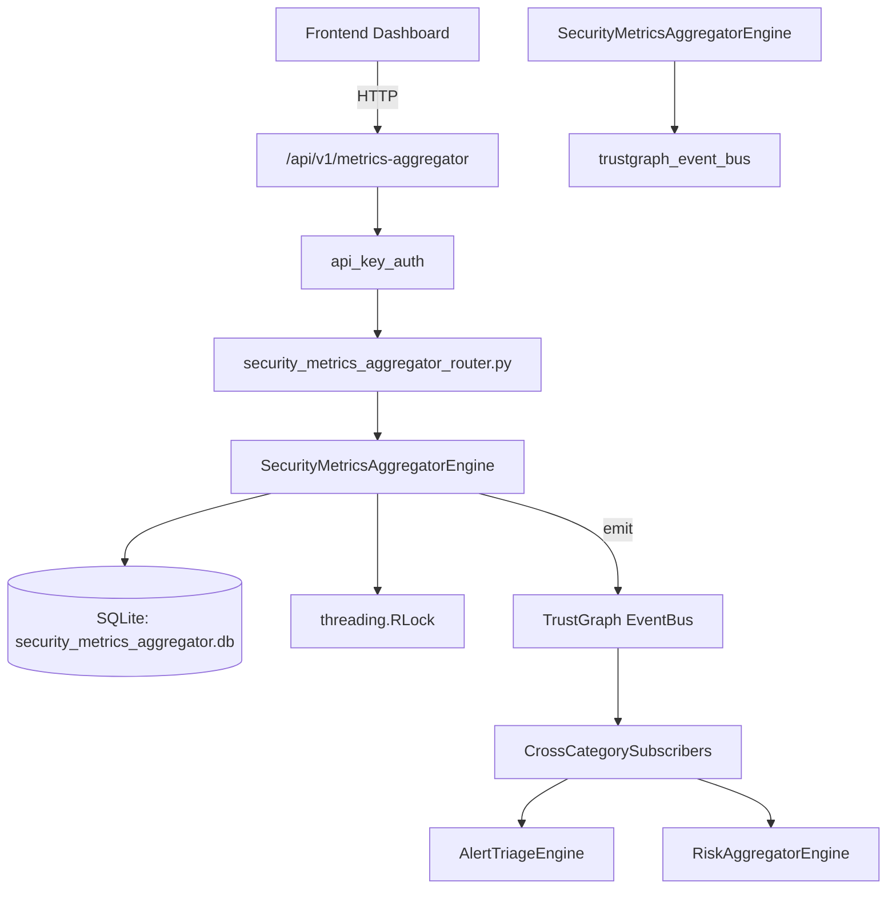

# US-0242: Security Metrics Aggregator

## Sub-Epic: Executive
**Master Goal**: ALDECI — $35/mo enterprise security intelligence platform replacing $50K-500K/yr tools

## User Story
As a **Sarah Chen (CISO)**, I need to aggregate security metrics
so that the platform delivers enterprise-grade executive capabilities at 1/1000th the cost of legacy tools.

## Why This Matters
Security Metrics Aggregator replaces functionality found in enterprise tools like CrowdStrike, Wiz, Snyk, and Rapid7.
By building this into ALDECI's $35/mo stack, customers save $50K+/yr on standalone Executive tooling.

## Architecture

## Current State: 95% Complete
- ✅ `register_source()` — Register a new metrics source. (line 163)
- ✅ `list_sources()` — List sources for an org, optionally filtered. (line 208)
- ✅ `sync_source()` — Increment metric_count by delta and update last_sync. (line 231)
- ✅ `record_metric()` — Record a new metric observation. (line 263)
- ✅ `list_metrics()` — List metrics for an org, optionally filtered. (line 314)
- ✅ `get_latest_metric()` — Return most recent metric by collected_at for org, or None. (line 341)
- ❌ TrustGraph event emission — not yet verified

## Key Functions (from `suite-core/core/security_metrics_aggregator_engine.py` — 480 lines)
- `SecurityMetricsAggregatorEngine.register_source()` — Register a new metrics source. (line 163)
- `SecurityMetricsAggregatorEngine.list_sources()` — List sources for an org, optionally filtered. (line 208)
- `SecurityMetricsAggregatorEngine.sync_source()` — Increment metric_count by delta and update last_sync. (line 231)
- `SecurityMetricsAggregatorEngine.record_metric()` — Record a new metric observation. (line 263)
- `SecurityMetricsAggregatorEngine.list_metrics()` — List metrics for an org, optionally filtered. (line 314)
- `SecurityMetricsAggregatorEngine.get_latest_metric()` — Return most recent metric by collected_at for org, or None. (line 341)
- `SecurityMetricsAggregatorEngine.create_aggregation()` — Create an aggregation computation record. (line 360)
- `SecurityMetricsAggregatorEngine.list_aggregations()` — List aggregations for an org, optionally filtered. (line 405)

## Dependencies
- **Depends on**: trustgraph_event_bus
- **Depended by**: Routers, TrustGraph EventBus, CrossCategorySubscribers
- **TrustGraph**: Event emission wired via ResponseInterceptorMiddleware
- **Source file**: `suite-core/core/security_metrics_aggregator_engine.py` (480 lines)
- **Router file**: `suite-api/apps/api/security_metrics_aggregator_router.py`

## API Endpoints
| Method | Path | Description |
|--------|------|-------------|
| POST | `/api/v1/metrics-aggregator/sources` | register source |
| GET | `/api/v1/metrics-aggregator/sources` | list sources |
| PUT | `/api/v1/metrics-aggregator/sources/{source_id}/sync` | sync source |
| POST | `/api/v1/metrics-aggregator/metrics` | record metric |
| GET | `/api/v1/metrics-aggregator/metrics` | list metrics |
| GET | `/api/v1/metrics-aggregator/metrics/latest/{metric_name}` | get latest metric |
| POST | `/api/v1/metrics-aggregator/aggregations` | create aggregation |
| GET | `/api/v1/metrics-aggregator/aggregations` | list aggregations |
| GET | `/api/v1/metrics-aggregator/stats` | get aggregator stats |

## Tasks Remaining
1. Verify TrustGraph event emission works end-to-end (2h)
2. Add integration test with real persona workflow (2h)
3. Wire CrossCategorySubscriber consumer chain (1h)
4. Validate with 30-persona walkthrough (1h)
5. Optimize query performance for large datasets (2h)
6. Expand test coverage to edge cases (2h)

## Definition of Done
- [ ] Sarah Chen (CISO) can access /api/v1/metrics-aggregator and get meaningful data
- [ ] All CRUD operations return correct HTTP status codes
- [ ] TrustGraph receives events from this engine
- [ ] 40+ tests passing in `tests/test_security_metrics_aggregator_engine.py`
- [ ] 30-persona walkthrough includes this endpoint at 100%
- [ ] No hardcoded org_id — all queries are org-scoped

## Sprint: Wave 50 (est. April 26-28, 2026)

## Test Coverage
- **Test file**: `tests/test_security_metrics_aggregator_engine.py`
- **Tests**: 40 tests
- **Status**: Passing
